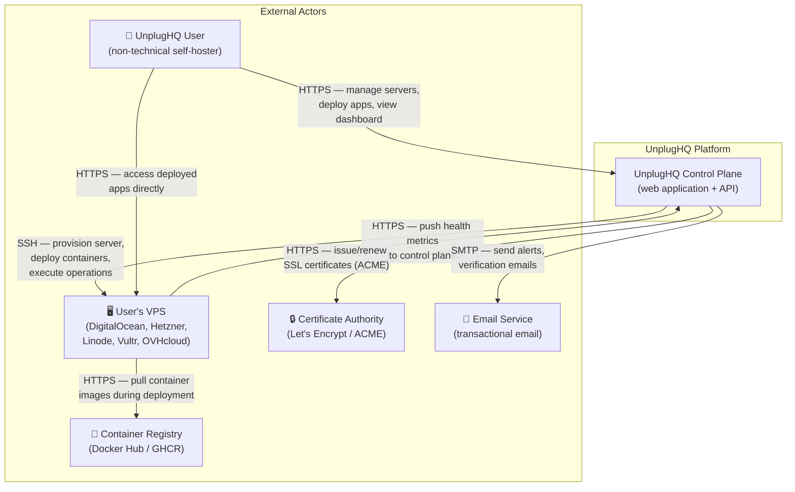
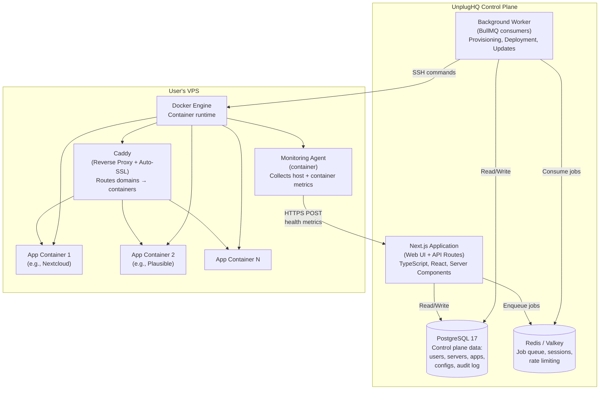
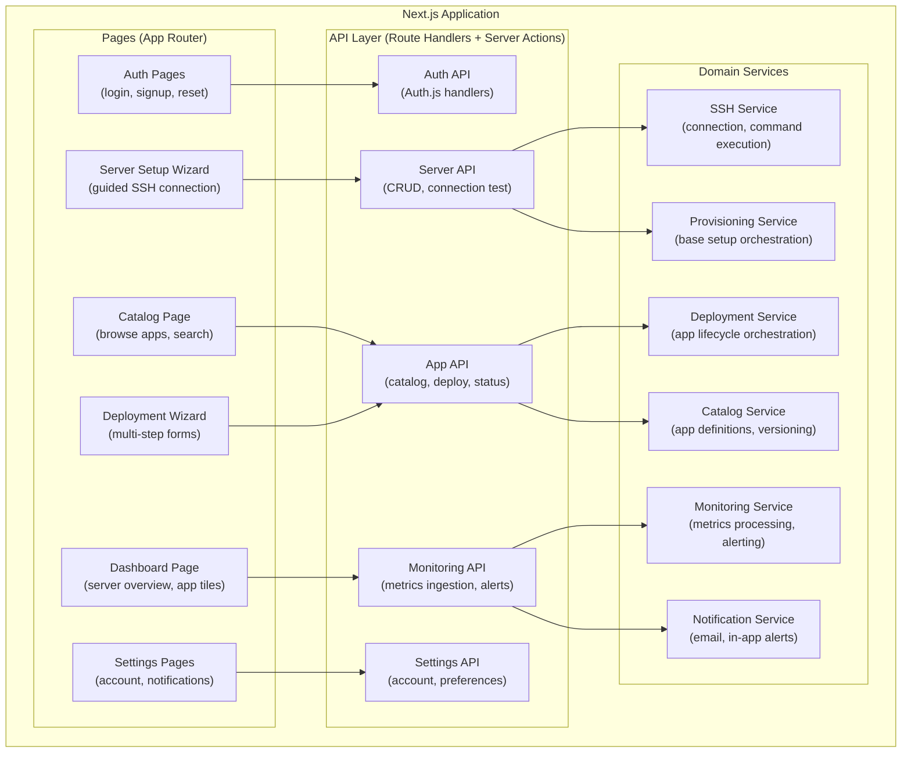
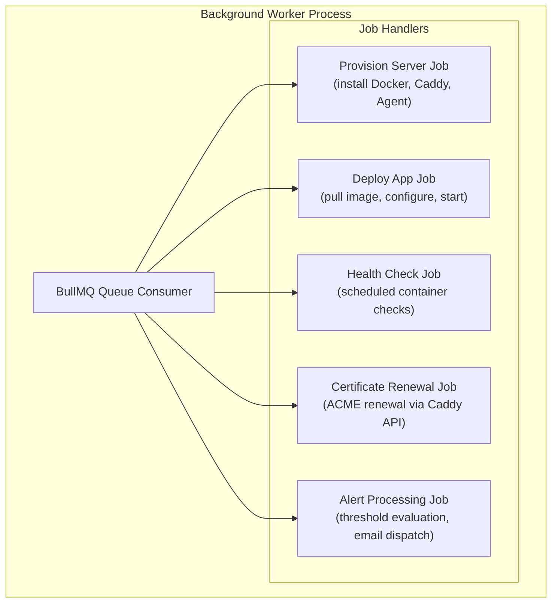
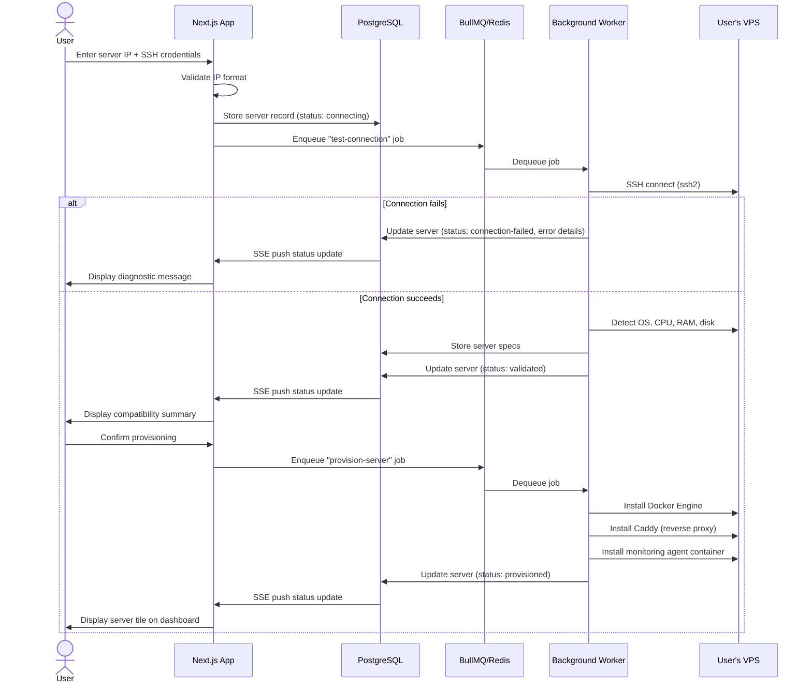
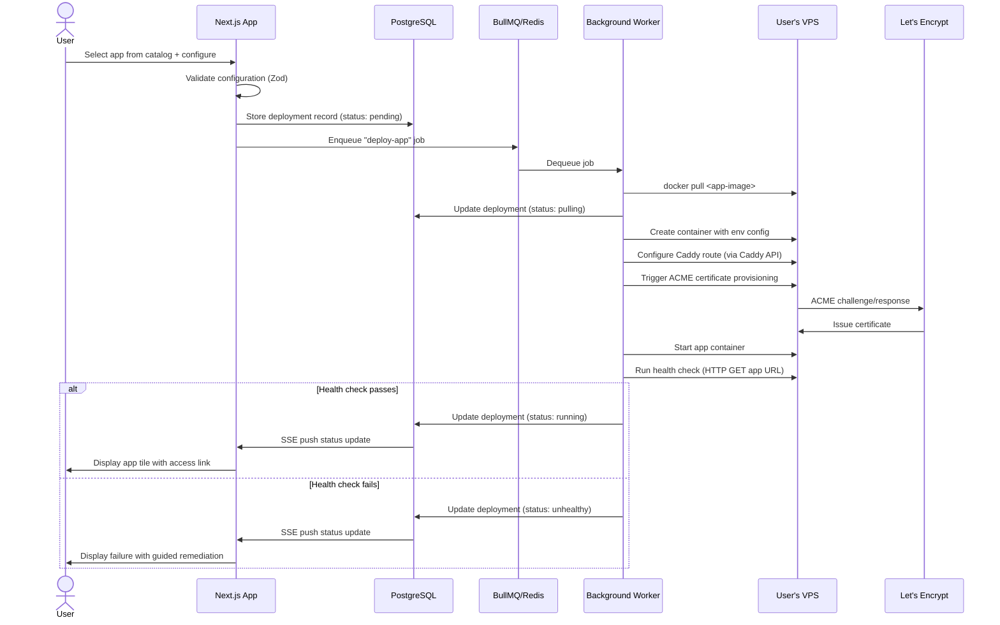
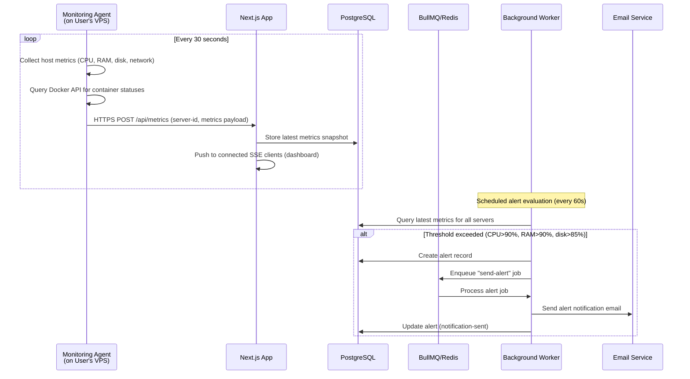
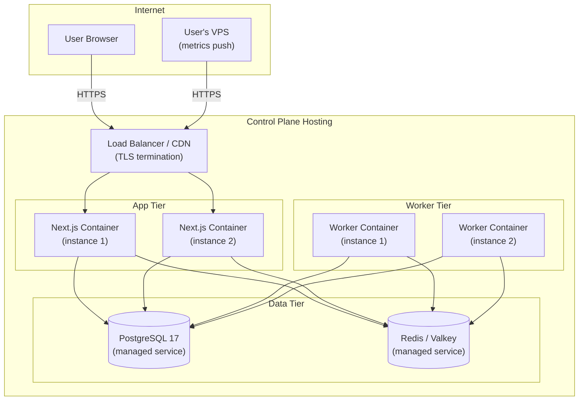
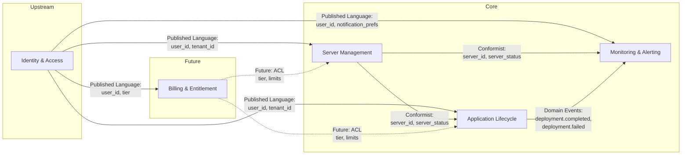

# Architecture Overview

## 1. Introduction and Goals

UnplugHQ is a web-based self-hosting management platform that enables non-technical users to deploy, manage, and maintain self-hosted applications on their own servers without terminal access.

### Key Quality Goals

| Priority | Quality Goal | Scenario |
|----------|-------------|----------|
| 1 | Security | SSH credentials encrypted at rest; control plane stores zero user application data; tenant isolation enforced at database level |
| 2 | Usability | All user journeys completable without terminal access; first app deployment < 15 minutes |
| 3 | Reliability | Health monitoring accuracy ≥ 99.5%; automated rollback on failed updates; idempotent provisioning |
| 4 | Performance | Dashboard page load < 3s on 10 Mbps; API p95 < 2s; functional on 5s+ SSH latency |
| 5 | Maintainability | Full TypeScript type safety from database schema to UI; modular bounded contexts for PI-2+ feature growth |

### Stakeholders

See [Stakeholder Analysis](stakeholder-analysis.md) for the full stakeholder register. Architecture-relevant stakeholders:

| Stakeholder | Architectural Concern |
|-------------|----------------------|
| Aspiring Self-Hoster (S1) | Zero-terminal operation, guided UX, data sovereignty |
| Technical Simplifier (S2) | Dashboard quality, automation reliability, export capability |
| Security Analyst (S7) | SSH credential handling, tenant isolation, attack surface minimization |
| GDPR Regulators (S17) | Data processing boundaries, consent, deletion capability |

---

## 2. Architecture Constraints

### Technical Constraints

| ID | Constraint | Source |
|----|-----------|--------|
| TC-1 | Web platform only — no native mobile apps | Environment Rule 18 |
| TC-2 | Mobile-first responsive design (375px minimum viewport) | NFR-008 |
| TC-3 | Control plane must never store user application data | SC5, NFR-004, BR-Global-001 |
| TC-4 | Apps must remain operational after UnplugHQ disconnection | SC6, NFR-005, BR-Global-002 |
| TC-5 | SSH key material must be encrypted at rest if retained | NFR-010, BR-F1-002 |
| TC-6 | Provisioning operations must be idempotent | BR-F1-003 |
| TC-7 | All destructive operations require explicit confirmation | NFR-006, BR-Global-003 |

### Organizational Constraints

| ID | Constraint | Source |
|----|-----------|--------|
| OC-1 | Multi-PI delivery (PI-1 = MVP, PI-2 = operational maturity, PI-3+ = platform expansion) | Feature Roadmap |
| OC-2 | Tiered pricing model (Free / Pro / Team) implies multi-tenant architecture with usage limits | Product Vision — Pricing Model |
| OC-3 | Global audience with varying internet speeds | Product Vision — Constraints |

---

## 3. System Scope and Context

### Business Context



### Technical Context

| Interface | Protocol | Direction | Data Exchanged |
|-----------|----------|-----------|----------------|
| User ↔ Control Plane | HTTPS (TLS 1.3) | Bidirectional | UI pages, API requests/responses, SSE streams |
| Control Plane → User's VPS | SSH (port 22) | Outbound | Provisioning commands, deployment scripts, configuration |
| User's VPS → Control Plane | HTTPS | Outbound | Health metrics (CPU, RAM, disk, container status), event notifications |
| Control Plane → Certificate Authority | HTTPS (ACME) | Outbound | Certificate signing requests, challenge responses |
| Control Plane → Email Service | SMTP/API | Outbound | Verification emails, alert notifications, password resets |
| User's VPS → Container Registry | HTTPS | Outbound | Docker image pulls during deployment |
| User → User's VPS | HTTPS | Direct | Access to deployed self-hosted applications |

---

## 4. Solution Strategy

| Decision | Choice | Rationale |
|----------|--------|-----------|
| Architecture style | Modular monolith with control plane / data plane separation | Single deployable unit for PI-1 velocity; bounded context modules enable extraction to services in PI-3+ if needed |
| Frontend framework | Next.js 16 (App Router, Server Components, Server Actions) | Best ecosystem for dashboard UX, type-safe forms, SSR performance — see [Solution Assessment](solution-assessment.md) |
| UI component library | shadcn/ui + Radix UI + Tailwind CSS 4 | Accessible, composable, customizable components; "premium indie tool" aesthetic |
| Backend runtime | Node.js 22 LTS | Unified runtime for frontend and backend; mature SSH library ecosystem (ssh2) |
| Database | PostgreSQL 17 | Multi-tenant SaaS requires ACID transactions, row-level security, and proven scalability |
| ORM | Drizzle ORM 0.45.x | Type-safe SQL-first queries; no code generation step; lightweight |
| Authentication | Auth.js v5 | Production-proven, OWASP-aligned; handles signup/login/session/password-reset (F4) |
| Background jobs | BullMQ 5.x + Redis/Valkey | Reliable job queue for long-running provisioning, deployment, and update operations |
| SSH connectivity | ssh2 1.17.x | Most mature Node.js SSH client; supports key-based auth, command execution, SFTP |
| Validation | Zod 3.x | Runtime type validation at API boundaries; schema-first contract definition |
| Reverse proxy (on user's VPS) | Caddy 2.x | Automatic HTTPS (ACME integration), clean API for programmatic route management, simple configuration |
| Container runtime (on user's VPS) | Docker Engine | Industry standard; required by all self-hosted apps in the catalog |
| Package manager | pnpm 10.x | Efficient disk usage, strict dependency resolution, workspace support |
| Language | TypeScript 5.9.x | End-to-end type safety from Drizzle schema to React components |

**ADR references:** ADR-001 (Next.js full-stack), ADR-002 (Caddy reverse proxy), ADR-003 (control/data plane separation), ADR-004 (Drizzle ORM), ADR-005 (BullMQ job queue). *ADR artifacts will be produced by the Solution Designer at P1.*

---

## 5. Building Block View

### Level 1 — Container Decomposition



### Level 2 — Next.js Application Components



### Level 2 — Background Worker Components



---

## 6. Runtime View

### Scenario 1: First-Time Server Connection (UJ1 — Connection Phase)



### Scenario 2: Application Deployment (UJ1 — Deployment Phase)



### Scenario 3: Health Monitoring Cycle



---

## 7. Deployment View

### Control Plane Infrastructure



### Deployment Specifications

| Component | Target | Scaling Strategy |
|-----------|--------|-----------------|
| Next.js Application | Docker container behind load balancer | Horizontal — add instances based on request load |
| Background Worker | Docker container (separate process) | Horizontal — add workers based on job queue depth |
| PostgreSQL | Managed service (e.g., Neon, Supabase, AWS RDS, or self-hosted) | Vertical initially; read replicas for PI-3+ |
| Redis/Valkey | Managed service (e.g., Upstash, AWS ElastiCache, or self-hosted) | Single instance for PI-1; clustered for PI-3+ |
| CDN | Cloudflare or equivalent | Static assets, TLS termination, DDoS protection |

### Data Plane (User's VPS) Software Stack

| Component | Installation Method | Managed By |
|-----------|-------------------|------------|
| Docker Engine | APT/YUM package during provisioning | UnplugHQ provisioning job |
| Caddy 2.x | Docker container | UnplugHQ provisioning job |
| Monitoring Agent | Docker container | UnplugHQ provisioning job |
| User's Apps | Docker containers | UnplugHQ deployment jobs |

---

## 8. Cross-cutting Concepts

### 8.1 Authentication & Authorization

| Aspect | Decision |
|--------|----------|
| Framework | Auth.js v5 integrated with Next.js App Router |
| Session strategy | Database-backed sessions (PostgreSQL) with secure HTTP-only cookies |
| Password storage | Argon2id hashing (memory-hard, side-channel resistant) — see BR-F4-002 |
| Session expiry | Configurable inactivity timeout (default: 30 days per FR-F4-006) |
| Rate limiting | 10 failed login attempts / 5 minutes → temporary account lock (BR-F4-001) |
| CSRF protection | Built-in via Auth.js token verification |
| Multi-tenancy | All database queries scoped by `tenant_id` (user account ID) — enforced at ORM query layer |

### 8.2 SSH Credential Management

| Aspect | Decision |
|--------|----------|
| Key type | Ed25519 preferred; RSA 4096 fallback for older providers |
| Storage | SSH private keys encrypted at rest using AES-256-GCM with per-tenant key derived from a master key (NFR-010) |
| Key derivation | Master key stored in environment variable / secret manager; per-tenant key derived via HKDF |
| Scope | Private keys retained only for servers with active management. Deleted on server disconnect. |
| Transport | Keys never logged, never included in API responses, never transmitted to the browser |
| Rotation | Users can regenerate SSH keys from the server settings UI |

### 8.3 Data Sovereignty Enforcement

| Boundary | Rule | Enforcement |
|----------|------|-------------|
| Control plane database | Stores only: user accounts, server connection metadata, app configuration references, deployment status, audit events, health metric snapshots | Schema review at P4; no BLOB/TEXT columns for user file content |
| Monitoring agent | Transmits only: CPU%, RAM%, disk%, network bytes, container status enum | Agent contract reviewed by Security Analyst; payload schema validated server-side |
| Backup/restore | All backup data stored on the user's server only | Backup commands execute via SSH on user's VPS; no backup data transits control plane |
| Configuration export | Docker Compose + Caddyfile + env templates generated on control plane from metadata, downloaded by user | Export produces standard formats that work without UnplugHQ (BR-Global-002) |

### 8.4 Logging & Audit

| Layer | Approach |
|-------|----------|
| Application logging | Structured JSON logs (pino) with correlation IDs per request |
| Audit log | Database table recording: action, timestamp, user_id, target (server/app), outcome, metadata. Retained 90 days minimum (NFR-013). Accessible from user's account settings. |
| Error tracking | Structured error boundaries in React; server-side error capture with stack traces in structured logs |
| Log levels | `error`, `warn`, `info`, `debug` — production runs at `info` |

### 8.5 Configuration Management

| Aspect | Approach |
|--------|----------|
| Environment variables | Control plane config via environment variables (12-factor). Validated at startup with Zod schema. |
| Feature flags | Simple database-backed feature flag table for tier-gated features (Free vs Pro vs Team) |
| App definitions | Versioned JSON/YAML files in the repository defining each catalog app (image, config schema, health check, resource requirements) |
| Secrets | SSH keys encrypted in database. API keys / master encryption key from environment / secret manager. Never committed to source. |

### 8.6 Error Handling Strategy

| Context | Strategy |
|---------|---------|
| API routes | Consistent error response shape: `{ error: { code, message, details? } }`. HTTP status codes per RFC 9110. |
| Background jobs | BullMQ retry with exponential backoff (3 retries). Failed jobs logged with full context. Server/app status updated to reflect failure. |
| SSH operations | Timeout (30s connect, 120s command). Retry once on transient failures. Failed operations report specific diagnostic to user (FR-F1-003, FR-F1-009). |
| UI | React error boundaries per route segment. Friendly error states with retry actions. No raw stack traces in production UI. |

---

## 9. Architecture Decisions

### ADR-001: Next.js Full-Stack Framework

**Status:** Proposed
**Context:** UnplugHQ requires a web framework supporting SSR for fast dashboard loads, Server Actions for multi-step wizard forms, real-time updates via SSE/streaming, and a rich component ecosystem for data visualization.
**Decision:** Use Next.js 16 (App Router) as the unified frontend and API framework.
**Consequences:** Single TypeScript codebase for UI and API. Requires Node.js runtime for server components. Larger initial bundle than SvelteKit but offset by React ecosystem breadth for dashboard components. Vendor-neutral deployment (not locked to Vercel).

### ADR-002: Caddy as User-Server Reverse Proxy

**Status:** Proposed
**Context:** Each user's VPS needs a reverse proxy that routes domains to Docker containers and handles automatic SSL certificate provisioning. Options considered: Caddy, Traefik, Nginx + certbot.
**Decision:** Use Caddy 2.x as the reverse proxy on user VPS.
**Consequences:** Automatic HTTPS by default (built-in ACME client). Clean admin API for programmatic route management during deployment. Simpler configuration than Traefik for single-server use. Single binary or Docker container deployment. Traefik's Docker label-based auto-discovery is more powerful but adds configuration complexity that UnplugHQ manages programmatically anyway.

### ADR-003: Control Plane / Data Plane Separation

**Status:** Proposed
**Context:** Data sovereignty is a non-negotiable constraint (SC5, NFR-004). User application data must never reside on UnplugHQ infrastructure.
**Decision:** Strict control plane / data plane architecture. Control plane (UnplugHQ-hosted) stores only management metadata. Data plane (user's VPS) hosts all application data, containers, backups, and user files.
**Consequences:** All provisioning and deployment operations execute remotely via SSH. Health metrics are pushed from the VPS monitoring agent to the control plane. Backup/restore operates entirely on the user's VPS. This architecture enables vendor independence (TC-4) — apps continue running if UnplugHQ is disconnected.

### ADR-004: Drizzle ORM for Database Access

**Status:** Proposed
**Context:** The control plane needs a type-safe database access layer for PostgreSQL. Options considered: Drizzle ORM, Prisma, Kysely, raw pg.
**Decision:** Use Drizzle ORM 0.45.x.
**Consequences:** SQL-first approach keeps queries explicit and reviewable. TypeScript schema declarations generate types without a code generation step (unlike Prisma). Lightweight runtime without a query engine binary. Migration support via drizzle-kit. Trade-off: smaller community than Prisma, but growing rapidly and sufficient for this use case.

### ADR-005: BullMQ for Background Job Processing

**Status:** Proposed
**Context:** Server provisioning, app deployment, health checks, and alert processing are long-running operations that cannot block the HTTP request cycle. Options considered: BullMQ, pg-boss, custom polling, Temporal.
**Decision:** Use BullMQ 5.x with Redis/Valkey as the job queue.
**Consequences:** Reliable, Redis-backed job processing with retry, backoff, rate limiting, and job prioritization. Supports named queues for different operation types (provisioning, deployment, monitoring). Workers run as separate processes, enabling independent scaling. Trade-off: requires Redis infrastructure alongside PostgreSQL. pg-boss (PostgreSQL-only) was considered but BullMQ's maturity, throughput, and feature set for complex job orchestration is materially superior.

---

## 10. Quality Attribute Scenarios

| ID | Quality Attribute | Stimulus | Source | Environment | Artifact | Response | Response Measure |
|----|------------------|----------|--------|-------------|----------|----------|-----------------|
| QA-1 | Performance | User loads dashboard page | Authenticated user | Normal operation, 10 Mbps connection | Next.js dashboard route | Server renders page with current server/app statuses | Page interactive in < 3 seconds (NFR-011) |
| QA-2 | Performance | User completes first-app deployment flow | New user | Normal network, DNS pre-configured | Full UJ1 flow | User has running app with SSL and dashboard tile | Total time < 15 minutes from signup (SC1) |
| QA-3 | Reliability | Monitoring agent reports app container stopped | Monitoring agent on VPS | Normal operation | Alert processing pipeline | System creates alert, updates dashboard status, sends email notification | Alert delivered within 5 minutes of condition detection (FR-F3-006) |
| QA-4 | Reliability | App update health check fails | Background worker | Post-update deployment | Rollback pipeline | System restores pre-update snapshot and restarts previous version | Automatic rollback completes within 5 minutes; zero data loss |
| QA-5 | Security | Attacker attempts brute-force login | External attacker | Production | Auth rate limiter | Account temporarily locked after 10 failed attempts in 5 minutes | Lock duration: 15 minutes. No credential leak via error messages (BR-F4-001) |
| QA-6 | Security | Database backup is accessed | Internal/External | Production | SSH key storage | SSH private keys in database are unreadable without decryption key | Keys encrypted with AES-256-GCM; master key in secret manager (NFR-010) |
| QA-7 | Scalability | 1000 concurrent users on dashboards | Authenticated users | Peak load | Next.js + PostgreSQL | Dashboard pages render with current data | p95 response time < 2 seconds for dashboard API (NFR-011) |
| QA-8 | Usability | Non-technical user connects VPS | Primary user (S1) | First-time setup | Server connection wizard | User completes connection without terminal or documentation external to UnplugHQ | Zero CLI commands required; UX audit confirms (SC2) |
| QA-9 | Portability | User disconnects from UnplugHQ | Any user | Normal operation | Configuration export | Docker Compose, Caddyfile, and env templates exported | Apps continue running post-disconnect; zero data loss (SC6) |
| QA-10 | Data sovereignty | System processes deployment request | Control plane | Any operation | Database and network boundary | Zero user application data stored on control plane | Architecture audit confirms control-plane-only data model (SC5) |

---

## 11. Risks and Technical Debt

| Risk/Debt | Severity | Mitigation |
|-----------|----------|-----------|
| SSH connectivity variability across VPS providers (R1) | High | Define supported baseline (Ubuntu 22.04/24.04 LTS, Debian 12); compatibility check before provisioning; provider-specific connection instructions |
| Provisioning drift across OS variants (R2) | High | Idempotent provisioning scripts; test against supported OS matrix in CI; pre-flight environment validation |
| Monitoring agent security on user's VPS | Medium | Agent authenticates to control plane with per-server API token; HTTPS-only communication; no inbound ports opened on control plane for agent |
| Redis/PostgreSQL operational overhead | Low | Use managed services for PI-1. Evaluate serverless options (Neon, Upstash) to minimize ops burden. |
| Next.js vendor coupling | Low | App uses standard Node.js APIs and React. Build output is a standard Node.js server — deployable anywhere (not locked to Vercel). No Vercel-specific features used. |

---

## 12. Glossary

See [Domain Glossary](domain-glossary.md) for the full ubiquitous language. Architecture-specific terms:

| Term | Definition |
|------|-----------|
| Control Plane | UnplugHQ-hosted infrastructure: web app, API, PostgreSQL, Redis, workers. Stores management metadata only. |
| Data Plane | The user's VPS where all Docker containers, application data, backups, and reverse proxy live. |
| Monitoring Agent | Lightweight container on user's VPS that collects host and container metrics and pushes them to the control plane. |
| App Definition | Versioned specification in the catalog describing how to deploy and configure a self-hostable application. |
| Provisioning Job | Background task that installs Docker, Caddy, and monitoring agent on a user's VPS via SSH. |
| Deployment Job | Background task that deploys an app container, configures routing, provisions SSL, and runs health checks. |

---

## 13. Bounded Contexts and Context Map

### Bounded Contexts

| Context | Responsibility | Key Entities | PI Coverage |
|---------|---------------|--------------|-------------|
| **Identity & Access** | User accounts, authentication, sessions, authorization, account settings, GDPR compliance | User, Session, PasswordResetToken, NotificationPreference | PI-1 (F4) |
| **Server Management** | VPS connection, SSH operations, provisioning lifecycle, server health, compatibility validation | Server, SSHCredential, ProvisioningJob, ServerSpecs | PI-1 (F1) |
| **Application Lifecycle** | App catalog, deployment orchestration, configuration, status management, SSL certificates | AppDefinition, Deployment, AppConfig, Certificate | PI-1 (F2) |
| **Monitoring & Alerting** | Health metrics collection, threshold evaluation, alert lifecycle, notification dispatch | MetricSnapshot, Alert, AlertRule, Notification | PI-1 (F3) |
| **Billing & Entitlement** | Subscription tiers, usage limits, payment processing | Subscription, UsageLimit, Invoice | PI-3+ (stub in PI-1 for tier-gating) |

### Context Map



**Relationship types:**
- **Published Language:** Identity & Access publishes `user_id` and `tenant_id` as the shared identity vocabulary consumed by all downstream contexts.
- **Conformist:** Application Lifecycle and Monitoring conform to Server Management's `server_id` and status model without translation — they accept the upstream model as-is.
- **Domain Events:** Application Lifecycle publishes deployment lifecycle events that Monitoring & Alerting consumes to trigger post-deployment health checks and status updates.
- **Anti-Corruption Layer (future):** Billing & Entitlement will use an ACL to translate external payment provider concepts into internal tier/limit models.

---

## 14. Infrastructure Blueprint

### PI-1 Deployment Topology

| Layer | Service | Technology | Hosting |
|-------|---------|-----------|---------|
| Edge | CDN + DDoS protection | Cloudflare | Managed |
| Compute | Next.js application | Docker container | Cloud VM or container platform |
| Compute | BullMQ workers | Docker container | Cloud VM or container platform |
| Database | PostgreSQL 17 | Managed database | Neon, Supabase, or equivalent |
| Cache/Queue | Redis/Valkey | Managed Redis | Upstash or equivalent |
| Email | Transactional email | External service (Resend, Postmark, or SES) | Managed |
| DNS | Control plane domain | Cloudflare DNS | Managed |

### CI/CD Pipeline Design

| Stage | Action | Tool |
|-------|--------|------|
| Lint | ESLint + TypeScript typecheck | GitHub Actions |
| Test | Unit tests (Vitest) + Integration tests | GitHub Actions |
| Build | Next.js production build | GitHub Actions |
| Security | `npm audit` + dependency check | GitHub Actions |
| Deploy (staging) | Docker build → push → deploy to staging | GitHub Actions |
| Smoke test | E2E smoke suite against staging | Playwright |
| Deploy (production) | Promote staging image to production | GitHub Actions + manual approval |

### Environment Matrix

| Environment | Purpose | Data |
|-------------|---------|------|
| Local development | Developer machine | SQLite or local PostgreSQL, mock SSH |
| CI | Automated testing | PostgreSQL in Docker, mock SSH |
| Staging | Pre-production validation | Managed PostgreSQL, real SSH to test VPS |
| Production | Live service | Managed PostgreSQL, managed Redis, real user VPSs |

---

## 15. Design System Architecture

### CSS Methodology

| Decision | Choice | Rationale |
|----------|--------|-----------|
| CSS methodology | Tailwind CSS 4 (utility-first) + CSS Modules for component-scoped overrides | Tailwind 4's CSS-first configuration aligns with modern CSS; utility classes for rapid UI development; CSS Modules where component encapsulation is needed |
| Scoping strategy | Tailwind utilities (global) + CSS Modules (scoped) | Tailwind handles the majority of styling; CSS Modules for complex component-specific styles that exceed utility composition |

### CSS `@layer` Ordering

```css
@layer reset, tokens, base, components, utilities;
```

| Layer | Content |
|-------|---------|
| `reset` | CSS reset / normalize (Tailwind's Preflight) |
| `tokens` | CSS custom properties (design tokens for colors, spacing, typography, shadows) |
| `base` | Base element styles (body, headings, links — Tailwind's base layer) |
| `components` | Component-level styles (shadcn/ui component overrides, CSS Module outputs) |
| `utilities` | Tailwind utility classes (highest precedence for overrides) |

### Icon Strategy

| Decision | Choice | Rationale |
|----------|--------|-----------|
| Icon library | Lucide React | Consistent, accessible SVG icons; tree-shakeable; 1500+ icons; actively maintained; used by shadcn/ui |
| Icon delivery | Inline SVG via React components | Best accessibility (ARIA attributes per icon); no additional HTTP requests; tree-shaking eliminates unused icons |

### Design Token Pipeline

| Decision | Choice | Rationale |
|----------|--------|-----------|
| Token format | CSS custom properties (native) | No build-time transformation needed; runtime theme switching via class toggle; Tailwind 4 consumes CSS variables natively |
| Token organization | Three-tier: reference → semantic → component | Reference tokens define raw values; semantic tokens map to intent (e.g., `--color-surface-primary`); component tokens scope to specific UI elements |
| Transformation pipeline | Tailwind CSS 4 `@theme` directive | Tailwind 4's native CSS configuration eliminates the need for Style Dictionary or similar build tools |

**Token file structure:**

```
code/src/styles/
├── tokens/
│   ├── reference.css       # Raw color palette, spacing scale, type scale
│   ├── semantic.css        # Intent-mapped tokens (surface, text, border, accent)
│   └── component.css       # Component-specific tokens (button, card, input, alert)
├── themes/
│   ├── dark.css            # Dark theme overrides (primary theme)
│   └── light.css           # Light theme overrides
└── global.css              # @layer declarations, @import tokens, Tailwind directives
```

### Font Loading Pipeline

| Decision | Choice | Rationale |
|----------|--------|-----------|
| Font hosting | Self-hosted (in `public/fonts/`) | Eliminates third-party requests; GDPR compliance (no Google Fonts CDN); better caching control |
| Font selection | Variable font (Inter or Geist — SA recommends SD/UX evaluate) | Variable fonts reduce HTTP requests (one file for all weights); modern browser support is universal |
| Preload strategy | Preload primary weight subset via `<link rel="preload">` in `<head>` | Eliminates FOIT for above-the-fold content; preload only the Latin subset to minimize payload |
| `font-display` policy | `font-display: swap` | Text visible immediately with fallback; swap when custom font loads; acceptable for a dashboard UI |
| Fallback font metrics | Use `@font-face` `size-adjust`, `ascent-override`, `descent-override` for fallback font metrics matching | Minimizes Cumulative Layout Shift (CLS) during font swap |

### Theming Architecture

| Decision | Choice | Rationale |
|----------|--------|-----------|
| Primary theme | Dark mode (per Product Vision — "dark mode as primary") | Aesthetic direction: "premium indie tool" with dark mode primary |
| Theme switching | CSS class toggle on `<html>` element (`class="dark"` / `class="light"`) | Works with Tailwind's dark mode variant; compatible with SSR (no flash); persists via cookie |
| User preference | Respect `prefers-color-scheme` for initial visit; user can override in settings; preference persisted in account settings (server-side) and cookie (client-side) | Privacy-respecting default; user control; syncs across devices via account |
| Single vs multi-brand | Single brand with dark/light variants | No multi-brand requirement in Product Vision |

### Visual Regression Testing

| Decision | Choice | Rationale |
|----------|--------|-----------|
| Tool | Percy (cloud-hosted) | Default recommendation per framework instructions. CI/CD integration via GitHub Actions. Cross-browser snapshot comparison. |
| Fallback | Playwright screenshot comparison | For offline/air-gapped environments if Percy is unavailable |
| Coverage | Key pages: dashboard, catalog, deployment wizard, server setup wizard, login/signup | Focus on high-traffic, high-complexity pages |

### CSS Performance Budget

| Metric | Target | Rationale |
|--------|--------|-----------|
| Total CSS bundle (compressed) | < 50 KB | Tailwind 4's JIT produces only used utilities; achievable for a dashboard application |
| Critical CSS | Extracted via Next.js automatic CSS chunking | Next.js App Router handles per-route CSS splitting automatically |
| Unused CSS | < 5% of shipped CSS | Tailwind 4's content-aware purging; monitored via coverage reports |

### Storybook Configuration

| Decision | Choice | Rationale |
|----------|--------|-----------|
| Storybook version | 8.x | Current stable; supports React Server Components stories |
| Addons | `@storybook/addon-a11y`, `@storybook/addon-themes`, `@storybook/addon-viewport` | Accessibility audit per component, theme switching preview, responsive viewport testing |
| Static build | `storybook build` → deploy to GitHub Pages (`/storybook/`) | Component documentation accessible to UX, A11Y, and Content Strategy agents |
| Hosting | GitHub Pages (same repo, different path) | Zero additional infrastructure |

### Zeroheight Integration

| Decision | Choice | Rationale |
|----------|--------|-----------|
| Integration approach | Embed Storybook stories via iframe | Zeroheight's standard integration pattern; CSP headers must allow Zeroheight domain as frame-ancestor |
| CSP requirements | `frame-ancestors 'self' https://*.zeroheight.com` | Allow Zeroheight to embed Storybook; restrict to Zeroheight domain only |

---

## 16. Recommended External Skills

_Run `node .github/skills/skills-discovery/scripts/search-skills.mjs --project unplughq --role system-architect --json` to identify installable skills for the recommended tech stack._

Recommended skills based on the architecture:

| Skill | Source | Rationale |
|-------|--------|-----------|
| Next.js App Router | Context7 / official docs | Server Components, Server Actions, streaming SSR patterns |
| Drizzle ORM | Context7 / official docs | Schema declaration, migration, query patterns for PostgreSQL |
| Auth.js v5 | Context7 / official docs | Next.js integration, credential provider, session strategy |
| Tailwind CSS 4 | Context7 / official docs | CSS-first config, `@theme` directive, dark mode |
| shadcn/ui | Context7 / official docs | Component installation, customization, accessibility patterns |
| BullMQ | Context7 / official docs | Queue definition, worker patterns, retry strategies |
| ssh2 | npm docs | SSH connection, command execution, key management |

---

## 17. Technology Stack Summary

### Control Plane

| Layer | Technology | Version | Purpose |
|-------|-----------|---------|---------|
| Runtime | Node.js | 22 LTS | Server runtime |
| Framework | Next.js | 16.x | Full-stack web framework |
| Language | TypeScript | 5.9.x | Type safety |
| UI Components | shadcn/ui + Radix UI | latest | Accessible component library |
| Styling | Tailwind CSS | 4.x | Utility-first CSS |
| Database | PostgreSQL | 17 | Control plane persistence |
| ORM | Drizzle ORM | 0.45.x | Type-safe database access |
| Auth | Auth.js | v5 | Authentication & sessions |
| Job Queue | BullMQ | 5.x | Background job processing |
| Queue Backend | Redis / Valkey | 7.x | Queue storage, caching, sessions |
| SSH | ssh2 | 1.17.x | Remote server operations |
| Validation | Zod | 3.x | Runtime type validation |
| Icons | Lucide React | latest | SVG icon library |
| Testing | Vitest + Playwright | latest | Unit + E2E testing |
| Visual Regression | Percy | latest | Screenshot comparison |
| Component Dev | Storybook | 8.x | Component documentation |
| Package Manager | pnpm | 10.x | Dependency management |
| Logging | pino | latest | Structured JSON logging |

### Data Plane (User's VPS)

| Component | Technology | Version | Purpose |
|-----------|-----------|---------|---------|
| Container Runtime | Docker Engine | 27.x | Run application containers |
| Reverse Proxy | Caddy | 2.x | Route domains, auto-SSL |
| Monitoring Agent | Node.js container | — | Collect and push health metrics |

### Dependency Notes

| Package | Exact Name | Import As | Note |
|---------|-----------|-----------|------|
| Drizzle ORM | `drizzle-orm` | `drizzle-orm` | Not `drizzle` (different package) |
| Auth.js | `next-auth` | `next-auth` | v5 is the Auth.js rewrite; npm package name remains `next-auth` |
| ssh2 | `ssh2` | `ssh2` | Types via `@types/ssh2` |
| Argon2 | `argon2` | `argon2` | Not `bcrypt` or `bcryptjs` — Argon2id for password hashing (memory-hard) |
| BullMQ | `bullmq` | `bullmq` | Not `bull` (legacy) |
