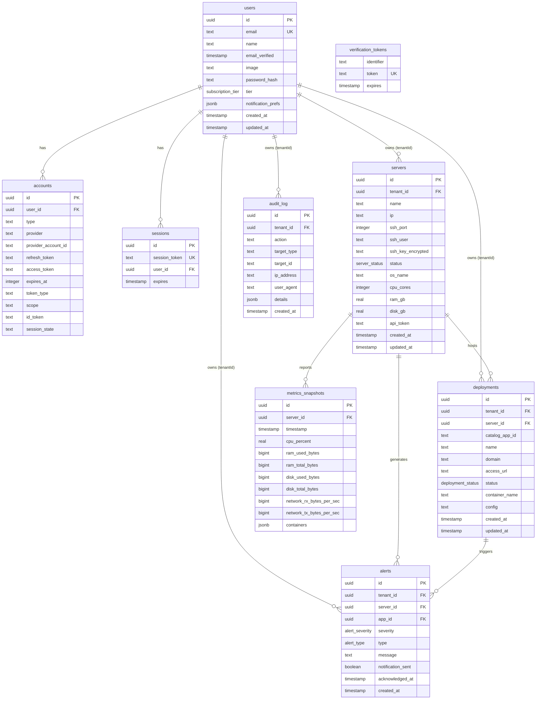

# Database Schema — UnplugHQ

PostgreSQL 17 database schema for Sprint 1 entities, implemented with Drizzle ORM 0.45.x. All tables use UUID v4 primary keys (E-02 mitigation), tenant isolation via `tenant_id` columns (I-07 mitigation), and parameterized queries enforced by the ORM (T-02 mitigation).

**Upstream references:** [Architecture Overview](architecture-overview.md) · [API Contracts](api-contracts.md) · [Threat Model](threat-model.md) · [Requirements](requirements.md)

---

## 1. Entity Relationship Diagram



---

## 2. Table Descriptions

### 2.1 users

Auth.js v5 compatible user table. Stores account credentials, subscription tier, and notification preferences. The `id` column serves as the `tenantId` for all tenant-scoped tables.

| Column | Type | Nullable | Default | Notes |
|--------|------|----------|---------|-------|
| id | uuid | no | gen_random_uuid() | PK — UUID v4 (E-02) |
| name | text | yes | — | Display name |
| email | text | no | — | Unique; login identifier |
| email_verified | timestamp | yes | — | Auth.js email verification |
| image | text | yes | — | Avatar URL (Auth.js) |
| password_hash | text | yes | — | Argon2id hash (BR-F4-002) |
| tier | subscription_tier | no | 'free' | Enum: free/pro/team |
| notification_prefs | jsonb | no | {"emailAlerts": true} | Notification settings (FR-F4-005) |
| created_at | timestamp | no | now() | |
| updated_at | timestamp | no | now() | |

### 2.2 accounts

Auth.js v5 OAuth provider accounts. Links external identity providers to user records.

| Column | Type | Nullable | Default | Notes |
|--------|------|----------|---------|-------|
| id | uuid | no | gen_random_uuid() | PK |
| user_id | uuid | no | — | FK → users.id (cascade delete) |
| type | text | no | — | Auth.js account type |
| provider | text | no | — | OAuth provider name |
| provider_account_id | text | no | — | Provider-specific user ID |
| refresh_token | text | yes | — | OAuth refresh token |
| access_token | text | yes | — | OAuth access token |
| expires_at | integer | yes | — | Token expiration epoch |
| token_type | text | yes | — | |
| scope | text | yes | — | OAuth scopes |
| id_token | text | yes | — | OIDC ID token |
| session_state | text | yes | — | |

### 2.3 sessions

Auth.js v5 database-backed sessions. Enables server-side session revocation (S-02 mitigation).

| Column | Type | Nullable | Default | Notes |
|--------|------|----------|---------|-------|
| id | uuid | no | gen_random_uuid() | PK |
| session_token | text | no | — | Unique session identifier |
| user_id | uuid | no | — | FK → users.id (cascade delete) |
| expires | timestamp | no | — | Session expiry (FR-F4-006) |

### 2.4 verification_tokens

Auth.js v5 email verification and password reset tokens (FR-F4-004).

| Column | Type | Nullable | Default | Notes |
|--------|------|----------|---------|-------|
| identifier | text | no | — | Email or other identifier |
| token | text | no | — | Unique cryptographic token |
| expires | timestamp | no | — | 1-hour expiry for reset tokens |

### 2.5 servers

Connected VPS servers. The `ssh_key_encrypted` column stores AES-256-GCM encrypted SSH private key material (I-01 mitigation). The `api_token` authenticates monitoring agent requests (S-03 mitigation).

| Column | Type | Nullable | Default | Notes |
|--------|------|----------|---------|-------|
| id | uuid | no | gen_random_uuid() | PK — UUID v4 (E-02) |
| tenant_id | uuid | no | — | FK → users.id — tenant isolation (I-07) |
| name | text | no | — | Human-readable name (FR-F1-008) |
| ip | text | no | — | IPv4 address |
| ssh_port | integer | no | 22 | SSH connection port |
| ssh_user | text | no | — | SSH username (default: unplughq) |
| ssh_key_encrypted | text | yes | — | AES-256-GCM encrypted blob: base64(iv+ciphertext+authTag) (I-01) |
| status | server_status | no | 'connecting' | Lifecycle enum |
| os_name | text | yes | — | Detected after SSH connection (FR-F1-004) |
| cpu_cores | integer | yes | — | Detected after SSH connection |
| ram_gb | real | yes | — | Detected after SSH connection |
| disk_gb | real | yes | — | Detected after SSH connection |
| api_token | text | yes | — | Per-server monitoring agent token (S-03) |
| created_at | timestamp | no | now() | |
| updated_at | timestamp | no | now() | |

### 2.6 deployments

Deployed applications on user servers. Tracks the full deployment lifecycle from pending through running.

| Column | Type | Nullable | Default | Notes |
|--------|------|----------|---------|-------|
| id | uuid | no | gen_random_uuid() | PK — UUID v4 (E-02) |
| tenant_id | uuid | no | — | FK → users.id — tenant isolation (I-07) |
| server_id | uuid | no | — | FK → servers.id |
| catalog_app_id | text | no | — | Reference to catalog definition |
| name | text | no | — | App display name |
| domain | text | no | — | FQDN for access |
| access_url | text | yes | — | Full HTTPS URL when running |
| status | deployment_status | no | 'pending' | Lifecycle enum (10 states) |
| container_name | text | no | — | Docker container name |
| config | text | yes | — | Encrypted app configuration |
| created_at | timestamp | no | now() | |
| updated_at | timestamp | no | now() | |

### 2.7 alerts

Server and application health alerts. Alert state transitions are tracked via `acknowledged_at` (R-03 mitigation).

| Column | Type | Nullable | Default | Notes |
|--------|------|----------|---------|-------|
| id | uuid | no | gen_random_uuid() | PK |
| tenant_id | uuid | no | — | FK → users.id — tenant isolation (I-07) |
| server_id | uuid | no | — | FK → servers.id |
| app_id | uuid | yes | — | FK → deployments.id (nullable for server-level alerts) |
| severity | alert_severity | no | — | Enum: info/warning/critical |
| type | alert_type | no | — | Enum: cpu-critical/ram-critical/disk-critical/app-unavailable/server-unreachable |
| message | text | no | — | Human-readable alert description |
| notification_sent | boolean | no | false | Whether email was dispatched |
| acknowledged_at | timestamp | yes | — | When user dismissed alert (FR-F3-007) |
| created_at | timestamp | no | now() | |

### 2.8 audit_log

Append-only audit trail for all state-changing operations (R-01 mitigation, NFR-013). Application code MUST NOT issue UPDATE or DELETE against this table.

| Column | Type | Nullable | Default | Notes |
|--------|------|----------|---------|-------|
| id | uuid | no | gen_random_uuid() | PK |
| tenant_id | uuid | no | — | FK → users.id — tenant isolation (I-07) |
| action | text | no | — | Action verb (e.g., server.provision, deployment.create) |
| target_type | text | no | — | Entity type (server, deployment, user, alert) |
| target_id | text | yes | — | UUID of affected entity |
| ip_address | text | yes | — | Client IP (NFR-013) |
| user_agent | text | yes | — | Client User-Agent header |
| details | jsonb | yes | — | Structured context data |
| created_at | timestamp | no | now() | Immutable creation timestamp |

### 2.9 metrics_snapshots

Time-series server resource metrics collected every 30 seconds by the monitoring agent. Data sovereignty compliance: only infrastructure metrics, never user application data (I-06, BR-F3-003).

| Column | Type | Nullable | Default | Notes |
|--------|------|----------|---------|-------|
| id | uuid | no | gen_random_uuid() | PK |
| server_id | uuid | no | — | FK → servers.id |
| timestamp | timestamp | no | — | Collection time |
| cpu_percent | real | no | — | 0–100% |
| ram_used_bytes | bigint | no | — | Bytes currently in use |
| ram_total_bytes | bigint | no | — | Total installed RAM |
| disk_used_bytes | bigint | no | — | Bytes used on primary disk |
| disk_total_bytes | bigint | no | — | Total disk capacity |
| network_rx_bytes_per_sec | bigint | no | — | Inbound bandwidth |
| network_tx_bytes_per_sec | bigint | no | — | Outbound bandwidth |
| containers | jsonb | no | [] | Array of container status objects |

---

## 3. PostgreSQL Enums

| Enum | Values |
|------|--------|
| server_status | connecting, validated, provisioning, provisioned, connection-failed, provision-failed, disconnected, error |
| deployment_status | pending, pulling, configuring, provisioning-ssl, starting, running, unhealthy, stopped, failed, removing |
| subscription_tier | free, pro, team |
| alert_severity | info, warning, critical |
| alert_type | cpu-critical, ram-critical, disk-critical, app-unavailable, server-unreachable |

---

## 4. Index Justifications

12 indexes are defined for query performance and tenant isolation:

| Index Name | Table | Columns | Type | Justification |
|------------|-------|---------|------|---------------|
| servers_tenant_id_idx | servers | tenant_id | btree | Every `server.list` query filters by tenant (I-07 tenant isolation) |
| servers_status_idx | servers | status | btree | Dashboard filters servers by active status |
| deployments_tenant_id_idx | deployments | tenant_id | btree | Every `app.deployment.list` query filters by tenant (I-07) |
| deployments_server_id_idx | deployments | server_id | btree | Deployment listing filtered by server |
| deployments_status_idx | deployments | status | btree | Dashboard groups deployments by status |
| alerts_tenant_id_created_at_idx | alerts | tenant_id, created_at | btree | `monitor.alerts.list` sorts alerts by recency within tenant |
| alerts_server_id_idx | alerts | server_id | btree | Alert listing by server |
| audit_log_tenant_id_created_at_idx | audit_log | tenant_id, created_at | btree | `user.auditLog` paginated query (NFR-013); composite enables range scans on timestamp within tenant |
| metrics_server_id_timestamp_idx | metrics_snapshots | server_id, timestamp | btree | `monitor.serverMetrics` time-series queries; composite enables efficient range scans |
| accounts_provider_account_idx | accounts | provider, provider_account_id | btree (unique) | Auth.js OAuth account lookup |
| accounts_user_id_idx | accounts | user_id | btree | Auth.js account-by-user lookup |
| sessions_user_id_idx | sessions | user_id | btree | Auth.js session-by-user lookup; supports session revocation (S-02) |

---

## 5. Security Mitigations

| Threat | Mitigation | Implementation |
|--------|-----------|----------------|
| E-02 — Sequential ID enumeration | UUID v4 primary keys | All `id` columns use `uuid().defaultRandom()` |
| I-01 — SSH key exposure from DB breach | AES-256-GCM encrypted storage | `servers.ssh_key_encrypted` stores `base64(iv + ciphertext + authTag)` |
| I-07 — Cross-tenant data leakage | `tenant_id` on all user-data tables + indexes | `servers`, `deployments`, `alerts`, `audit_log` all have `tenant_id` FK |
| R-01 — Unaudited destructive operations | Append-only audit log | `audit_log` table with no application UPDATE/DELETE; captures action, target, IP, user-agent, details |
| R-03 — Alert tampering | Immutable alert records | Alert `created_at` is immutable; state changes tracked via `acknowledged_at` |
| S-02 — Session hijacking | Database-backed sessions | `sessions` table enables server-side revocation |
| S-03 — Monitoring agent impersonation | Per-server API tokens | `servers.api_token` column for agent authentication |
| T-02 — SQL injection | ORM-enforced parameterized queries | Drizzle ORM; zero raw SQL usage |
| BR-F4-002 — Password storage | Argon2id hash only | `users.password_hash`; plaintext never stored |

---

## 6. Migration Instructions

### Generate migration

```bash
pnpm db:generate
```

### Apply migration to database

```bash
pnpm db:migrate
```

### Push schema directly (development only)

```bash
pnpm db:push
```

### Seed development data

```bash
pnpm db:seed
```

### View schema in Drizzle Studio

```bash
pnpm db:studio
```

---

## 7. Schema Files

| File | Purpose |
|------|---------|
| `code/src/server/db/schema/tables.ts` | Drizzle `pgTable` definitions, enums, indexes |
| `code/src/server/db/schema/relations.ts` | Drizzle relational query configuration |
| `code/src/server/db/schema/index.ts` | Barrel export |
| `code/src/server/db/index.ts` | Database connection (postgres.js driver) |
| `code/src/server/db/seed.ts` | Development seed script |
| `code/drizzle/0000_jittery_piledriver.sql` | Generated SQL migration |
| `code/drizzle.config.ts` | Drizzle Kit configuration |
