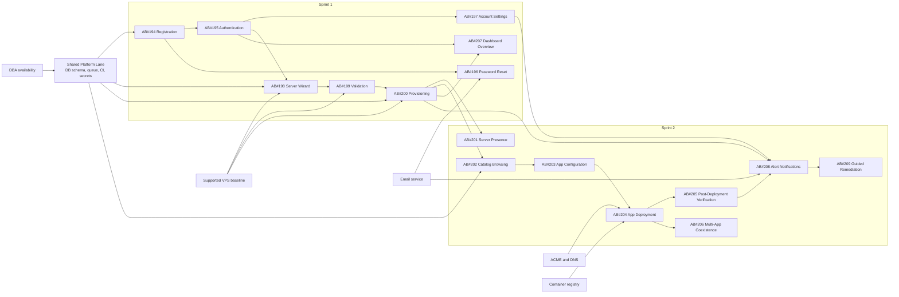
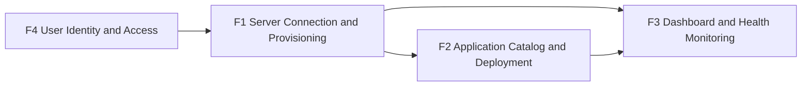

# Dependency Map

## Purpose

This map makes delivery dependencies explicit across stories, features, and external systems for PI-1. It focuses on the first-app path, the health-visibility path, and the shared platform constraints that can create hidden queues or late-sprint pileups.

## Story Dependency Graph

## Feature Dependency Map

### Feature Interpretation

| Feature Edge | Dependency Type | Explanation |
| --- | --- | --- |
| F4 -> F1 | Hard | Server onboarding is a protected, account-scoped flow. |
| F1 -> F2 | Hard | A provisioned server is required before deployment can deliver user value. |
| F1 -> F3 | Hard | Dashboard health data depends on a connected and instrumented server. |
| F2 -> F3 | Soft-to-hard | Dashboard shell can exist earlier, but meaningful app-state visibility and alerts depend on deployment and verification semantics. |

## Dependency Register

| From | To | Level | Strength | Rationale | Bottleneck Risk |
| --- | --- | --- | --- | --- | --- |
| AB#194 | AB#195 | Story | Hard | Authentication requires the user identity and credential base created in registration | Low |
| AB#195 | AB#198 | Story | Hard | Wizard entry is authenticated and tenant-scoped | Medium |
| AB#195 | AB#207 | Story | Hard | Dashboard is behind auth; without protected routes the UI is not usable | Medium |
| AB#198 | AB#199 | Story | Hard | Validation only occurs after a successful connection attempt | Low |
| AB#199 | AB#200 | Story | Hard | Provisioning must not run on unsupported hosts | High |
| AB#200 | AB#202 | Story | Soft | Catalog browsing can render earlier, but deployment flow readiness depends on a healthy server path | Medium |
| AB#200 | AB#207 | Story | Hard for server metrics | Server overview needs monitoring agent and heartbeat data from provisioning | High |
| AB#200 | AB#208 | Story | Hard | Alerting depends on monitoring infrastructure created during provisioning | High |
| AB#202 | AB#203 | Story | Hard | App configuration depends on selecting a catalog item and app definition | Low |
| AB#203 | AB#204 | Story | Hard | Deployment cannot start until config is complete | Medium |
| AB#204 | AB#205 | Story | Hard | Health verification follows deployment | High |
| AB#204 | AB#206 | Story | Hard | Coexistence testing requires at least one completed deployment path | Medium |
| AB#205 | AB#208 | Story | Hard | Alerts need verified health semantics to avoid false positives | High |
| AB#197 | AB#208 | Story | Hard business rule | Alert delivery must respect notification preferences | Medium |
| AB#208 | AB#209 | Story | Hard | Remediation UX requires an active alert model | Low |
| Shared Platform lane | AB#194-AB#209 | Cross-cutting | Hard | Schema, queue, environment, and secrets are upstream of all delivery work | High |

## Critical Path Analysis

### Critical Path A: First Managed Server

`AB#194 -> AB#195 -> AB#198 -> AB#199 -> AB#200 -> AB#207`

This is the Sprint 1 path that proves PI1-O1, PI1-O2, and the first useful slice of PI1-O4. It is critical because every step is sequential and because AB#200 is both the largest story and the main integration seam between BE, DevOps, and FE.

### Critical Path B: First App Live and Verified

`AB#194 -> AB#195 -> AB#198 -> AB#199 -> AB#200 -> AB#202 -> AB#203 -> AB#204 -> AB#205`

This is the end-to-end MVP path for first user value. It crosses every foundational feature except remediation. Any slip in AB#200 or AB#204 directly pushes the PI promise to the right.

### Critical Path C: Operational Trust Loop

`AB#194 -> AB#195 -> AB#197 -> AB#198 -> AB#199 -> AB#200 -> AB#204 -> AB#205 -> AB#208`

This adds the notification preference rule and health verification semantics needed for PI1-O5. It is the longest dependency chain and the most likely path to accumulate hidden wait states.

## Bottlenecks and Queue Risks

| Bottleneck | Why It Matters | Affected Work | Early Signal | Mitigation |
| --- | --- | --- | --- | --- |
| DBA shared lane | Both sprint tracks depend on schema and migration stability | AB#194-AB#200 in Sprint 1, AB#202-AB#204 in Sprint 2 | Schema changes continue after sprint start | Freeze structural changes after early review and treat late schema work as exception-only |
| BE orchestration load | Long-running jobs and integration contracts stack on one discipline | AB#198, AB#199, AB#200, AB#204, AB#205, AB#208 | BE waiting on multiple test or infra feedback cycles | Break orchestration into contract-first increments with earlier integration checkpoints |
| DevOps provisioning support | Provisioning, monitoring, and SSL all rely on infra templates | AB#200, AB#204, AB#208 | Provisioning scripts or containers are still moving mid-sprint | Land baseline templates before feature coding expands |
| Auth.js v5 adoption | New auth framework can delay all protected routes | AB#194, AB#195, AB#198, AB#207 | Login shell is not working by mid-Week 1 | Use a narrow, working auth skeleton first and defer nonessential auth polish |
| Sprint 2 overcommit risk | Planned load exceeds current reliable baseline if all stories are committed | AB#201-AB#209 | Carryover from Sprint 1 or unstable velocity | Keep AB#209 as stretch until Sprint 1 actuals are known |

## External Dependencies

| External Dependency | Consumed By | Dependency Type | Failure Mode | Planning Treatment |
| --- | --- | --- | --- | --- |
| Supported VPS images and SSH reachability | AB#198, AB#199, AB#200 | External platform | Connection failures or unsupported host behavior | Treat support matrix as a planning gate, not a runtime surprise |
| PostgreSQL and Redis baseline | Shared Platform lane, AB#194, AB#200, AB#204 | Technical platform | Auth, queue, and progress tracking instability | Validate environment before parallel coding starts |
| Transactional email service | AB#196, AB#208 | External service | Password resets or alerts cannot complete | Keep email flows thin and observable |
| ACME and DNS propagation | AB#204, AB#205 | External service | SSL issuance or access URL verification fails | Surface as a non-blocking warning where possible, and verify separately |
| Container registry availability | AB#204 | External service | Deployment stalls during image pull | Add retry and human-readable failure states |

## Dependency Management Actions

| Action | Owner | Timing | Intended Effect |
| --- | --- | --- | --- |
| Confirm the AB#207-in-Sprint-1 planning change in PO and SM artifacts | PO, SM | Before Gate 4 | Removes sprint-allocation ambiguity |
| Deliver shared schema and environment baseline before track divergence | DBA, DevOps, TL | Sprint 1 start | Shortens the highest-risk wait state |
| Review AB#200 at mid-sprint as a pacing item | SM, TL, RTE | Sprint 1 midpoint | Prevents silent overflow on the main critical path |
| Keep AB#204 and AB#205 in the same planning horizon | PO, TL | Sprint 2 planning | Avoids a half-complete deployment experience |
| Hold AB#209 as stretch until Sprint 1 actual velocity is known | PO, RTE | Sprint 2 commitment | Preserves PI predictability |

## Workflow Observations

There is a live contradiction between the invocation context and the current draft backlog artifacts about the placement of AB#201 and AB#207, and the invocation context's Sprint 1 total does not match its listed story set. This dependency map follows the explicit story list from the invocation context and should trigger reconciliation in the PO and SM planning artifacts before gate evaluation.

## Research Sources

- [SAFe PI Planning](https://framework.scaledagile.com/pi-planning/) - accessed 2026-03-15
- [SAFe Continuous Delivery Pipeline](https://framework.scaledagile.com/continuous-delivery-pipeline/) - accessed 2026-03-15
