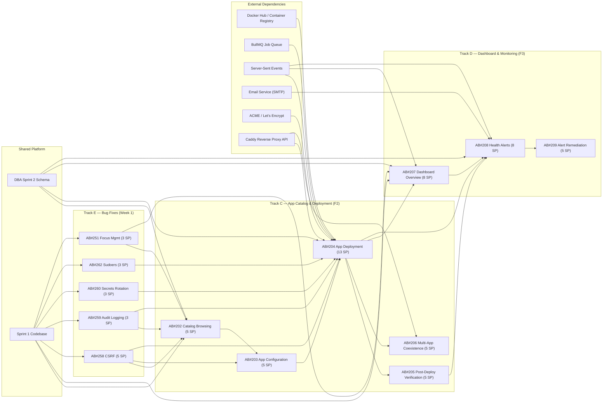
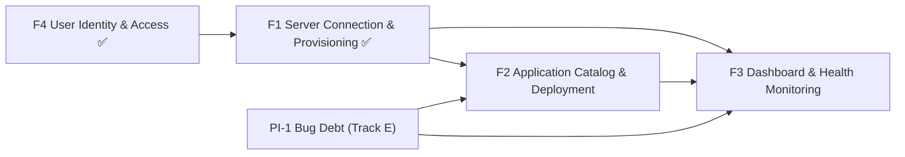
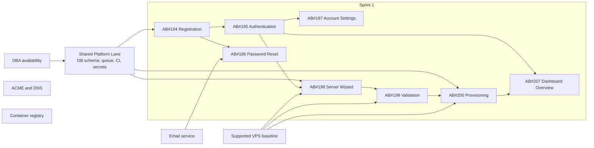

# Dependency Map — PI-2 Sprint 2

## Purpose

This map makes delivery dependencies explicit across stories, bugs, features, and external systems for PI-2 Sprint 2. It covers the 3-track flow (Catalog, Dashboard, Bugs), bug-first sequencing constraints, schema dependencies, cross-track technical dependencies, and external system dependencies.

## Sprint 2 Story Dependency Graph



## Feature Dependency Map



### Feature Interpretation

| Feature Edge | Dependency Type | Explanation |
| --- | --- | --- |
| F4 → F1 | Hard (delivered) | Server onboarding is a protected, account-scoped flow. Delivered in Sprint 1. |
| F1 → F2 | Hard | A provisioned server is required before deployment. Sprint 1 codebase provides SSH service, BullMQ, monitoring agent. |
| F1 → F3 | Hard | Dashboard health data depends on a connected and instrumented server. Sprint 1 delivered dashboard shell (AB#207). |
| F2 → F3 | Soft-to-hard | Dashboard shell exists from Sprint 1. But app-state tiles, deployment SSE patterns, and health verification semantics (S-205) are needed for meaningful alert evaluation (S-208). |
| Bug Debt → F2, F3 | Hard (BR-BF-001) | Security bugs touch middleware and validation layers exercised by F2/F3. Must resolve before feature code on affected paths. |

## Dependency Register — Sprint 2

### Inter-Story Dependencies (Within Tracks)

| From | To | Level | Strength | Rationale | Bottleneck Risk |
| --- | --- | --- | --- | --- | --- |
| AB#202 | AB#203 | Story | Hard | App configuration requires a selected catalog item and its `configSchema` | Low — sequential within Track C |
| AB#203 | AB#204 | Story | Hard | Deployment cannot start until configuration is complete and validated | Medium — S-204 is 13 SP critical path item |
| AB#204 | AB#205 | Story | Hard | Post-deployment health check requires a deployed container to verify | High — S-205 depends on S-204 completion |
| AB#204 | AB#206 | Story | Hard | Multi-app coexistence requires ≥1 completed deployment to test against | Medium — S-206 is P2 safety valve |
| AB#207 | AB#208 | Story | Hard | Alert UI renders within dashboard layout; alert evaluation needs dashboard metrics context | Medium — sequential within Track D |
| AB#208 | AB#209 | Story | Hard | Remediation requires an active alert model and acknowledgement flow | Low — S-209 is P2 safety valve |

### Cross-Track Dependencies

| From | To | Level | Strength | Rationale | Bottleneck Risk |
| --- | --- | --- | --- | --- | --- |
| Track E (all bugs) | Track C + D (all features) | Cross-track | Hard (BR-BF-001) | Security bugs touch middleware (CSRF, audit, secrets rotation) and UI layers (focus management) that F2/F3 exercise. Feature code on affected paths must not merge before bug fixes. | **High** — if any bug slips past Day 3, feature tracks are blocked |
| AB#204 (Track C) | AB#207 (Track D) | Cross-track | Soft-to-hard | Dashboard app tiles need deployment data schema (delivered early by DBA). S-204's SSE patterns are reused by S-207 for live metrics. | **Medium** — DBA delivers schema early; SSE patterns shared after Day 7 review |
| AB#204 SSE patterns (Track C) | AB#208 (Track D) | Cross-track | Hard technical | Alert pipeline uses SSE `alert.created` and `metrics.update` events that mirror S-204's SSE infrastructure | **Medium** — SSE integration review at Day 7 catches issues before S-208 |
| AB#205 (Track C) | AB#208 (Track D) | Cross-track | Hard | Alert evaluation uses health semantics defined in S-205's post-deployment verification (healthy/unhealthy states, stale data threshold) | **Medium** — health vocabulary must be stable before alert thresholds are evaluated |
| AB#197 (Sprint 1) | AB#208 (Track D) | Cross-sprint rule | Hard business rule | Alert email must respect notification preferences set in Sprint 1's Account Settings | Low — notification contract landed in Sprint 1 |

### Schema Dependencies (DBA → BE → FE)

| Schema Entity | DBA Delivers | BE Consumes | FE Consumes | Affected Stories |
| --- | --- | --- | --- | --- |
| `catalog_apps` table | Day 1-2 | Catalog router (S-202), deploy validation (S-204) | Catalog browsing UI (S-202), config wizard (S-203) | AB#202, AB#203, AB#204 |
| `deployments` table | Day 1-2 | Deploy state machine (S-204), deployment list (S-202), post-deploy check (S-205), multi-app queries (S-206) | Deploy progress UI (S-204), post-deploy UI (S-205), multi-app UI (S-206) | AB#204, AB#205, AB#206 |
| `alerts` table | Day 1-2 | Alert evaluation (S-208), alert dismiss (S-208), alert list (S-208), remediation queries (S-209) | Alert UI (S-208), remediation UI (S-209) | AB#208, AB#209 |
| `metrics_snapshots` extension | Day 1-2 | Dashboard aggregation (S-207), metrics time-series query (S-207), alert threshold evaluation (S-208) | Dashboard gauges (S-207) | AB#207, AB#208 |
| `audit_log` extension | Day 1-2 (for B-259) | Audit log service extension (B-259), new F2/F3 operation logging | Audit log view (B-259) | AB#259, all F2/F3 operations |
| Catalog seed data (≥15 apps) | Day 2-3 | Catalog list/get queries (S-202) | Catalog browsing UI (S-202) | AB#202 |
| Indexes | Day 2-3 | All query patterns | — | Performance for all Sprint 2 queries |

**Schema dependency chain:** `DBA (schema Days 1-2) → BE (consumes from Day 2) → FE (consumes via BE API from Day 3)`

**Schema risk mitigation:** DBA delivers complete Sprint 2 schema as additive tables (no PI-1 table modifications except audit_log extension for B-259). TL reviews migration at Day 2. Late schema changes are exception-only (per Sprint 1 lesson).

### Bug-First Dependencies (BR-BF-001)

| Bug | Affected Code Paths | Must Merge Before | Impact on Feature Code |
| --- | --- | --- | --- |
| AB#258 (CSRF) | All state-changing tRPC mutations, Server Actions | S-202 (catalog mutations if any), S-203 (config save), S-204 (deployment create), S-207 (any server mutations) | F2/F3 mutations must include CSRF token from the start |
| AB#259 (Audit Logging) | tRPC context, server operation handlers, all destructive operations | S-202 (catalog), S-204 (deploy/stop/start/remove), S-208 (alert dismiss) | F2/F3 operations must call audit log service from the start (BR-BF-003) |
| AB#260 (Secrets Rotation) | SSH key management, API token issuance, monitoring agent auth | S-204 (SSH-based deployment), S-207 (monitoring agent data) | Deployment must use rotation-safe key handling |
| AB#262 (Sudoers) | VPS file permissions, SSH operations | S-204 (SSH-based deployment on VPS) | Deployment SSH operations execute on properly-secured VPS |
| AB#251 (Focus Management) | Route transition handlers, dynamic content insertion | S-202 (catalog browsing = route transitions), S-207 (dashboard navigation) | F2/F3 route transitions use fixed focus management from the start |

**Enforcement rule:** No feature code PR may merge to `feat/pi-2-sprint-2` that modifies code paths listed above until the corresponding bug fix is merged. Day 3 bug review checkpoint verifies compliance.

## External Dependencies — Sprint 2

| External Dependency | Consumed By | Dependency Type | Failure Mode | Planning Treatment |
| --- | --- | --- | --- | --- |
| Docker Hub / Container Registry | AB#204 (image pull during deployment) | Runtime external | Image pull failure, rate limit, registry outage → deployment stalls | Retry with backoff in deploy job; graceful error messaging (R25); image digest pinning (NFR-018) |
| BullMQ Job Queue | AB#204 (deploy-app job), AB#208 (alert email DLQ) | Technical platform | Job processing failure, queue stall → deployment stuck or alert email lost | Established in Sprint 1 provisioning job; DLQ for failed alert emails; job resume-from-failure (R14) |
| Server-Sent Events (SSE) | AB#204 (deployment progress), AB#207 (live metrics), AB#208 (alert created) | Technical platform | SSE connection drop → stale UI data | Fallback to polling (NFR-017); reconnection with backoff; SSE integration review Day 7 |
| Email Service (SMTP) | AB#208 (alert email dispatch) | External service | Email delivery failure → missed alert notifications | DLQ with max 3 retries; delivery tracking on alert record; extends Sprint 1 email service |
| ACME / Let's Encrypt | AB#204 (SSL provisioning for deployed apps) | External service | Certificate issuance failure → HTTPS unreachable | Caddy handles ACME automatically; DNS pre-check in deploy flow (FR-F2-114); non-blocking warning |
| Caddy Reverse Proxy API | AB#204 (route creation), AB#206 (multi-app routing) | Technical platform | Misroute, config conflict → deployed app unreachable | `@id` matching for route management (§3.4); config rollback on failure; R18 mitigation |
| PostgreSQL 17 | DBA schema, all BE queries | Technical platform | Migration failure, query performance → sprint blocked | Additive schema only; migration tested against Sprint 1 snapshot; R23 mitigation |
| VPS SSH connectivity | AB#204 (remote Docker operations), AB#260 (key rotation) | External platform | SSH timeout, connection refused → deployment failure | Sprint 1 established SSH patterns; idempotent state machine with per-step rollback (R14) |

## Critical Path Analysis — Sprint 2

### Critical Path: First App Deployed and Monitored

```
DBA (schema, Days 1-2) 
  → BE (bug fixes B-258/B-259/B-260, Days 1-3)
    → BE (catalog router S-202, Days 3-5) 
      → BE (config API S-203, Days 4-6)
        → BE (deploy job S-204, Days 5-8) 
          → FE (deploy progress UI S-204, Days 7-8) 
            → BE (dashboard query S-207, Days 5-8)
              → FE (dashboard UI S-207, Days 6-8)
                → BE (alert eval S-208, Days 8-9) 
                  → FE (alert UI S-208, Days 8-9)
```

**Critical path length:** ~9 working days out of 10 — minimal float.

**Critical path gating items:**
1. **DBA schema (Days 1-2)** — gates all 3 tracks
2. **Bug fixes (Days 1-3)** — gates F2/F3 feature code on affected paths
3. **AB#204 deploy job (Days 5-8)** — 13 SP, largest story, gates M4 + Track D SSE reuse
4. **AB#208 alert eval (Days 8-9)** — multi-component (DBA + BE + FE + DevOps), gates M5

### Critical Path: Security Debt Resolution

```
Sprint 1 codebase
  → BE: B-258 CSRF (Days 1-2)
  → BE: B-259 Audit Logging (Days 1-2)
  → BE: B-260 Secrets Rotation (Days 2-3)
  → DevOps: B-262 Sudoers (Days 1-2)
  → FE: B-251 Focus Management (Days 1-2)
  → Day 3 Bug Review Checkpoint (M7)
```

All 5 bugs are independent of each other (no inter-bug dependencies). They run in parallel across BE, FE, and DevOps, converging at the Day 3 review checkpoint.

### Critical Path: Dashboard → Alerts → Remediation (Track D)

```
Sprint 1 metrics foundation + DBA metrics schema
  → BE: Dashboard aggregation S-207 (Days 4-7)
    → FE: Dashboard UI S-207 (Days 5-8)
      → BE: Alert evaluation S-208 (Days 8-9) 
        → FE: Alert UI S-208 (Days 8-9)
          → BE: Guided remediation S-209 (Days 9-10)
            → FE: Remediation UI S-209 (Day 10)
```

Track D depends on S-204's SSE patterns (cross-track). If SSE review at Day 7 reveals issues, Track D S-208/S-209 are at risk.

## Bottlenecks and Queue Risks — Sprint 2

| Bottleneck | Why It Matters | Affected Work | Early Signal | Mitigation |
| --- | --- | --- | --- | --- |
| DBA shared schema | All 3 tracks depend on schema stability before feature code starts | All Sprint 2 stories | Schema not reviewed by Day 2 | Front-load schema Days 1-2; TL reviews migration; additive only |
| BE orchestration load | BE handles all 3 security bugs (Week 1) + 8 stories (Week 1-2) across both tracks | B-258, B-259, B-260, S-202–S-209 | BE not completing 3 bugs by Day 3 | Bug-first prioritization; bugs are bounded-scope with specific AC from SEC audit |
| SSE infrastructure novelty | First use of SSE for real-time UI; shared by S-204 (deployment progress), S-207 (live metrics), S-208 (alert events) | AB#204, AB#207, AB#208 | SSE integration not working at Day 7 review | Fallback to polling (NFR-017); Day 7 SSE integration review |
| DevOps multi-role | DevOps handles sudoers fix (B-262) + Caddy route automation (S-204) + monitoring extensions (S-207) + deploy pipeline (S-204) + alert email infra (S-208) | B-262, S-204, S-207, S-208 | DevOps blocked on multiple concurrent concerns | Bug fix first (Day 1), then Caddy/deploy pipeline, then monitoring/email |
| Bug-to-feature handoff | Day 3 bug review is a hard gate. Feature code on affected paths cannot proceed if bugs are unresolved | All F2/F3 stories on affected code paths | Any bug unresolved at Day 3 | Escalate to PO; bugs have bounded AC from SEC/A11Y audit; scope creep triggers escalation |

## Dependency Management Actions — Sprint 2

| Action | Owner | Timing | Intended Effect |
| --- | --- | --- | --- |
| DBA delivers complete Sprint 2 schema (catalog + deployment + alert + metrics) | DBA + TL | Days 1-2 | Unblocks all 3 tracks for feature implementation |
| Bug review checkpoint — all 5 deferred bugs resolved | TL + all code agents | Day 3 | M7 milestone met; feature tracks unblocked |
| SSE integration review — end-to-end event pipeline verified | BE + FE + TL | Day 7 | S-204 deployment progress works; patterns validated for S-207/S-208 reuse |
| Deployment pipeline review — state machine + rollback + health checks | BE + DevOps + TL | Day 8 | M4 milestone on track; S-204 functionality verified |
| P2 descope decision — assess velocity and risk | PO + SM | Day 7 | Protect P1 commitment; descope S-209 first, then S-206, then S-205 |
| Integration merge — all sub-branches mergeable to feature branch | TL | Days 5 (Week 1 checkpoint) + Day 10 (final) | Avoid late-integration surprise conflicts |
| Alert email infra availability — SMTP config, DLQ setup | DevOps | Day 8 | S-208 alert email dispatch has infrastructure ready |

---

## PI-1 Dependency Map — Historical Reference

> The following Sprint 1 dependency map is retained as historical reference. Sprint 1 delivered 8/8 stories with all dependencies satisfied.

### Sprint 1 Story Dependency Graph



### Sprint 1 Dependency Register

| From | To | Level | Strength | Rationale | Outcome |
| --- | --- | --- | --- | --- | --- |
| AB#194 | AB#195 | Story | Hard | Authentication requires user model from registration | ✅ Delivered |
| AB#195 | AB#198 | Story | Hard | Server wizard is a protected route | ✅ Delivered |
| AB#195 | AB#207 | Story | Hard | Dashboard is behind auth | ✅ Delivered |
| AB#198 | AB#199 | Story | Hard | Validation after connection attempt | ✅ Delivered |
| AB#199 | AB#200 | Story | Hard | Provisioning on validated hosts only | ✅ Delivered |
| AB#200 | AB#207 | Story | Hard | Dashboard needs monitoring agent data | ✅ Delivered |
| AB#197 | AB#208 | Cross-sprint | Hard business rule | Notification preferences for alert email | Carried to Sprint 2 |
| Shared Platform | All | Cross-cutting | Hard | Schema, queue, env underpin all stories | ✅ Delivered |

## Research Sources

- [SAFe PI Planning](https://framework.scaledagile.com/pi-planning/) - accessed 2026-03-15, 2026-03-16
- [SAFe Continuous Delivery Pipeline](https://framework.scaledagile.com/continuous-delivery-pipeline/) - accessed 2026-03-15, 2026-03-16

- [SAFe PI Planning](https://framework.scaledagile.com/pi-planning/) - accessed 2026-03-15
- [SAFe Continuous Delivery Pipeline](https://framework.scaledagile.com/continuous-delivery-pipeline/) - accessed 2026-03-15
