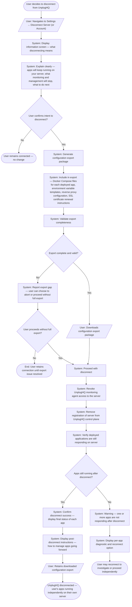
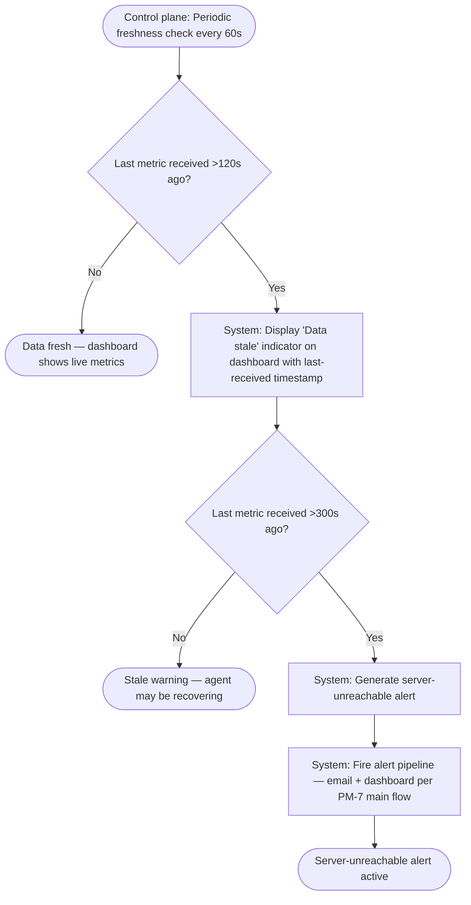
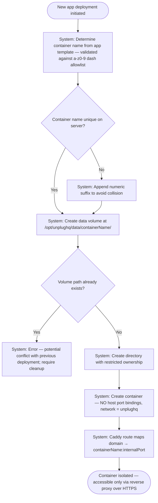

# Process Models

## Overview

This document contains BPMN-style process models for the core user journeys defined in the Product Vision. Each model depicts the "to-be" future-state process — the experience UnplugHQ enables for non-technical users. Models use Mermaid flowchart syntax representing swim-lane activity diagrams with gateways, error paths, and system/user participant boundaries.

**PI-1 models** (PM-1 through PM-5) cover the five foundational user journeys. **PI-2 models** (PM-6 through PM-8) detail the implementation-level processes for app deployment, health monitoring, and multi-app management.

**Upstream reference:** [Product Vision](product-vision.md) · [Requirements](requirements.md) · [API Contracts](api-contracts.md)

---

## Modeling Conventions

- **Rounded rectangles / process nodes**: Activities performed by an actor
- **Diamond gateways (`{decision}`)**:  Decision points or conditions
- **Oval terminal nodes (`([text])`)**: Start and end events
- **Actor labels in italics**: User = non-technical UnplugHQ user; System = UnplugHQ platform; External = third-party or server-side action
- **Happy path**: Left-to-right or top-to-bottom, primary flow
- **Exception paths**: Branch to the right or bottom, labelled with the failure condition

---

## PI-1 Process Models (Delivered — Historical Reference)

---

## PM-1: First-Time Server Connection and Application Deployment (UJ1)

> **Business context:** The core value-delivery journey for UnplugHQ. A user with no terminal experience arrives at UnplugHQ, creates an account, connects a VPS, selects a self-hosted application from the catalog, and ends with a running application accessible at their own domain — without touching a terminal. This is the "aha moment" of the entire product.
>
> **Success metric:** Time from sign-up to first running app < 15 minutes (SC1)

---

## PM-2: Adding a Second Application to an Existing Server (UJ2)

> **Business context:** Represents the expansion pattern for returning users. This journey validates that UnplugHQ can manage multi-app servers without disrupting existing deployments. The system must detect the existing reverse proxy configuration and integrate the new application routing seamlessly.
>
> **Success metric:** Second app deployment < 5 minutes (feature roadmap metric)

---

## PM-3: Handling an Application Update (UJ3)

> **Business context:** Represents the ongoing maintenance lifecycle for deployed apps. UnplugHQ's core operational-maturity promise — apps stay updated with zero user-triggered downtime. This journey includes the safety-critical pre-update backup and automatic rollback paths.
>
> **Success metric:** Zero user-caused data loss from updates (SC4) — planned for PI-2 as F5

---

## PM-4: Responding to a Health Alert (UJ4)

> **Business context:** This journey covers the routine health-monitoring response loop. UnplugHQ must convert infrastructure signals into guided, non-technical actions — so a user who receives a disk usage alert can resolve it in under 10 minutes without any server knowledge.
>
> **Success metric:** Alert-to-resolution time < 10 minutes for guided issues (SC4 proxy)

---

## PM-5: Disconnecting from UnplugHQ (UJ5)

> **Business context:** The trust-building journey. A user who chooses to stop using UnplugHQ must be able to do so without losing access to their self-hosted applications. This journey enforces the "no vendor lock-in" constraint from the Product Vision and validates SC6.
>
> **Success metric:** Zero data loss during export; apps operational post-disconnect (SC6)

---

## Process Model Summary

| Model ID | User Journey | Core Business Value | Key Risk Handled |
|----------|-------------|--------------------|--------------------|
| PM-1 | UJ1 – First-Time Setup | Delivers the primary product promise from zero to first running app | R1 (SSH compatibility), R5 (security), R12 (DNS/SSL) |
| PM-2 | UJ2 – Adding a Second App | Confirms multi-app server management without disruption | R2 (provisioning drift), R4 (dashboard noise) |
| PM-3 | UJ3 – Handling an Update | Automated maintenance with zero-downtime safety net | R4 (update trust), SC4 (zero data loss) |
| PM-4 | UJ4 – Responding to an Alert | Health visibility translates to guided non-technical resolution | R4 (health signal accuracy), SC7 |
| PM-5 | UJ5 – Migrating Away | Validates no vendor lock-in; builds long-term user trust | R6 (data sovereignty), SC5, SC6 |

---

## PI-2 Process Models (Sprint 2 — Active)

---

## PM-6: App Deployment Lifecycle (F2 — Catalog Browse → Configure → Deploy → Verify → Monitor)

> **Business context:** Details the complete app deployment state machine from catalog selection through post-deployment monitoring. This is the PI-2 implementation-level refinement of the deployment portion of PM-1 and PM-2, aligning with the BullMQ job pipeline, SSE progress events, and API contracts.
>
> **Stories:** AB#202 (Catalog Browsing), AB#203 (Guided Config), AB#204 (Deployment + Progress), AB#205 (Post-Deploy Verification)
> **Risk mitigations:** R13 (app template extensibility), R14 (remote Docker orchestration), R18 (Caddy routing), R20 (supply chain), R25 (Docker Hub availability)
> **Success metrics:** First app deployment <15 min (SC1); ≤5 config steps (PI2-O2)

```mermaid
flowchart TD
    A([User navigates to App Catalog]) --> B[System: Load catalog entries via app.catalog.list]
    B --> C[/"User: Browses categories, searches by name"/]
    C --> D[/"User: Selects an app from catalog"/]
    D --> E[System: Load app detail via app.catalog.get including configSchema]
    E --> F[System: Display app detail page — description, resource requirements, upstream link]
    F --> G{User clicks 'Install This App'?}
    G -- No --> C
    G -- Yes --> H{User has a connected server?}
    H -- No --> I[System: Redirect to Add Server flow — PM-1]
    I --> J([End: User must connect a server first])
    H -- Yes --> K{Multiple servers connected?}
    K -- Yes --> L[/"User: Selects target server from list"/]
    K -- No --> M[System: Auto-select single server]
    L --> N[System: Pre-deployment resource check]
    M --> N
    N --> O{Server has sufficient resources?}
    O -- No --> P[System: Display resource warning — name bottleneck CPU/RAM/disk]
    P --> Q{User acknowledges and proceeds?}
    Q -- No --> C
    Q -- Yes --> R[System: Generate guided configuration form from configSchema]
    O -- Yes --> R
    R --> S[/"User: Fills in configuration — domain, admin email, app-specific fields"/]
    S --> T[System: Validate inputs against configSchema]
    T --> U{Inputs valid?}
    U -- No --> V[System: Highlight invalid fields with inline guidance]
    V --> S
    U -- Yes --> W[System: DNS pre-check — does domain resolve to server IP?]
    W --> X{DNS resolves correctly?}
    X -- No --> Y[System: Display DNS warning — domain not yet pointing to server IP]
    X -- Yes --> Z[System: Display deployment summary screen]
    Y --> Z
    Z --> AA{User confirms deployment?}
    AA -- No --> C
    AA -- Yes --> AB[System: Call app.deployment.create — enqueue deploy-app BullMQ job]
    AB --> AC[System: Job state = pending → pulling]
    AC --> AD[System: SSE event deployment.progress — 'Downloading your app']
    AD --> AE[System: Pull container image by pinned digest via SSH]
    AE --> AF{Image pull successful?}
    AF -- No --> AG[System: Job state → failed; cleanup; display Docker Hub error with retry option]
    AG --> AH([End: Image pull failed — R25 mitigation])
    AF -- Yes --> AI[System: Job state = pulling → configuring]
    AI --> AJ[System: SSE event — 'Setting up your app']
    AJ --> AK[System: Write env file to VPS via SFTP with 600 permissions]
    AK --> AL[System: Create container on unplughq Docker network with --env-file]
    AL --> AM[System: Job state = configuring → provisioning-ssl]
    AM --> AN[System: SSE event — 'Securing your connection']
    AN --> AO[System: Add Caddy route via Admin API — POST route with @id]
    AO --> AP{Caddy route + SSL certificate issued?}
    AP -- No --> AQ[System: Job state → failed; remove container + Caddy route; display SSL guidance]
    AQ --> AR([End: SSL/routing failed — R12, R18 mitigation])
    AP -- Yes --> AS[System: Job state = provisioning-ssl → starting]
    AS --> AT[System: SSE event — 'Starting your app']
    AT --> AU[System: Start container via SSH docker start]
    AU --> AV[System: Run post-deployment health check — HTTP GET to domain, 3 retries, 20s timeout]
    AV --> AW{Health check passes?}
    AW -- No --> AX[System: Job state → failed; flag in dashboard; display guided next steps]
    AX --> AY([End: Health check failed — FR-F2-115])
    AW -- Yes --> AZ[System: Job state = starting → running]
    AZ --> BA[System: SSE event — 'Your app is ready!']
    BA --> BB[System: Store accessUrl; add app tile to dashboard; write audit log entry]
    BB --> BC[System: Begin ongoing monitoring — agent metrics include new container]
    BC --> BD([User clicks access link — app is live ✨])
```

---

## PM-7: Health Check and Alerting Pipeline (F3 — Agent Push → Process → Threshold Check → Alert → Notify → Remediate)

> **Business context:** Details the end-to-end health monitoring pipeline from metric collection on the user's VPS through threshold evaluation, alert generation, email notification, and guided remediation. This is the PI-2 implementation-level refinement of PM-4 (Responding to an Alert).
>
> **Stories:** AB#207 (Dashboard Overview), AB#208 (Health Alerts), AB#209 (Alert Remediation)
> **Risk mitigations:** R15 (health monitoring latency), R17 (alert pipeline reliability), R21 (agent privileges)
> **Success metrics:** Alert delivery <5 min (FR-F3-006); ≥99.5% accuracy (SC7); alert-to-resolution <10 min (UJ4)

```mermaid
flowchart TD
    A([Monitoring agent running on user's VPS]) --> B[Agent: Collect server metrics — CPU, RAM, disk, network]
    B --> C[Agent: Enumerate containers via docker ps — collect per-container status + disk usage]
    C --> D[Agent: Build MetricsSnapshot payload]
    D --> E[Agent: POST /api/agent/metrics with per-server API token]
    E --> F{Control plane: Token valid?}
    F -- No --> G[Control plane: Return 401 UNAUTHENTICATED]
    G --> H([Agent: Log auth failure; retry with backoff])
    F -- Yes --> I{Control plane: Rate limit check — ≤2 req/60s?}
    I -- No --> J[Control plane: Return 429 RATE_LIMITED]
    J --> K([Agent: Back off; retry at next interval])
    I -- Yes --> L{Control plane: Strict Zod parse — MetricsSnapshot valid?}
    L -- No --> M[Control plane: Return 400 VALIDATION_ERROR]
    M --> N([Agent: Log validation failure])
    L -- Yes --> O[Control plane: Validate serverId matches token-bound server]
    O --> P{Server ID matches?}
    P -- No --> Q[Control plane: Return 403 FORBIDDEN]
    P -- Yes --> R[Control plane: Store metrics snapshot]
    R --> S[Control plane: Check data freshness — last metric timestamp]
    S --> T[Control plane: Push metrics.update SSE event to connected dashboard clients]
    T --> U{Evaluate alert thresholds}

    U --> V{CPU > 90% sustained 5 min?}
    V -- Yes --> W[System: Generate cpu-critical alert]
    V -- No --> X{RAM > 90%?}
    X -- Yes --> Y[System: Generate ram-critical alert]
    X -- No --> Z{Disk > 85%?}
    Z -- Yes --> AA[System: Generate disk-critical alert]
    Z -- No --> AB{Any container status ≠ running for >60s?}
    AB -- Yes --> AC[System: Generate app-unavailable alert for affected app]
    AB -- No --> AD([Continue monitoring — no alert condition])

    W --> AE[System: Store alert record with severity and type]
    Y --> AE
    AA --> AE
    AC --> AE
    AE --> AF[System: Push alert.created SSE event to dashboard]
    AF --> AG{User has email notifications enabled?}
    AG -- No --> AH[System: Dashboard alert only — no email]
    AG -- Yes --> AI[System: Compose alert email — type, severity, server/app, threshold, current value, dashboard link, remediation hints]
    AI --> AJ[System: Send email via shared email service]
    AJ --> AK{Email sent successfully?}
    AK -- No --> AL[System: Enqueue to dead-letter queue — retry up to 3 times with backoff]
    AL --> AM[System: Update alert record — notificationSent = false, track retry count]
    AK -- Yes --> AN[System: Update alert record — notificationSent = true]
    AM --> AN

    AN --> AO[/"User: Opens dashboard in response to notification or routine check"/]
    AH --> AO
    AO --> AP[/"User: Reviews alert detail — expanded view with metrics, threshold, remediation options"/]
    AP --> AQ{Alert type?}

    AQ -- app-unavailable --> AR[System: Offer 'Restart App' one-click action]
    AR --> AS[/"User: Clicks 'Restart App'"/]
    AS --> AT[System: Call app.deployment.start — docker start via SSH]
    AT --> AU[System: Post-restart health check]
    AU --> AV{App healthy after restart?}
    AV -- Yes --> AW[System: Auto-resolve alert; update status to running]
    AV -- No --> AX[System: Display failure with next-level guidance]

    AQ -- disk-critical --> AY[System: Display per-app disk usage breakdown]
    AY --> AZ[System: Suggest remediation — identify large apps, clean up, expand storage]
    AZ --> BA[/"User: Takes guided action"/]
    BA --> BB[System: Re-check disk condition on next metric push]
    BB --> BC{Condition resolved?}
    BC -- Yes --> BD[System: Clear alert; update dashboard]
    BC -- No --> BE[System: Display updated state; offer escalation]

    AQ -- cpu-critical / ram-critical --> BF[System: Display per-app resource contribution]
    BF --> BG[System: Suggest stopping low-priority app or upgrading server]
    BG --> BH[/"User: Takes guided action"/]
    BH --> BI[System: Re-check resource condition on next metric push]
    BI --> BJ{Condition resolved?}
    BJ -- Yes --> BK[System: Clear alert]
    BJ -- No --> BL[System: Escalation guidance]

    AP --> BM{User dismisses alert?}
    BM -- Yes --> BN[System: Call monitor.alerts.dismiss — alert moves to Recent]
    BN --> BO([Alert dismissed — will only re-trigger if condition clears and reoccurs])

    AW --> BP([Alert resolved — dashboard healthy])
    BD --> BP
    BK --> BP
```

### Health Data Freshness Sub-Process

---

## PM-8: Multi-App Management (F2 — Add App → Resource Check → Deploy Alongside Existing → Update Reverse Proxy)

> **Business context:** Details the multi-app coexistence process, focusing on the resource contention, port isolation, reverse proxy integration, and cross-app health verification challenges that arise when a user has 2+ apps on a single server. This refines PM-2 (Adding a Second App) with implementation-level detail.
>
> **Stories:** AB#206 (Multi-App Coexistence)
> **Risk mitigations:** R16 (resource contention), R18 (Caddy routing complexity)
> **Success metrics:** ≥3 apps on one server (PI2-O3); zero routing conflicts; resource allocation visible per app

```mermaid
flowchart TD
    A([User has ≥1 app running on their server]) --> B[/"User: Clicks 'Add App' from dashboard"/]
    B --> C[System: Load catalog — app.catalog.list]
    C --> D[/"User: Selects new app from catalog"/]
    D --> E[System: Load app template — check resource requirements]

    E --> F[System: Query latest server metrics — current CPU, RAM, disk usage]
    F --> G[System: Query deployed apps — app.deployment.list for target server]
    G --> H[System: Calculate aggregate resource usage — existing apps + new app requirements]
    H --> I{Aggregate resources < 80% capacity?}
    I -- Yes --> J[System: Resources sufficient — proceed to configuration]
    I -- No, 80-99% --> K[System: Display resource warning — aggregate usage will be high]
    K --> L{User acknowledges resource warning?}
    L -- No --> M([User defers — browses lighter alternatives])
    L -- Yes --> J
    I -- No, >100% --> N[System: Display resource insufficient error — not enough CPU/RAM/disk for this app]
    N --> O[System: Suggest: stop an existing app, choose a lighter app, or upgrade server]
    O --> M

    J --> P[System: Generate guided configuration form from app template]
    P --> Q[/"User: Configures new app — domain, settings"/]
    Q --> R[System: Validate domain is unique — not already bound to another app on this server]
    R --> S{Domain unique?}
    S -- No --> T[System: Error — this domain is already in use by another app]
    T --> Q
    S -- Yes --> U[System: Display deployment summary — including list of existing apps that will continue running]
    U --> V{User confirms deployment?}
    V -- No --> C
    V -- Yes --> W[System: Enqueue deploy-app job — same pipeline as PM-6]

    W --> X[System: Deploy new container on unplughq Docker network]
    X --> Y[System: Add new Caddy route via Admin API — POST with unique @id]
    Y --> Z{New route + SSL provisioned without disrupting existing routes?}
    Z -- No --> AA[System: Rollback new route; remove new container; report Caddy conflict]
    AA --> AB([End: Routing conflict — investigate and retry])
    Z -- Yes --> AC[System: Start new container]
    AC --> AD[System: Health check new app — HTTP GET to new domain]
    AD --> AE{New app healthy?}
    AE -- No --> AF[System: Flag new deployment as failed; existing apps unaffected]
    AF --> AG([End: New app failed — existing apps remain healthy])
    AE -- Yes --> AH[System: Cross-verify existing apps — health check all running apps]
    AH --> AI{All existing apps still healthy?}
    AI -- No --> AJ[System: Alert — existing app impacted after new deployment]
    AJ --> AK[System: Display impacted app details; suggest rollback of new deployment]
    AK --> AL([User investigates — may remove new app to restore stability])
    AI -- Yes --> AM[System: Update dashboard — all apps visible with individual status tiles]
    AM --> AN[System: Update per-app resource tracking — new container included in metrics]
    AN --> AO[System: Write audit log — new app deployed alongside N existing apps]
    AO --> AP([Dashboard shows all apps healthy — multi-app coexistence confirmed ✅])
```

### Port and Volume Isolation Model

---

## Process Model Summary

### PI-1 Process Models

| Model ID | User Journey | Core Business Value | Key Risk Handled |
|----------|-------------|--------------------|--------------------|
| PM-1 | UJ1 – First-Time Setup | Delivers the primary product promise from zero to first running app | R1 (SSH compatibility), R5 (security), R12 (DNS/SSL) |
| PM-2 | UJ2 – Adding a Second App | Confirms multi-app server management without disruption | R2 (provisioning drift), R4 (dashboard noise) |
| PM-3 | UJ3 – Handling an Update | Automated maintenance with zero-downtime safety net | R4 (update trust), SC4 (zero data loss) |
| PM-4 | UJ4 – Responding to an Alert | Health visibility translates to guided non-technical resolution | R4 (health signal accuracy), SC7 |
| PM-5 | UJ5 – Migrating Away | Validates no vendor lock-in; builds long-term user trust | R6 (data sovereignty), SC5, SC6 |

### PI-2 Process Models

| Model ID | Feature | Core Business Value | Key Risk Handled |
|----------|---------|--------------------|--------------------|
| PM-6 | F2 – App Deployment Lifecycle | Full deployment state machine from catalog to monitoring | R13 (app template), R14 (Docker orchestration), R18 (Caddy), R20 (supply chain), R25 (Docker Hub) |
| PM-7 | F3 – Health Check & Alerting Pipeline | End-to-end monitoring from agent push through alert email and remediation | R15 (monitoring latency), R17 (alert pipeline), R21 (agent privileges) |
| PM-8 | F2 – Multi-App Management | Resource-aware multi-app deployment with isolation and cross-app verification | R16 (resource contention), R18 (Caddy routing complexity) |
