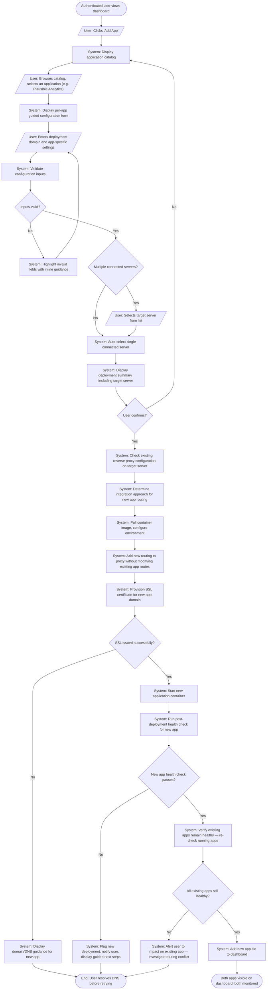
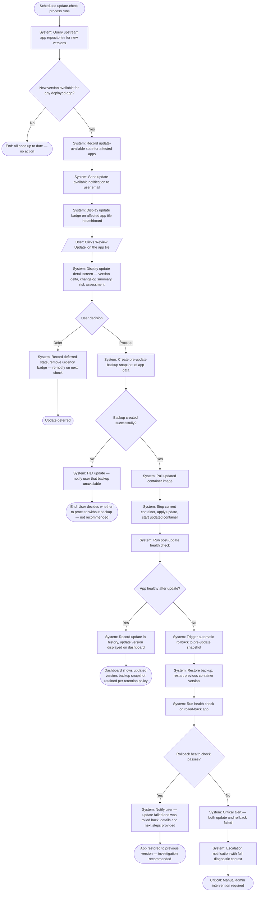
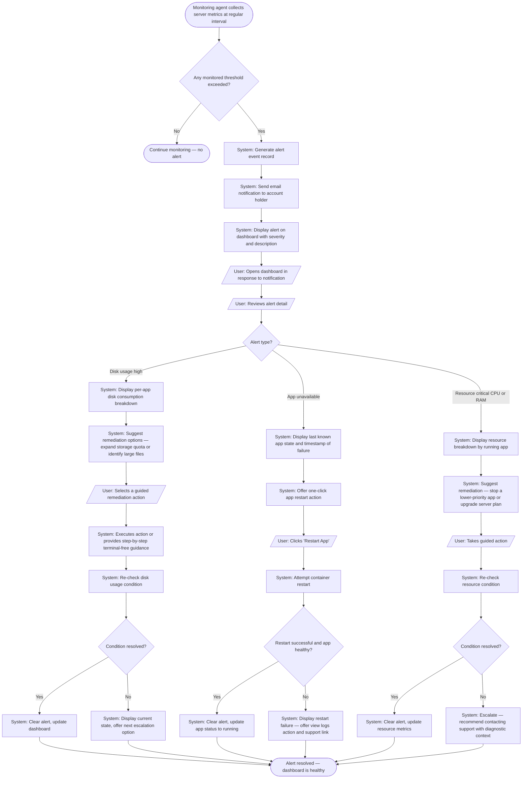

# Process Models

## Overview

This document contains BPMN-style process models for the five core user journeys defined in the Product Vision. Each model depicts the "to-be" future-state process — the experience UnplugHQ enables for non-technical users. Models use Mermaid flowchart syntax representing swim-lane activity diagrams with gateways, error paths, and system/user participant boundaries.

**Upstream reference:** [Product Vision](product-vision.md)

---

## Modeling Conventions

- **Rounded rectangles / process nodes**: Activities performed by an actor
- **Diamond gateways (`{decision}`)**:  Decision points or conditions
- **Oval terminal nodes (`([text])`)**: Start and end events
- **Actor labels in italics**: User = non-technical UnplugHQ user; System = UnplugHQ platform; External = third-party or server-side action
- **Happy path**: Left-to-right or top-to-bottom, primary flow
- **Exception paths**: Branch to the right or bottom, labelled with the failure condition

---

## PM-1: First-Time Server Connection and Application Deployment (UJ1)

> **Business context:** The core value-delivery journey for UnplugHQ. A user with no terminal experience arrives at UnplugHQ, creates an account, connects a VPS, selects a self-hosted application from the catalog, and ends with a running application accessible at their own domain — without touching a terminal. This is the "aha moment" of the entire product.
>
> **Success metric:** Time from sign-up to first running app < 15 minutes (SC1)

```mermaid
flowchart TD
    A([User visits UnplugHQ]) --> B[/"User: Sign up with email + password"/]
    B --> C{Email format valid?}
    C -- No --> B
    C -- Yes --> D[System: Create account, send verification email]
    D --> E[/"User: Click verification link in email"/]
    E --> F{Link valid and not expired?}
    F -- No / Expired --> G[System: Offer to resend verification]
    G --> D
    F -- Yes --> H[System: Activate account, redirect to onboarding]
    H --> I[/"User: Select 'Add Server'"/]
    I --> J[/"User: Choose VPS provider from list"/]
    J --> K[System: Display provider-specific SSH key setup instructions with visuals]
    K --> L[/"User: Generate SSH key and add public key to VPS provider panel"/]
    L --> M[/"User: Enter server IP address"/]
    M --> N{IP format valid?}
    N -- No --> M
    N -- Yes --> O[System: Test SSH connectivity and authentication]
    O --> P{Connection successful?}
    P -- No --> Q[System: Display diagnostic message with actionable guidance]
    Q --> R[/"User: Resolve connectivity issue"/]
    R --> O
    P -- Yes --> S[System: Detect OS, measure CPU / RAM / disk]
    S --> T[System: Evaluate server compatibility against supported baseline]
    T --> U{Server compatible?}
    U -- Unsupported --> V[System: Display unsupported reason; halt provisioning]
    V --> W([End: User must resolve before continuing])
    U -- Partially supported --> X[System: Display compatibility warning]
    X --> Y{User confirms proceeding?}
    Y -- No --> W
    Y -- Yes --> Z[System: Begin automated base provisioning]
    U -- Supported --> Z
    Z --> AA[System: Install container runtime, reverse proxy, monitoring agent]
    AA --> AB{Provisioning successful?}
    AB -- No --> AC[System: Report failure, clean up partial state]
    AC --> W
    AB -- Yes --> AD[System: Server appears in dashboard with healthy indicator]
    AD --> AE[/"User: Browses application catalog"/]
    AE --> AF[/"User: Selects application (e.g. Nextcloud)"/]
    AF --> AG[System: Display guided per-app configuration form]
    AG --> AH[/"User: Completes configuration — domain, admin email, storage quota"/]
    AH --> AI[System: Validate configuration inputs]
    AI --> AJ{Inputs valid?}
    AJ -- No --> AK[System: Highlight invalid fields with inline guidance]
    AK --> AH
    AJ -- Yes --> AL[System: Display deployment summary screen]
    AL --> AM{User confirms deployment?}
    AM -- No --> AE
    AM -- Yes --> AN[System: Pull container image, configure environment]
    AN --> AO[System: Configure reverse proxy routing]
    AO --> AP[System: Provision SSL certificate via automated CA]
    AP --> AQ{SSL issued successfully?}
    AQ -- No --> AR[System: Display SSL guidance — DNS check, domain propagation]
    AR --> AS([End: User resolves domain/DNS before retrying])
    AQ -- Yes --> AT[System: Start application container]
    AT --> AU[System: Run post-deployment health check]
    AU --> AV{Health check passes?}
    AV -- No --> AW[System: Flag deployment, notify user, display guided next steps]
    AW --> AS
    AV -- Yes --> AX[System: Add application tile to dashboard with access link]
    AX --> AY([User: Accesses their own self-hosted application ✨])
```

---

## PM-2: Adding a Second Application to an Existing Server (UJ2)

> **Business context:** Represents the expansion pattern for returning users. This journey validates that UnplugHQ can manage multi-app servers without disrupting existing deployments. The system must detect the existing reverse proxy configuration and integrate the new application routing seamlessly.
>
> **Success metric:** Second app deployment < 5 minutes (feature roadmap metric)

---

## PM-3: Handling an Application Update (UJ3)

> **Business context:** Represents the ongoing maintenance lifecycle for deployed apps. UnplugHQ's core operational-maturity promise — apps stay updated with zero user-triggered downtime. This journey includes the safety-critical pre-update backup and automatic rollback paths.
>
> **Success metric:** Zero user-caused data loss from updates (SC4) — planned for PI-2 as F5

---

## PM-4: Responding to a Health Alert (UJ4)

> **Business context:** This journey covers the routine health-monitoring response loop. UnplugHQ must convert infrastructure signals into guided, non-technical actions — so a user who receives a disk usage alert can resolve it in under 10 minutes without any server knowledge.
>
> **Success metric:** Alert-to-resolution time < 10 minutes for guided issues (SC4 proxy)

---

## PM-5: Disconnecting from UnplugHQ (UJ5)

> **Business context:** The trust-building journey. A user who chooses to stop using UnplugHQ must be able to do so without losing access to their self-hosted applications. This journey enforces the "no vendor lock-in" constraint from the Product Vision and validates SC6.
>
> **Success metric:** Zero data loss during export; apps operational post-disconnect (SC6)

---

## Process Model Summary

| Model ID | User Journey | Core Business Value | Key Risk Handled |
|----------|-------------|--------------------|--------------------|
| PM-1 | UJ1 – First-Time Setup | Delivers the primary product promise from zero to first running app | R1 (SSH compatibility), R5 (security), R12 (DNS/SSL) |
| PM-2 | UJ2 – Adding a Second App | Confirms multi-app server management without disruption | R2 (provisioning drift), R4 (dashboard noise) |
| PM-3 | UJ3 – Handling an Update | Automated maintenance with zero-downtime safety net | R4 (update trust), SC4 (zero data loss) |
| PM-4 | UJ4 – Responding to an Alert | Health visibility translates to guided non-technical resolution | R4 (health signal accuracy), SC7 |
| PM-5 | UJ5 – Migrating Away | Validates no vendor lock-in; builds long-term user trust | R6 (data sovereignty), SC5, SC6 |
