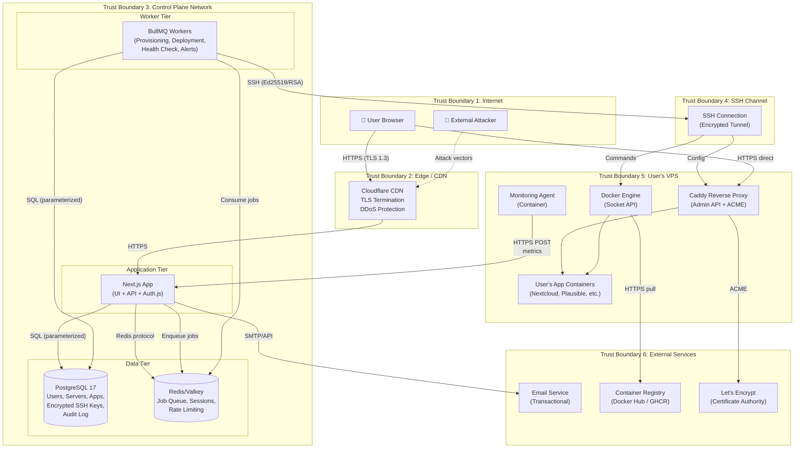
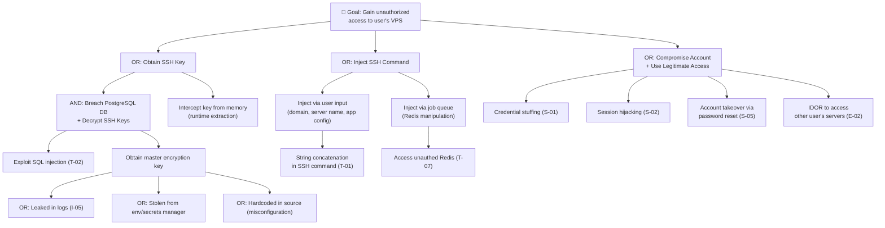
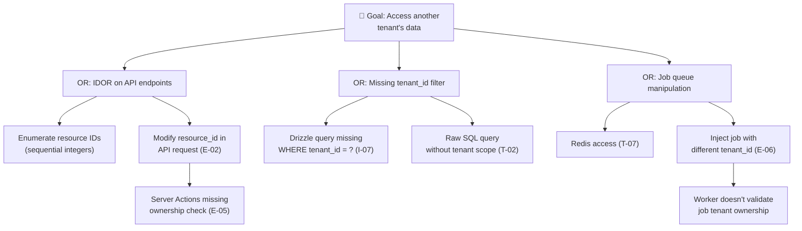

# Threat Model — UnplugHQ Platform

## 1. Document Purpose

This threat model identifies, analyzes, and prioritizes security risks for the UnplugHQ self-hosting management platform. The platform enables non-technical users to deploy and manage Docker containers on their own VPS servers through a web-based control panel. This creates a high-security context: the control plane has SSH access to users' production servers, manages cryptographic key material, orchestrates Docker containers, and processes authentication credentials.

**Methodology:** STRIDE (Spoofing, Tampering, Repudiation, Information Disclosure, Denial of Service, Elevation of Privilege) applied to each trust boundary and major component.

**OWASP alignment:** Mapped to OWASP Top 10:2025 — A01 Broken Access Control through A10 Mishandling of Exceptional Conditions.

**Upstream artifacts consumed:**

- `product-vision.md` — user journeys, data sovereignty constraints, pricing tiers
- `architecture-overview.md` — bounded contexts, deployment topology, data flows, ADRs
- `solution-assessment.md` — technology stack selection and risk alignment
- `requirements.md` — functional/non-functional requirements, business rules

---

## 2. System Overview

### 2.1 Architecture Summary

UnplugHQ is a modular monolith with strict **control plane / data plane separation**:

| Layer | Components | Hosting | Security Sensitivity |
|-------|-----------|---------|---------------------|
| **Control Plane** | Next.js App (UI + API), BullMQ Workers, PostgreSQL, Redis/Valkey | Cloud infrastructure (UnplugHQ-managed) | **Critical** — stores SSH credentials, orchestrates remote servers |
| **Data Plane** | Docker Engine, Caddy Reverse Proxy, Monitoring Agent, User's App Containers | User's VPS (user-owned) | **Critical** — user's production data, directly internet-exposed |
| **Edge** | CDN/Load Balancer (Cloudflare), TLS termination | Managed CDN | **High** — entry point for all user traffic |

### 2.2 Technology Stack

| Component | Technology | Security-Relevant Properties |
|-----------|-----------|------------------------------|
| Frontend + API | Next.js 16 (App Router, Server Components, Server Actions) | Server-side rendering reduces client attack surface; Server Actions enforce CSRF by default |
| Authentication | Auth.js v5 | Database-backed sessions, CSRF tokens on POST routes, HttpOnly cookies, JWE encryption (A256CBC-HS512) |
| Database | PostgreSQL 17 (Drizzle ORM) | Parameterized queries via ORM; row-level tenant isolation; AES-256-GCM encrypted SSH keys |
| Validation | Zod 3.x | Runtime type validation at API boundaries |
| SSH Client | ssh2 1.17.x | Node.js SSH implementation; supports Ed25519 and RSA keys |
| Job Queue | BullMQ 5.x + Redis/Valkey | Reliable background job processing; Redis connection requires authentication |
| Reverse Proxy (VPS) | Caddy 2.x | Automatic HTTPS via built-in ACME; admin API for programmatic route management |
| Container Runtime (VPS) | Docker Engine | Docker socket API for container lifecycle management |
| Password Hashing | Argon2id | Memory-hard; side-channel resistant (per BR-F4-002) |

---

## 3. Data Flow Diagram with Trust Boundaries

### 3.1 Trust Boundaries

| ID | Boundary | Crosses | Risk Level |
|----|----------|---------|-----------|
| TB1→TB2 | Internet → CDN/Edge | Untrusted traffic enters platform perimeter | **Critical** |
| TB2→TB3 | CDN → Control Plane App | Traffic enters application layer after TLS termination | **High** |
| TB3 internal | App ↔ Database ↔ Redis | Control plane components intercommunicate | **Medium** |
| TB3→TB4 | Control Plane → SSH Channel | Control plane initiates SSH to user's server | **Critical** |
| TB4→TB5 | SSH Channel → User's VPS | Commands execute on user-owned infrastructure | **Critical** |
| TB5→TB3 | Monitoring Agent → Control Plane | Agent pushes metrics from VPS to control plane | **High** |
| TB5→TB6 | VPS → Container Registry | Docker pulls images from external registries | **High** |
| TB3→TB6 | Control Plane → Email Service | Sends transactional emails (password reset, alerts) | **Medium** |
| TB5→TB6 | Caddy → Let's Encrypt | ACME certificate issuance | **Medium** |

---

## 4. STRIDE Threat Enumeration

### 4.1 Spoofing (S)

| ID | Threat | Affected Component | OWASP 2025 | Risk | CVSS v4.0 Est. | Mitigation | Status |
|----|--------|-------------------|------------|------|----------------|------------|--------|
| S-01 | **Credential stuffing against login** — Attacker uses leaked credential databases to gain access to user accounts | Auth.js (F4) | A07 Authentication Failures | **High** | 7.5 | Rate limiting: 10 failed attempts / 5 min → account lock (BR-F4-001). Argon2id password hashing. Generic error messages that don't reveal valid accounts. Consider future FIDO2/WebAuthn support. | Mitigated by design |
| S-02 | **Session hijacking via cookie theft** — Attacker steals session cookie through XSS or network interception | Auth.js Sessions | A07 Authentication Failures | **High** | 7.1 | HttpOnly, Secure, SameSite=Lax cookies (Auth.js default). Database-backed sessions enabling server-side revocation. CSP headers to prevent XSS. HSTS to prevent downgrade. | Mitigated by design |
| S-03 | **Monitoring agent impersonation** — Attacker sends fabricated health metrics to the control plane, pretending to be a legitimate monitoring agent | Monitoring API (TB5→TB3) | A07 Authentication Failures | **High** | 7.3 | Per-server API token issued during provisioning. Token transmitted in `Authorization` header over HTTPS. Validate `server_id` matches token's bound server. Rate-limit metrics ingestion per server. | Requires implementation |
| S-04 | **SSH key impersonation** — Attacker who has compromised a user's VPS uses the monitoring agent's credentials to inject false data or enumerate other tenants | Monitoring Agent | A01 Broken Access Control | **Medium** | 6.2 | Agent tokens are scoped to a single server — cannot access other tenants' data. Metrics payload schema validated server-side (reject unexpected fields). Token rotation on server re-provisioning. | Requires implementation |
| S-05 | **Password reset token interception** — Attacker intercepts password reset email and uses the token to take over an account | Password Reset (F4) | A07 Authentication Failures | **Medium** | 6.5 | One-time use tokens. 1-hour expiry (FR-F4-004). Cryptographically random token generation (≥256 bits). Invalidate all existing tokens on successful reset. Send confirmation email after reset. | Mitigated by design |
| S-06 | **Phishing of SSH credentials** — Social engineering attack to obtain VPS credentials that would be entered into UnplugHQ | Server Connection Wizard (F1) | A07 Authentication Failures | **Low** | 4.0 | Out of platform scope — user provides their own credentials. Mitigate via security education in the UI (provider-specific SSH key setup instructions per FR-F1-002). Warn users to use dedicated SSH keys for UnplugHQ. | Accepted (residual) |

### 4.2 Tampering (T)

| ID | Threat | Affected Component | OWASP 2025 | Risk | CVSS v4.0 Est. | Mitigation | Status |
|----|--------|-------------------|------------|------|----------------|------------|--------|
| T-01 | **SSH command injection** — Attacker manipulates input fields (server name, app configuration, domain) to inject malicious commands that execute on the user's VPS via SSH | SSH Service, Provisioning/Deployment Workers | A05 Injection | **Critical** | 9.8 | Never construct SSH commands via string concatenation. Use parameterized command templates. Zod validation on all user inputs before they reach SSH execution layer. Allowlist-validate domain names, IP addresses, app names. Escape all interpolated values in shell commands. | Requires implementation |
| T-02 | **SQL injection via ORM bypass** — Crafted input bypasses Drizzle ORM's parameterized queries due to raw SQL usage | PostgreSQL, API Layer | A05 Injection | **High** | 8.6 | Drizzle ORM enforces parameterized queries by default. **Prohibit all raw SQL queries** — enforce via linting rule. Code review gate at P5 for any `sql.raw()` or template literal SQL. | Requires implementation |
| T-03 | **App definition tampering in catalog** — Attacker modifies catalog app definitions to inject malicious Docker images or configurations | Catalog Service (F2) | A08 Software or Data Integrity Failures | **High** | 8.1 | App definitions stored as versioned files in the repository (not user-editable). Integrity check: pin Docker image digests (SHA256) in app definitions, not just tags. Signed commits for catalog updates. Code review required for any catalog change. | Requires implementation |
| T-04 | **Caddy admin API tampering** — Attacker on the VPS modifies Caddy configuration to redirect traffic or disable TLS | Caddy Reverse Proxy (TB5) | A02 Security Misconfiguration | **High** | 7.5 | Bind Caddy admin API to localhost only (`admin: localhost:2019`). Require admin API authentication. Only the UnplugHQ monitoring agent and provisioning scripts access the Caddy API. Firewall rules restrict access. | Requires implementation |
| T-05 | **Tampered monitoring agent** — Compromised VPS has its monitoring agent replaced to send false metrics or exfiltrate data | Monitoring Agent (TB5) | A08 Software or Data Integrity Failures | **Medium** | 6.8 | Monitoring agent container runs read-only filesystem. Docker restart policy ensures replacement is noisy (container restart events logged). Agent binary integrity can be verified via image digest. Agent has minimal permissions — no SSH access, no host filesystem write. | Requires implementation |
| T-06 | **Cross-Site Request Forgery on Server Actions** — Attacker crafts a malicious page that triggers destructive server actions (deploy, remove app, disconnect server) when visited by an authenticated user | Next.js Server Actions | A01 Broken Access Control | **Medium** | 6.5 | Auth.js provides CSRF tokens on POST routes by default. Next.js Server Actions include built-in CSRF protection. Destructive operations require additional confirmation step (NFR-006). Validate `Origin` header on all mutating requests. | Mitigated by design |
| T-07 | **Redis data manipulation** — Attacker with network access to Redis modifies job queue entries to alter provisioning commands | Redis/Valkey (TB3) | A02 Security Misconfiguration | **Medium** | 6.0 | Redis instance requires authentication (AUTH password). Redis bound to private network only (no public exposure). Use TLS for Redis connections. BullMQ job data validated before execution. | Requires implementation |

### 4.3 Repudiation (R)

| ID | Threat | Affected Component | OWASP 2025 | Risk | CVSS v4.0 Est. | Mitigation | Status |
|----|--------|-------------------|------------|------|----------------|------------|--------|
| R-01 | **Unaudited destructive operations** — User or compromised account performs destructive actions (app removal, server disconnect) with no audit trail | Audit Log System | A09 Security Logging and Alerting Failures | **High** | 7.0 | Audit log captures all state-changing operations: action, timestamp, user_id, target (server/app), outcome, IP address, user agent (NFR-013). Audit log is append-only — no update/delete capability for regular users. Retained 90 days minimum. | Requires implementation |
| R-02 | **Missing SSH command audit trail** — SSH commands executed on user VPS are not logged, making it impossible to investigate incidents | SSH Service, Workers | A09 Security Logging and Alerting Failures | **Medium** | 5.5 | Log all SSH commands with: timestamp, server_id, user_id, command template name (not raw command to avoid logging secrets), job_id, exit code, execution duration. Correlate via BullMQ job ID. Store in PostgreSQL audit table. | Requires implementation |
| R-03 | **Alert tampering** — A malicious actor with database access modifies alert records to hide evidence of security events | Alert Processing | A09 Security Logging and Alerting Failures | **Medium** | 5.0 | Alerts stored with immutable creation timestamp. Alert state transitions recorded as append-only events (not in-place updates). Database user permissions: application user cannot DELETE from alert tables. | Requires implementation |

### 4.4 Information Disclosure (I)

| ID | Threat | Affected Component | OWASP 2025 | Risk | CVSS v4.0 Est. | Mitigation | Status |
|----|--------|-------------------|------------|------|----------------|------------|--------|
| I-01 | **SSH private key exposure from database breach** — Attacker gains access to PostgreSQL and obtains encrypted SSH private keys. If encryption is weak or keys are poorly managed, attacker gains SSH access to all connected VPSs | PostgreSQL, SSH Credential Storage | A04 Cryptographic Failures | **Critical** | 9.6 | AES-256-GCM encryption for SSH keys at rest. Per-tenant encryption key derived via HKDF from a master key. Master key stored in environment variable / dedicated secret manager (never in database or source code). Key hierarchy: Master Key → HKDF → Per-Tenant Key → AES-256-GCM(SSH Private Key). Rotate master key with zero-downtime re-encryption capability. | Requires implementation |
| I-02 | **User enumeration via authentication errors** — Different error messages for "user exists" vs "user doesn't exist" allow attackers to enumerate valid accounts | Auth.js, Signup/Login (F4) | A07 Authentication Failures | **Medium** | 5.3 | Generic error messages: "Invalid email or password" (FR-F4-002). Signup silently rejects duplicate emails without revealing existence (BR-F4-003). Password reset always returns "If an account exists, a reset link was sent." Consistent response timing for valid/invalid accounts. | Mitigated by design |
| I-03 | **Server metrics information leak** — Monitoring metrics exposed to unauthorized users through broken access control | Monitoring API, Dashboard (F3) | A01 Broken Access Control | **Medium** | 6.5 | All API endpoints enforce tenant_id scoping — users can only see their own servers' metrics. Drizzle ORM queries always include `WHERE tenant_id = ?`. Middleware validates session ownership before serving any server/app data. | Requires implementation |
| I-04 | **Verbose error messages exposing internals** — Stack traces, database queries, or infrastructure details leaked in API error responses or rendered pages | Next.js App, API Layer | A02 Security Misconfiguration | **Medium** | 5.3 | Production environment: `NODE_ENV=production`. React error boundaries show generic messages (no stack traces). API error responses use consistent shape `{ error: { code, message } }` — never include stack traces or SQL. Structured logging captures full diagnostic detail server-side only. | Requires implementation |
| I-05 | **SSH key material in logs** — SSH private keys or connection credentials accidentally logged in application logs, audit trail, or error reports | SSH Service, Logging | A09 Security Logging and Alerting Failures | **High** | 7.5 | Implement structured logging with explicit field allowlists. SSH key material and passwords must be excluded from all log output. Log redaction filter for patterns matching PEM-encoded keys (`-----BEGIN`), connection strings, and tokens. Pino serializers configured to strip sensitive fields. | Requires implementation |
| I-06 | **Data sovereignty violation via metrics over-collection** — Monitoring agent collects and transmits user application data (file contents, database records) to the control plane, violating SC5/NFR-004 | Monitoring Agent (TB5→TB3) | A06 Insecure Design | **High** | 7.0 | Agent collects ONLY: CPU%, RAM%, disk%, network bytes, container status enum (BR-F3-003). Payload schema enforced server-side with Zod validation — reject any payload with unexpected fields. Agent binary built from reviewed source — no dynamic plugin loading. No filesystem access to application data volumes. | Requires implementation |
| I-07 | **Cross-tenant data leakage** — Bug in tenant isolation allows one user to access another user's servers, apps, or SSH keys | All API endpoints, Database queries | A01 Broken Access Control | **Critical** | 9.1 | All database queries scoped by `tenant_id` at the ORM layer. Middleware extracts `tenant_id` from authenticated session — never from request parameters. Automated tests verify tenant isolation for every API endpoint. Consider PostgreSQL Row-Level Security (RLS) policies as a defense-in-depth layer. | Requires implementation |

### 4.5 Denial of Service (D)

| ID | Threat | Affected Component | OWASP 2025 | Risk | CVSS v4.0 Est. | Mitigation | Status |
|----|--------|-------------------|------------|------|----------------|------------|--------|
| D-01 | **Resource exhaustion via mass provisioning requests** — Attacker creates account and submits many simultaneous server provisioning or deployment jobs, exhausting worker capacity and SSH connections | BullMQ Workers, SSH Service | A06 Insecure Design | **High** | 7.5 | Rate limiting per user: max concurrent provisioning jobs (e.g., 2 for Free tier, 5 for Pro). BullMQ rate limiter and concurrency controls per queue. Free tier limits: max 3 apps, 1 server. Job priority based on subscription tier. | Requires implementation |
| D-02 | **Monitoring metrics flood** — Compromised or malicious agent sends excessive metrics requests, overwhelming the API server | Monitoring API (TB5→TB3) | A06 Insecure Design | **Medium** | 5.3 | Rate-limit metrics ingestion: max 2 requests per minute per server (30-second metric interval). Drop excess requests with 429 status. Per-server token identifies source — block abusive tokens. Cloudflare rate limiting at the edge for the metrics endpoint. | Requires implementation |
| D-03 | **Account creation abuse** — Automated signup to create many free-tier accounts for resource abuse | Auth.js, Signup (F4) | A06 Insecure Design | **Medium** | 5.3 | Email verification required before server connection is allowed. Rate limit signup: max 5 accounts per IP per hour. Consider CAPTCHA or proof-of-work challenge for signup (evaluate A11Y impact — no traditional CAPTCHA that blocks assistive technology). Monitor signup velocity for anomalies. | Requires implementation |
| D-04 | **SSH connection exhaustion on user's VPS** — Platform makes excessive SSH connections to a single VPS, creating a self-inflicted DoS on the user's server | SSH Service, Workers | A10 Mishandling of Exceptional Conditions | **Medium** | 5.5 | SSH connection pooling: reuse connections where possible. Max concurrent SSH connections per server (e.g., 3). Exponential backoff on SSH connection failures. Connection timeout: 30s connect, 120s command execution. | Requires implementation |
| D-05 | **Job queue poisoning** — Malicious data in job payloads causes worker crashes or infinite loops | BullMQ Workers | A10 Mishandling of Exceptional Conditions | **Medium** | 5.0 | Validate all job data with Zod schema before processing. Set maximum job execution time (timeout). BullMQ retry limit: 3 attempts with exponential backoff. Dead letter queue for repeatedly failing jobs. Worker process isolation via separate containers. | Requires implementation |

### 4.6 Elevation of Privilege (E)

| ID | Threat | Affected Component | OWASP 2025 | Risk | CVSS v4.0 Est. | Mitigation | Status |
|----|--------|-------------------|------------|------|----------------|------------|--------|
| E-01 | **Docker socket abuse for host escape** — If the UnplugHQ provisioning process mounts the Docker socket (`/var/run/docker.sock`) into a container, a compromised container could escape to the host | Docker Engine (TB5) | A01 Broken Access Control | **Critical** | 9.8 | SSH commands interact with Docker CLI or Docker API over the socket, but user app containers MUST NOT have access to the Docker socket. Only the monitoring agent may query Docker API (read-only) for container status. Provisioning scripts must never mount the Docker socket into user app containers. Monitoring agent container runs with `--security-opt=no-new-privileges`, read-only root filesystem, and limited capabilities (`CAP_NET_BIND_SERVICE` only if needed). | Requires implementation |
| E-02 | **Tenant privilege escalation via IDOR** — Attacker manipulates resource IDs in API requests (server_id, app_id, deployment_id) to access or modify another tenant's resources | All API endpoints | A01 Broken Access Control | **Critical** | 9.1 | All API operations validate that the requested resource belongs to the authenticated user's tenant. Resources looked up by composite key: `(tenant_id, resource_id)` — never by `resource_id` alone. Use UUIDs for external-facing resource identifiers (not sequential integers). Authorization check occurs at the service layer, not just the route handler. | Requires implementation |
| E-03 | **Free-to-Pro tier bypass** — User manipulates client-side state or API parameters to bypass subscription tier limits (more than 3 apps, more than 1 server on Free tier) | Subscription/Entitlement checks | A01 Broken Access Control | **Medium** | 6.5 | Tier enforcement at the API/service layer (server-side), never client-side only. Database constraint enforces max server/app counts per tier. Provisioning and deployment workers check tier limits before job execution. | Requires implementation |
| E-04 | **Provisioning script escalation on VPS** — Maliciously crafted app definition or configuration causes provisioning to execute unintended commands with elevated privileges on user's VPS | SSH Service, Provisioning Workers | A05 Injection | **Critical** | 9.0 | SSH connection uses a dedicated `unplughq` system user on the VPS (not root). `unplughq` user has limited `sudoers` entries (only Docker commands and specific package management). App definitions reviewed and pinned by hash before inclusion in catalog. Provisioning commands use pre-defined templates, not user-supplied shell scripts. | Requires implementation |
| E-05 | **Next.js Server Action authorization bypass** — Server Actions execute without verifying user authentication or authorization, allowing unauthenticated access to privileged operations | Next.js API Layer | A01 Broken Access Control | **High** | 8.1 | Every Server Action must begin with session validation (`auth()` call). Centralized authentication middleware for all API routes. Server Actions that mutate state must also verify resource ownership. Automated tests for every Server Action verify unauthenticated requests are rejected. | Requires implementation |
| E-06 | **Privilege escalation via background job manipulation** — Attacker injects or modifies jobs in the BullMQ queue to execute operations they're not authorized for (e.g., provisioning another user's server) | BullMQ/Redis, Workers | A01 Broken Access Control | **High** | 7.5 | Workers validate job ownership: every job payload includes `tenant_id`, verified against the database before execution. Redis requires authentication. Redis bound to private network. Jobs created only through the authenticated API layer — never directly by clients. | Requires implementation |

---

## 5. Risk Assessment Matrix

### 5.1 Risk Heat Map

| | **Low Likelihood** | **Medium Likelihood** | **High Likelihood** |
|---|---|---|---|
| **Critical Impact** | E-01 (Docker socket abuse), T-03 (Catalog tampering) | I-01 (SSH key from DB breach), E-04 (Provisioning escalation), I-07 (Cross-tenant leak) | T-01 (SSH command injection), E-02 (IDOR) |
| **High Impact** | T-04 (Caddy API tampering), E-06 (Job manipulation), I-06 (Data sovereignty) | S-01 (Credential stuffing), S-02 (Session hijacking), R-01 (Unaudited operations), I-05 (Keys in logs), D-01 (Mass provisioning) | E-05 (Server Action auth bypass), T-02 (SQL injection bypass) |
| **Medium Impact** | T-05 (Tampered agent), R-03 (Alert tampering) | S-03 (Agent impersonation), T-06 (CSRF on Actions), I-04 (Verbose errors), D-04 (SSH exhaustion) | I-02 (User enumeration), D-03 (Account creation abuse), E-03 (Tier bypass) |
| **Low Impact** | S-06 (Phishing SSH creds) | D-05 (Queue poisoning) | S-05 (Reset token intercept) |

### 5.2 Top 10 Risks (Prioritized)

| Rank | ID | Threat | Risk | Rationale |
|------|----|--------|------|-----------|
| 1 | T-01 | SSH command injection | **Critical** | Control plane executes commands on user servers. Injection → full VPS compromise. Affects all users. |
| 2 | I-01 | SSH private key exposure from DB breach | **Critical** | Database stores encrypted keys for all server connections. Breach + weak encryption → mass VPS compromise. |
| 3 | I-07 | Cross-tenant data leakage | **Critical** | Multi-tenant SaaS — tenant isolation failure exposes SSH keys, server access, and configurations across accounts. |
| 4 | E-02 | Tenant privilege escalation via IDOR | **Critical** | Sequential or predictable resource IDs could allow one user to manage another's servers/apps. |
| 5 | E-01 | Docker socket abuse for host escape | **Critical** | If Docker socket is exposed to app containers, a compromised app gets full host control. |
| 6 | E-04 | Provisioning script escalation | **Critical** | SSH commands running as privileged user on VPS — improper sanitization → root-level commands on user servers. |
| 7 | E-05 | Server Action authorization bypass | **High** | Missing auth checks on Server Actions = unauthenticated access to deployment/provisioning. |
| 8 | S-01 | Credential stuffing | **High** | Non-technical users likely reuse passwords. Compromised account → their server access. |
| 9 | R-01 | Unaudited destructive operations | **High** | Without audit trail, incident investigation and compliance (GDPR) are impossible. |
| 10 | I-05 | SSH key material in logs | **High** | Accidental logging of key material → exposure via log aggregation, error tracking services. |

---

## 6. Security Requirements

Derived from the threat analysis above, mapped to OWASP Application Security Verification Standard (ASVS) v4.0 sections.

### 6.1 Authentication & Session Management

| ID | Requirement | ASVS Ref | Priority | Threats Mitigated | Verification Method |
|----|-------------|----------|----------|-------------------|---------------------|
| SEC-AUTH-01 | Use Argon2id for password hashing with minimum parameters: memory 64MB, iterations 3, parallelism 1 | V2.4.1 | **Must** | S-01 | Code review, unit test |
| SEC-AUTH-02 | Enforce password minimum strength: ≥12 characters, mixed case, at least one number or symbol (per FR-F4-001) | V2.1.1 | **Must** | S-01 | Unit test, integration test |
| SEC-AUTH-03 | Session cookies must be HttpOnly, Secure, SameSite=Lax, and backed by database sessions (not JWT-only) | V3.4.1, V3.4.2, V3.4.3 | **Must** | S-02 | Configuration review, integration test |
| SEC-AUTH-04 | Rate-limit authentication: max 10 failed attempts per account within 5 minutes → 15-minute temporary lock (BR-F4-001) | V2.2.1 | **Must** | S-01 | Integration test |
| SEC-AUTH-05 | Password reset tokens must be cryptographically random (≥256 bits), single-use, and expire after 1 hour | V2.5.2, V2.5.3 | **Must** | S-05 | Unit test |
| SEC-AUTH-06 | Prevent user enumeration: generic error messages for login, signup, and password reset | V2.2.4 | **Must** | I-02 | Integration test, pentest |
| SEC-AUTH-07 | Server-side session invalidation on logout (FR-F4-003). Delete session from database immediately. | V3.3.1 | **Must** | S-02 | Integration test |
| SEC-AUTH-08 | Configurable session inactivity timeout (default: 30 days). Enforced server-side. | V3.3.2 | **Must** | S-02 | Configuration review |
| SEC-AUTH-09 | AUTH_SECRET must be ≥32 random bytes, stored in environment variable / secret manager, never in source code | V2.10.1 | **Must** | S-02, I-01 | Deployment review |

### 6.2 Access Control & Tenant Isolation

| ID | Requirement | ASVS Ref | Priority | Threats Mitigated | Verification Method |
|----|-------------|----------|----------|-------------------|---------------------|
| SEC-AC-01 | All API endpoints and Server Actions must begin with session authentication check (`auth()`) | V4.1.1 | **Must** | E-05 | Code review, automated test |
| SEC-AC-02 | All database queries must scope by `tenant_id` derived from authenticated session — never from request parameters | V4.1.2 | **Must** | I-07, E-02 | Code review, automated test |
| SEC-AC-03 | Resource lookup by composite key `(tenant_id, resource_id)` — never `resource_id` alone | V4.1.3 | **Must** | E-02, I-03 | Code review, automated test |
| SEC-AC-04 | Use UUIDs (v4 or v7) for all external-facing resource identifiers — not sequential integers | V4.2.1 | **Must** | E-02 | Schema review |
| SEC-AC-05 | Subscription tier limits (server count, app count) enforced server-side at both API and worker layers | V4.1.4 | **Must** | E-03 | Integration test |
| SEC-AC-06 | Implement PostgreSQL Row-Level Security (RLS) policies as defense-in-depth for tenant isolation | V4.1.2 | **Should** | I-07 | Database schema review |
| SEC-AC-07 | Destructive operations (app removal, server disconnect, config changes) require explicit confirmation step (NFR-006) | V4.2.2 | **Must** | T-06, R-01 | UI test, integration test |

### 6.3 Cryptography & SSH Key Management

| ID | Requirement | ASVS Ref | Priority | Threats Mitigated | Verification Method |
|----|-------------|----------|----------|-------------------|---------------------|
| SEC-CRYPT-01 | SSH private keys encrypted at rest using AES-256-GCM with per-tenant key derived via HKDF from master key (NFR-010) | V6.2.1 | **Must** | I-01 | Code review, crypto audit |
| SEC-CRYPT-02 | Master encryption key stored exclusively in environment variable / secret manager — never in database, source code, or logs | V6.4.1 | **Must** | I-01 | Deployment review |
| SEC-CRYPT-03 | SSH key material never logged, never included in API responses, never transmitted to the browser | V6.4.2 | **Must** | I-05 | Code review, log audit |
| SEC-CRYPT-04 | SSH connections prefer Ed25519 keys; RSA-4096 as fallback only for older providers | V6.2.5 | **Must** | I-01 | Configuration review |
| SEC-CRYPT-05 | SSH keys deleted from database when user disconnects a server | V6.1.1 | **Must** | I-01 | Integration test |
| SEC-CRYPT-06 | Master key rotation capability with zero-downtime re-encryption of all tenant keys | V6.4.1 | **Should** | I-01 | Operational procedure review |
| SEC-CRYPT-07 | TLS 1.3 for all HTTPS connections (control plane, agent-to-control-plane, user browser) | V9.1.1 | **Must** | S-02, I-04 | TLS configuration scan |
| SEC-CRYPT-08 | Per-server API tokens for monitoring agent authentication: cryptographically random, ≥256 bits, rotatable | V2.10.1 | **Must** | S-03, S-04 | Code review |

### 6.4 Input Validation & Injection Prevention

| ID | Requirement | ASVS Ref | Priority | Threats Mitigated | Verification Method |
|----|-------------|----------|----------|-------------------|---------------------|
| SEC-INPUT-01 | All user inputs validated with Zod schemas at API boundaries before processing | V5.1.1 | **Must** | T-01, T-02 | Code review, automated test |
| SEC-INPUT-02 | SSH commands constructed from pre-defined templates with parameterized values — never via string concatenation with user input | V5.3.4 | **Must** | T-01 | Code review, SAST |
| SEC-INPUT-03 | Domain names validated against RFC 1035 pattern. IP addresses validated against IPv4/IPv6 format. No wildcard or localhost domains. | V5.1.3 | **Must** | T-01 | Unit test |
| SEC-INPUT-04 | Prohibit all raw SQL queries (`sql.raw()`, template literal SQL). Enforce via ESLint rule. | V5.3.4 | **Must** | T-02 | SAST, linting |
| SEC-INPUT-05 | Docker image references in app definitions must be pinned by SHA256 digest, not mutable tags | V5.1.4 | **Must** | T-03 | Catalog review, automated check |
| SEC-INPUT-06 | Monitoring agent payload validated server-side with strict Zod schema: only CPU%, RAM%, disk%, network bytes, container status enum | V5.1.1 | **Must** | I-06, S-03 | Unit test |
| SEC-INPUT-07 | All user-facing text inputs sanitized for XSS before rendering (Next.js React handles this by default via JSX escaping; additional validation for dangerously-set HTML, markdown rendering) | V5.3.3 | **Must** | T-06 | Code review, DAST |

### 6.5 Docker & Container Security

| ID | Requirement | ASVS Ref | Priority | Threats Mitigated | Verification Method |
|----|-------------|----------|----------|-------------------|---------------------|
| SEC-DOCKER-01 | User app containers MUST NOT have access to the Docker socket (`/var/run/docker.sock`) | V14.2.1 | **Must** | E-01 | Provisioning template review, integration test |
| SEC-DOCKER-02 | Monitoring agent container runs with: `--security-opt=no-new-privileges`, read-only root filesystem (`--read-only`), dropped all capabilities except required | V14.2.1 | **Must** | E-01, T-05 | Provisioning template review |
| SEC-DOCKER-03 | User app containers run with `--security-opt=no-new-privileges` by default | V14.2.1 | **Must** | E-01 | Provisioning template review |
| SEC-DOCKER-04 | SSH connection to user's VPS uses a dedicated `unplughq` system user (not root). Sudo permissions limited to specific Docker and package management commands. | V4.3.1 | **Must** | E-04 | Provisioning script review |
| SEC-DOCKER-05 | Container images in the catalog sourced only from official or verified publishers on Docker Hub / GHCR | V14.2.1 | **Must** | T-03 | Catalog review process |
| SEC-DOCKER-06 | App containers must not use `--privileged` mode | V14.2.1 | **Must** | E-01 | Provisioning template review |

### 6.6 Infrastructure & Network Security

| ID | Requirement | ASVS Ref | Priority | Threats Mitigated | Verification Method |
|----|-------------|----------|----------|-------------------|---------------------|
| SEC-INFRA-01 | Redis/Valkey requires authentication and is bound to private network only (no public exposure) | V14.1.1 | **Must** | T-07, E-06 | Infrastructure review |
| SEC-INFRA-02 | PostgreSQL accessible only from application and worker containers — no public endpoint | V14.1.1 | **Must** | I-01, T-02 | Infrastructure review |
| SEC-INFRA-03 | Caddy admin API on user's VPS bound to `localhost:2019` only | V14.1.1 | **Must** | T-04 | Provisioning template review |
| SEC-INFRA-04 | Use TLS for Redis connections between application/worker containers and Redis service | V9.1.1 | **Should** | T-07 | Infrastructure review |
| SEC-INFRA-05 | CDN/Load balancer (Cloudflare) configured for DDoS protection, rate limiting, and TLS termination | V14.1.1 | **Must** | D-01, D-02 | Infrastructure review |
| SEC-INFRA-06 | Environment variables validated at application startup with Zod schema — fail fast on missing required secrets | V14.2.2 | **Must** | A02 Misconfiguration | Startup test |

### 6.7 Logging, Monitoring & Audit

| ID | Requirement | ASVS Ref | Priority | Threats Mitigated | Verification Method |
|----|-------------|----------|----------|-------------------|---------------------|
| SEC-LOG-01 | Audit log captures all state-changing operations: action, timestamp, user_id, target, outcome, IP address, user agent (NFR-013) | V7.1.1 | **Must** | R-01 | Code review, integration test |
| SEC-LOG-02 | Audit log is append-only for application users — no UPDATE or DELETE on audit table | V7.1.2 | **Must** | R-01, R-03 | Database permissions review |
| SEC-LOG-03 | SSH operations logged with: timestamp, server_id, user_id, command template name, job_id, exit code, duration — never raw command content containing secrets | V7.1.1, V7.1.3 | **Must** | R-02, I-05 | Code review |
| SEC-LOG-04 | Structured logging (pino) with explicit field allowlists. PEM key patterns, connection strings, and tokens filtered from all log output. | V7.1.3 | **Must** | I-05 | Code review, log audit |
| SEC-LOG-05 | Failed authentication attempts logged with IP, user agent, and email (hashed) for anomaly detection | V7.2.1 | **Must** | S-01 | Code review |
| SEC-LOG-06 | Log retention: minimum 90 days for audit events; 30 days for application logs | V7.1.4 | **Must** | R-01 | Operational review |

### 6.8 Rate Limiting & Abuse Prevention

| ID | Requirement | ASVS Ref | Priority | Threats Mitigated | Verification Method |
|----|-------------|----------|----------|-------------------|---------------------|
| SEC-RATE-01 | Authentication rate limiting: 10 failed attempts per account per 5 minutes (BR-F4-001) | V2.2.1 | **Must** | S-01 | Integration test |
| SEC-RATE-02 | Signup rate limiting: max 5 accounts per IP per hour | V11.1.4 | **Must** | D-03 | Integration test |
| SEC-RATE-03 | API rate limiting per authenticated user: tier-based (Free: 60 req/min, Pro: 300 req/min, Team: 600 req/min) | V11.1.4 | **Should** | D-01, D-02 | Integration test |
| SEC-RATE-04 | Metrics ingestion rate limiting: max 2 requests per server per minute | V11.1.4 | **Must** | D-02 | Integration test |
| SEC-RATE-05 | Concurrent job limits per user per tier (Free: 1 concurrent provisioning, Pro: 3, Team: 5) | V11.1.4 | **Must** | D-01 | Worker configuration review |
| SEC-RATE-06 | SSH connection limit: max 3 concurrent SSH connections per server | V11.1.4 | **Must** | D-04 | Worker configuration review |
| SEC-RATE-07 | Email verification required before server connection or app deployment is allowed | V2.1.6 | **Must** | D-03 | Integration test |

### 6.9 Data Sovereignty & Privacy

| ID | Requirement | ASVS Ref | Priority | Threats Mitigated | Verification Method |
|----|-------------|----------|----------|-------------------|---------------------|
| SEC-DATA-01 | Control plane database stores ONLY management metadata — never user application data (files, database records, uploaded content) (NFR-004, BR-Global-001) | V8.1.1 | **Must** | I-06 | Schema review, pentest |
| SEC-DATA-02 | Monitoring agent transmits ONLY system metrics (CPU, RAM, disk, network, container status) — no application payloads, logs, or file content (BR-F3-003) | V8.1.1 | **Must** | I-06 | Agent code review, payload validation |
| SEC-DATA-03 | GDPR compliance: privacy policy linked at signup, data processing disclosure presented, account deletion with full data removal capability (NFR-009) | V8.3.1 | **Must** | — | Compliance review |
| SEC-DATA-04 | Configuration export produces standard Docker Compose + Caddyfile that work without UnplugHQ (BR-Global-002, SC6) | V8.1.2 | **Must** | — | Integration test |
| SEC-DATA-05 | User data (account, server credentials, configurations) deleted within 30 days of account deletion request | V8.3.2 | **Must** | — | Integration test |

---

## 7. HTTP Security Headers

The following HTTP security response headers MUST be implemented on the control plane application. The Security Analyst defines the policy values; the Backend Developer and DevOps Engineer implement them.

| Header | Value | Rationale |
|--------|-------|-----------|
| `Content-Security-Policy` | `default-src 'self'; script-src 'self'; style-src 'self' 'unsafe-inline'; img-src 'self' data: https:; font-src 'self'; connect-src 'self'; frame-ancestors 'self'; base-uri 'self'; form-action 'self'; object-src 'none'; upgrade-insecure-requests;` | Prevent XSS, clickjacking, mixed content. `'unsafe-inline'` for styles is required by Tailwind CSS utility injection and shadcn/ui inline styles — evaluate moving to nonces if build pipeline supports it. `frame-ancestors 'self'` prevents clickjacking. |
| `Strict-Transport-Security` | `max-age=63072000; includeSubDomains; preload` | HSTS with 2-year max-age. Preload-eligible. Prevent TLS downgrade attacks. |
| `X-Content-Type-Options` | `nosniff` | Prevent MIME-type sniffing. |
| `X-Frame-Options` | `DENY` | Legacy clickjacking protection (CSP `frame-ancestors` is the primary control). |
| `Referrer-Policy` | `strict-origin-when-cross-origin` | Prevent referrer information leakage on external navigation. Send origin only for cross-origin requests. |
| `Permissions-Policy` | `camera=(), microphone=(), geolocation=(), payment=(), usb=(), bluetooth=(), serial=()` | Disable browser features not needed by the application. |

**Note on CSP `frame-ancestors`:** If a Zeroheight domain is configured for Storybook embedding in the future, add it as a specific allowed origin (e.g., `frame-ancestors 'self' https://{project}.zeroheight.com`). Never use `*` or overly broad patterns.

**Note on CSP `style-src`:** The `'unsafe-inline'` directive for `style-src` is a pragmatic trade-off required by Tailwind CSS inline styles and shadcn/ui component styling. If the build pipeline evolves to support nonce-based inline styles, upgrade to `style-src 'self' 'nonce-{random}'`.

---

## 8. Subresource Integrity (SRI)

All externally-loaded scripts and stylesheets MUST include SRI integrity attributes:

| Requirement | Detail |
|-------------|--------|
| External CDN scripts | Any `<script>` tag loading from an external CDN must include `integrity="sha384-{hash}"` and `crossorigin="anonymous"` |
| External CDN stylesheets | Any `<link rel="stylesheet">` from an external CDN must include `integrity="sha384-{hash}"` and `crossorigin="anonymous"` |
| Build pipeline | If using a CDN for static assets (Next.js `assetPrefix`), ensure the build pipeline generates and verifies SRI hashes |
| Self-hosted preference | Prefer self-hosting all JavaScript and CSS dependencies via npm/pnpm over CDN loading to reduce supply chain risk (OWASP A03:2025). SRI is the fallback control when CDN loading is necessary. |

---

## 9. Security Testing Plan

| Testing Type | Scope | Frequency | Tools / Approach |
|-------------|-------|-----------|-----------------|
| **SAST** | All TypeScript source code | Every commit (CI) | ESLint security plugin (`eslint-plugin-security`), custom rules for `sql.raw()` prohibition, SSH command concatenation detection |
| **SCA (Dependency Audit)** | `pnpm-lock.yaml`, Docker base images | Every commit (CI), weekly scheduled | `pnpm audit`, `npm audit`, Dependabot / Renovate for automated PRs. Docker image scanning (Trivy). |
| **DAST** | Control plane web application | Pre-release (staging) | OWASP ZAP baseline scan against staging. Focus: authentication flows, API injection, access control bypass. |
| **Manual Code Review** | SSH command construction, tenant isolation queries, crypto implementation, auth middleware | P5 | Security-focused code review by Security Analyst at P5. Specific focus areas: `ssh2.exec()` calls, Drizzle queries without `tenant_id`, raw SQL, log serialization. |
| **Penetration Testing** | Full attack surface (auth, API, SSH, multi-tenant isolation) | Pre-launch, then quarterly | Third-party pentest firm. Scope includes: IDOR testing, tenant isolation, SSH command injection, session management, rate limit bypass. |
| **Secret Scanning** | Repository, CI logs, error tracking | Continuous | GitHub Secret Scanning (enabled by default on public repos). Custom patterns for SSH keys, database URLs. Pre-commit hook with `gitleaks`. |
| **Container Security** | Docker images (control plane + VPS components) | Every build (CI) | Trivy scan on built images. No `latest` tags. Pin base images by digest. |

---

## 10. Compliance Mapping

### 10.1 OWASP Top 10:2025 Coverage

| OWASP 2025 | UnplugHQ Threats | Security Requirements |
|------------|-----------------|----------------------|
| A01 Broken Access Control | E-01, E-02, E-03, E-05, E-06, I-03, I-07, T-06 | SEC-AC-01 through SEC-AC-07 |
| A02 Security Misconfiguration | T-04, T-07, I-04 | SEC-INFRA-01 through SEC-INFRA-06 |
| A03 Software Supply Chain Failures | T-03 | SEC-INPUT-05, SEC-DOCKER-05, SRI requirements |
| A04 Cryptographic Failures | I-01 | SEC-CRYPT-01 through SEC-CRYPT-08 |
| A05 Injection | T-01, T-02, E-04 | SEC-INPUT-01 through SEC-INPUT-07 |
| A06 Insecure Design | D-01, D-02, D-03, I-06 | SEC-RATE-01 through SEC-RATE-07, SEC-DATA-01, SEC-DATA-02 |
| A07 Authentication Failures | S-01, S-02, S-03, S-05, I-02 | SEC-AUTH-01 through SEC-AUTH-09 |
| A08 Software or Data Integrity Failures | T-03, T-05 | SEC-INPUT-05, SEC-DOCKER-02, SEC-DOCKER-05 |
| A09 Security Logging and Alerting Failures | R-01, R-02, R-03, I-05 | SEC-LOG-01 through SEC-LOG-06 |
| A10 Mishandling of Exceptional Conditions | D-04, D-05 | SEC-RATE-05, SEC-RATE-06 |

### 10.2 OWASP ASVS v4.0 Coverage

| ASVS Chapter | Requirements Mapped | Coverage |
|--------------|-------------------|----------|
| V2: Authentication | SEC-AUTH-01 through SEC-AUTH-09, SEC-RATE-01, SEC-RATE-07 | Full |
| V3: Session Management | SEC-AUTH-03, SEC-AUTH-07, SEC-AUTH-08 | Full |
| V4: Access Control | SEC-AC-01 through SEC-AC-07 | Full |
| V5: Validation, Sanitization, Encoding | SEC-INPUT-01 through SEC-INPUT-07 | Full |
| V6: Stored Cryptography | SEC-CRYPT-01 through SEC-CRYPT-08 | Full |
| V7: Error Handling and Logging | SEC-LOG-01 through SEC-LOG-06 | Full |
| V8: Data Protection | SEC-DATA-01 through SEC-DATA-05 | Full |
| V9: Communication | SEC-CRYPT-07, SEC-INFRA-04 | Full |
| V11: Business Logic | SEC-RATE-01 through SEC-RATE-07, SEC-AC-05 | Full |
| V14: Configuration | SEC-INFRA-01 through SEC-INFRA-06, SEC-DOCKER-01 through SEC-DOCKER-06 | Full |

### 10.3 NIST CSF 2.0 Mapping

| NIST CSF Function | Relevant Requirements | Coverage |
|-------------------|----------------------|----------|
| **Identify (ID)** | Threat model (this document), data flow documentation, asset identification | Full — this document |
| **Protect (PR)** | SEC-AUTH-*, SEC-AC-*, SEC-CRYPT-*, SEC-INPUT-*, SEC-DOCKER-*, SEC-INFRA-* | Full |
| **Detect (DE)** | SEC-LOG-*, SEC-RATE-* (anomaly detection via rate limiting metrics) | Full |
| **Respond (RS)** | Audit log for incident investigation (SEC-LOG-01), account lock (SEC-AUTH-04), rate limiting (SEC-RATE-*) | Full |
| **Recover (RC)** | Automatic rollback on failed updates (architecture QA-4), configuration export (SEC-DATA-04) | Partial — full recovery procedures deferred to operational runbook |

---

## 11. Attack Trees

### 11.1 Attack Tree: Compromise User's VPS via UnplugHQ

### 11.2 Attack Tree: Cross-Tenant Data Breach

---

## 12. Residual Risks (Accepted)

| ID | Risk | Severity | Acceptance Rationale |
|----|------|----------|---------------------|
| S-06 | Phishing of SSH credentials outside the platform | Low | Out of platform control. Mitigated by provider-specific instructions and user education. |
| — | VPS provider compromise (infrastructure-level attack on Hetzner, DigitalOcean, etc.) | Low | Out of platform control. UnplugHQ cannot defend against the user's VPS provider being compromised. Users choose their own provider. |
| — | User reuses SSH key across multiple services | Low | Mitigated by recommending dedicated SSH keys for UnplugHQ in the setup wizard. Cannot enforce. |
| — | Zero-day vulnerabilities in ssh2, Auth.js, or Node.js | Medium | Mitigated by SCA scanning, Dependabot/Renovate automated updates, and security advisory monitoring. Residual risk accepted. |

---

## 13. Research Sources

| Source | What Was Retrieved | Applied To |
|--------|-------------------|-----------|
| OWASP Top 10:2025 | Updated risk categories (A01–A10), including new A03 Software Supply Chain Failures and A10 Mishandling of Exceptional Conditions | All threat categorization, compliance mapping |
| Auth.js documentation | Security model: CSRF protection, JWE encryption (A256CBC-HS512), HttpOnly cookies, database sessions, session rotation | SEC-AUTH-* requirements, S-01/S-02 mitigations |
| Auth.js deployment guide | AUTH_SECRET requirements, AUTH_TRUST_HOST for reverse proxy deployments, Docker deployment considerations | SEC-AUTH-09, deployment hardening |
| OWASP ASVS v4.0 | Verification requirements for authentication, session management, access control, cryptography, input validation | All security requirements mapping |
| NIST CSF 2.0 | Five function framework (Identify, Protect, Detect, Respond, Recover) | Compliance mapping section |

---

## 14. Workflow Observations

- **No observations to flag at this time.** All upstream artifacts (product vision, architecture overview, solution assessment, requirements) are consistent and well-structured for security analysis. The architecture-level security decisions (AES-256-GCM encryption, Argon2id, database-backed sessions, tenant_id scoping) are sound foundations. Implementation quality will determine whether these design-level decisions translate to actual security — P5 verification is critical.
