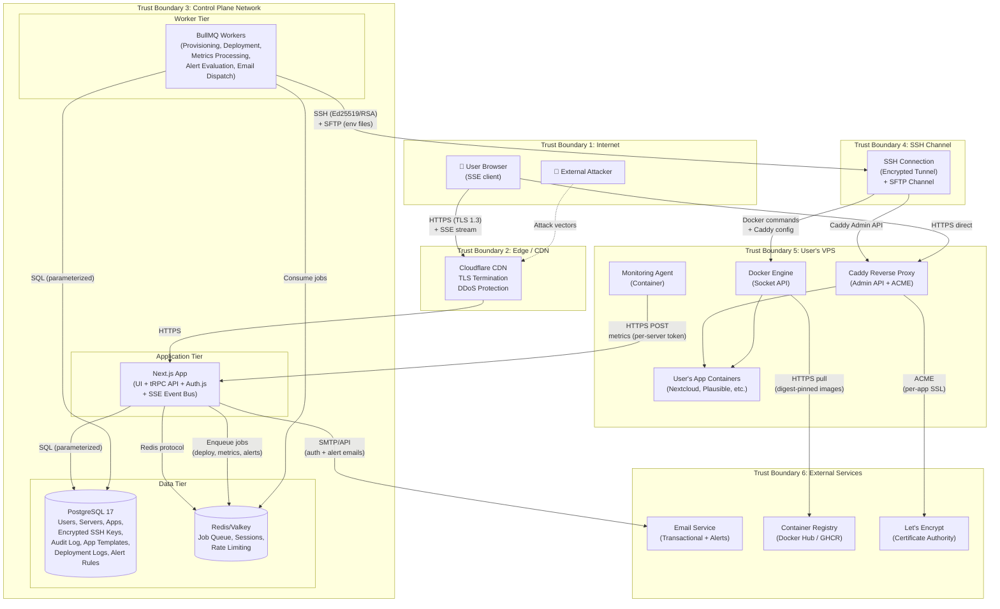
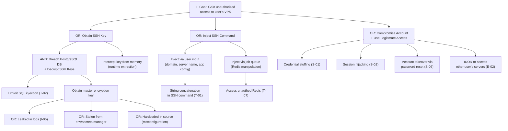
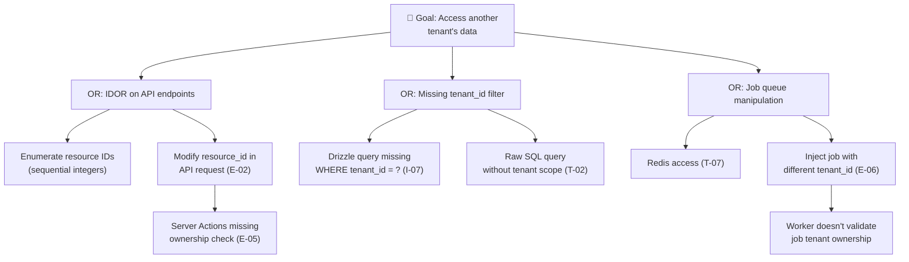

# Threat Model — UnplugHQ Platform

> **Version 2.0.0 — PI-2 Update.** This document extends the PI-1 threat model to cover Feature 2 (Application Catalog & Deployment) and Feature 3 (Dashboard & Health Monitoring) attack surfaces. PI-1 threats are retained in place; PI-2 additions are marked with `(PI-2)` annotations and use IDs in the `*-1x` range. Includes architectural mitigation guidance for deferred PI-1 security bugs (AB#258, AB#259, AB#260, AB#262).

## 1. Document Purpose

This threat model identifies, analyzes, and prioritizes security risks for the UnplugHQ self-hosting management platform. The platform enables non-technical users to deploy and manage Docker containers on their own VPS servers through a web-based control panel. This creates a high-security context: the control plane has SSH access to users' production servers, manages cryptographic key material, orchestrates Docker containers, and processes authentication credentials.

**PI-2 extends the attack surface significantly:** the deployment orchestrator executes multi-step SSH pipelines on remote hosts, app templates define container configurations that translate to shell commands, the health monitoring agent pushes real-time metrics over HTTPS, Server-Sent Events stream operational data to browsers, and the alert pipeline dispatches email notifications. Each new capability introduces new trust boundaries and attack vectors analyzed below.

**Methodology:** STRIDE (Spoofing, Tampering, Repudiation, Information Disclosure, Denial of Service, Elevation of Privilege) applied to each trust boundary and major component.

**OWASP alignment:** Mapped to OWASP Top 10:2025 — A01 Broken Access Control through A10 Mishandling of Exceptional Conditions.

**Upstream artifacts consumed:**

- `product-vision.md` — user journeys, data sovereignty constraints, pricing tiers
- `architecture-overview.md` v2.0.0 — bounded contexts, deployment topology, data flows, ADRs (PI-2 extension)
- `solution-assessment.md` v2.0.0 — technology stack selection, PI-2 component analysis, deferred bug impact
- `requirements.md` v2.0.0 — functional/non-functional requirements, business rules (PI-2 features + bug fixes)
- `risk-register.md` v2.0.0 — PI-2 risk register (R13–R25), deferred PI-1 security bugs
- `pi-1-summary.md` — PI-1 delivery outcomes, deferred security findings

---

## 2. System Overview

### 2.1 Architecture Summary

UnplugHQ is a modular monolith with strict **control plane / data plane separation**:

| Layer | Components | Hosting | Security Sensitivity |
|-------|-----------|---------|---------------------|
| **Control Plane** | Next.js App (UI + API + SSE), BullMQ Workers (provisioning, deployment, metrics, alerts), PostgreSQL, Redis/Valkey | Cloud infrastructure (UnplugHQ-managed) | **Critical** — stores SSH credentials, orchestrates remote servers, processes deployment pipelines |
| **Data Plane** | Docker Engine, Caddy Reverse Proxy, Monitoring Agent, User's App Containers | User's VPS (user-owned) | **Critical** — user's production data, directly internet-exposed |
| **Edge** | CDN/Load Balancer (Cloudflare), TLS termination | Managed CDN | **High** — entry point for all user traffic |

### 2.2 Technology Stack

| Component | Technology | Security-Relevant Properties |
|-----------|-----------|------------------------------|
| Frontend + API | Next.js 16 (App Router, Server Components, Server Actions) | Server-side rendering reduces client attack surface; Server Actions enforce CSRF by default |
| API Layer | tRPC v11 (4 new PI-2 routers: app.catalog, app.deployment, monitor, alerts) | Type-safe RPC; middleware pipeline supports CSRF and audit middleware injection |
| Authentication | Auth.js v5 | Database-backed sessions, CSRF tokens on POST routes, HttpOnly cookies, JWE encryption (A256CBC-HS512) |
| Database | PostgreSQL 17 (Drizzle ORM) | Parameterized queries via ORM; row-level tenant isolation; AES-256-GCM encrypted SSH keys; 7+ new PI-2 tables |
| Validation | Zod 3.x | Runtime type validation at API boundaries |
| SSH Client | ssh2 1.17.x | Node.js SSH implementation; supports Ed25519 and RSA keys; SFTP for environment file deployment |
| Job Queue | BullMQ 5.x + Redis/Valkey | Reliable background job processing; Redis connection requires authentication; PI-2 adds deploy-app, process-metrics, send-alert handlers |
| Reverse Proxy (VPS) | Caddy 2.x | Automatic HTTPS via built-in ACME; admin API for programmatic route management; PI-2 multi-app routing |
| Container Runtime (VPS) | Docker Engine | Docker socket API for container lifecycle management; PI-2 multi-container orchestration |
| Real-Time Updates | Server-Sent Events (SSE) via sseEventBus | Tenant-scoped event streaming; deployment progress, metric updates, alert notifications |
| App Templates | TypeScript modules with Zod validation | Declarative app definitions; image digest pinning; dynamic config schema |
| Password Hashing | Argon2id | Memory-hard; side-channel resistant (per BR-F4-002) |

---

## 3. Data Flow Diagram with Trust Boundaries



### 3.1 Trust Boundaries

| ID | Boundary | Crosses | Risk Level |
|----|----------|---------|-----------|
| TB1→TB2 | Internet → CDN/Edge | Untrusted traffic enters platform perimeter | **Critical** |
| TB2→TB3 | CDN → Control Plane App | Traffic enters application layer after TLS termination; includes SSE long-lived connections | **High** |
| TB3 internal | App ↔ Database ↔ Redis | Control plane components intercommunicate; deployment job payloads transit Redis | **Medium** |
| TB3→TB4 | Control Plane → SSH Channel | Control plane initiates SSH to user's server; **PI-2: deployment commands, env file SFTP, Caddy config** | **Critical** |
| TB4→TB5 | SSH Channel → User's VPS | Commands execute on user-owned infrastructure; **PI-2: multi-step deployment pipeline, container lifecycle** | **Critical** |
| TB5→TB3 | Monitoring Agent → Control Plane | Agent pushes metrics from VPS to control plane; **PI-2: per-container metrics, extended payload** | **High** |
| TB5→TB6 | VPS → Container Registry | Docker pulls images from external registries; **PI-2: user-initiated pulls for catalog apps** | **High** |
| TB3→TB6 | Control Plane → Email Service | Sends transactional emails; **PI-2: alert notification emails** | **Medium** |
| TB5→TB6 | Caddy → Let's Encrypt | ACME certificate issuance; **PI-2: per-app SSL certificates** | **Medium** |

---

## 4. STRIDE Threat Enumeration

### 4.1 Spoofing (S)

| ID | Threat | Affected Component | OWASP 2025 | Risk | CVSS v4.0 Est. | Mitigation | Status |
|----|--------|-------------------|------------|------|----------------|------------|--------|
| S-01 | **Credential stuffing against login** — Attacker uses leaked credential databases to gain access to user accounts | Auth.js (F4) | A07 Authentication Failures | **High** | 7.5 | Rate limiting: 10 failed attempts / 5 min → account lock (BR-F4-001). Argon2id password hashing. Generic error messages that don't reveal valid accounts. Consider future FIDO2/WebAuthn support. | Mitigated by design |
| S-02 | **Session hijacking via cookie theft** — Attacker steals session cookie through XSS or network interception | Auth.js Sessions | A07 Authentication Failures | **High** | 7.1 | HttpOnly, Secure, SameSite=Lax cookies (Auth.js default). Database-backed sessions enabling server-side revocation. CSP headers to prevent XSS. HSTS to prevent downgrade. | Mitigated by design |
| S-03 | **Monitoring agent impersonation** — Attacker sends fabricated health metrics to the control plane, pretending to be a legitimate monitoring agent | Monitoring API (TB5→TB3) | A07 Authentication Failures | **High** | 7.3 | Per-server API token issued during provisioning. Token transmitted in `Authorization` header over HTTPS. Validate `server_id` matches token's bound server. Rate-limit metrics ingestion per server. | Requires implementation |
| S-04 | **SSH key impersonation** — Attacker who has compromised a user's VPS uses the monitoring agent's credentials to inject false data or enumerate other tenants | Monitoring Agent | A01 Broken Access Control | **Medium** | 6.2 | Agent tokens are scoped to a single server — cannot access other tenants' data. Metrics payload schema validated server-side (reject unexpected fields). Token rotation on server re-provisioning. | Requires implementation |
| S-05 | **Password reset token interception** — Attacker intercepts password reset email and uses the token to take over an account | Password Reset (F4) | A07 Authentication Failures | **Medium** | 6.5 | One-time use tokens. 1-hour expiry (FR-F4-004). Cryptographically random token generation (≥256 bits). Invalidate all existing tokens on successful reset. Send confirmation email after reset. | Mitigated by design |
| S-06 | **Phishing of SSH credentials** — Social engineering attack to obtain VPS credentials that would be entered into UnplugHQ | Server Connection Wizard (F1) | A07 Authentication Failures | **Low** | 4.0 | Out of platform scope — user provides their own credentials. Mitigate via security education in the UI (provider-specific SSH key setup instructions per FR-F1-002). Warn users to use dedicated SSH keys for UnplugHQ. | Accepted (residual) |
| S-10 | **(PI-2) SSE connection spoofing** — Attacker establishes an SSE connection using a stolen or expired session token to receive real-time deployment progress, metric updates, and alert events for another tenant | SSE Event Bus (TB2→TB3) | A07 Authentication Failures | **High** | 7.3 | SSE endpoint must validate session authentication on connection establishment AND periodically re-validate (heartbeat cycle). Terminate SSE connections when the associated session is invalidated (logout, expiry). SSE events emitted only via `sseEventBus.emitToTenant()` — never broadcast. Connection-level tenant_id derived from authenticated session, not query parameters. | Requires implementation |
| S-11 | **(PI-2) Deployment job replay** — Attacker who has observed a valid deployment job payload replays it to trigger unauthorized deployments on the same or different server | BullMQ Workers, Redis (TB3) | A08 Software or Data Integrity Failures | **Medium** | 6.5 | Each deployment job must include a unique nonce (UUIDv7 deployment_id) validated before execution. Worker checks that `deployment_id` does not already exist in `completed` state. Deployment status state machine prevents re-entry to `pending` from `running` or `completed`. Redis authentication prevents external job injection. | Requires implementation |
| S-12 | **(PI-2) Alert email spoofing** — Attacker sends fake alert notification emails appearing to come from UnplugHQ, directing users to phishing pages | Email Service (TB3→TB6) | A07 Authentication Failures | **Low** | 4.5 | Configure SPF, DKIM, and DMARC records for the sending domain. Include a user-specific detail (e.g., server name) in alert emails that a phisher would not know. Alert emails link to the authenticated dashboard — never to login pages or credential-collecting forms. | Requires implementation |

### 4.2 Tampering (T)

| ID | Threat | Affected Component | OWASP 2025 | Risk | CVSS v4.0 Est. | Mitigation | Status |
|----|--------|-------------------|------------|------|----------------|------------|--------|
| T-01 | **SSH command injection** — Attacker manipulates input fields (server name, app configuration, domain) to inject malicious commands that execute on the user's VPS via SSH | SSH Service, Provisioning/Deployment Workers | A05 Injection | **Critical** | 9.8 | Never construct SSH commands via string concatenation. Use parameterized command templates. Zod validation on all user inputs before they reach SSH execution layer. Allowlist-validate domain names, IP addresses, app names. Escape all interpolated values in shell commands. | Requires implementation |
| T-02 | **SQL injection via ORM bypass** — Crafted input bypasses Drizzle ORM's parameterized queries due to raw SQL usage | PostgreSQL, API Layer | A05 Injection | **High** | 8.6 | Drizzle ORM enforces parameterized queries by default. **Prohibit all raw SQL queries** — enforce via linting rule. Code review gate at P5 for any `sql.raw()` or template literal SQL. | Requires implementation |
| T-03 | **App definition tampering in catalog** — Attacker modifies catalog app definitions to inject malicious Docker images or configurations | Catalog Service (F2) | A08 Software or Data Integrity Failures | **High** | 8.1 | App definitions stored as versioned files in the repository (not user-editable). Integrity check: pin Docker image digests (SHA256) in app definitions, not just tags. Signed commits for catalog updates. Code review required for any catalog change. | Requires implementation |
| T-04 | **Caddy admin API tampering** — Attacker on the VPS modifies Caddy configuration to redirect traffic or disable TLS | Caddy Reverse Proxy (TB5) | A02 Security Misconfiguration | **High** | 7.5 | Bind Caddy admin API to localhost only (`admin: localhost:2019`). Require admin API authentication. Only the UnplugHQ monitoring agent and provisioning scripts access the Caddy API. Firewall rules restrict access. | Requires implementation |
| T-05 | **Tampered monitoring agent** — Compromised VPS has its monitoring agent replaced to send false metrics or exfiltrate data | Monitoring Agent (TB5) | A08 Software or Data Integrity Failures | **Medium** | 6.8 | Monitoring agent container runs read-only filesystem. Docker restart policy ensures replacement is noisy (container restart events logged). Agent binary integrity can be verified via image digest. Agent has minimal permissions — no SSH access, no host filesystem write. | Requires implementation |
| T-06 | **Cross-Site Request Forgery on Server Actions** — Attacker crafts a malicious page that triggers destructive server actions (deploy, remove app, disconnect server) when visited by an authenticated user | Next.js Server Actions | A01 Broken Access Control | **Medium** | 6.5 | Auth.js provides CSRF tokens on POST routes by default. Next.js Server Actions include built-in CSRF protection. Destructive operations require additional confirmation step (NFR-006). Validate `Origin` header on all mutating requests. | Mitigated by design |
| T-07 | **Redis data manipulation** — Attacker with network access to Redis modifies job queue entries to alter provisioning commands | Redis/Valkey (TB3) | A02 Security Misconfiguration | **Medium** | 6.0 | Redis instance requires authentication (AUTH password). Redis bound to private network only (no public exposure). Use TLS for Redis connections. BullMQ job data validated before execution. | Requires implementation |
| T-10 | **(PI-2) Deployment config injection via app template parameters** — Attacker manipulates user-configurable deployment parameters (domain name, admin email, custom environment variables) to inject malicious values that reach SSH commands, Docker environment files, or Caddy configuration | Deployment Orchestrator, SSH Service (TB3→TB4→TB5) | A05 Injection | **Critical** | 9.5 | All deployment configuration values validated with strict Zod schemas before they reach the deployment pipeline. Domain names: RFC 1035 + no localhost/wildcard/IP-only. Email addresses: RFC 5322 format. Custom env values: reject shell metacharacters (`; & \| \` $ ( ) { } < > \n`), heredoc markers, and command substitution patterns. Environment files written via SFTP (FR-F2-113) — never as inline SSH args. Caddy route IDs generated server-side, not from user input. | Requires implementation |
| T-11 | **(PI-2) Deployment state machine manipulation** — Attacker manipulates deployment status transitions to bypass rollback protections, skip health checks, or force a deployment to appear successful | Deployment Service, BullMQ (TB3) | A01 Broken Access Control | **High** | 7.8 | Deployment state machine enforces valid transitions only: `pending → pulling → configuring → provisioning-ssl → starting → running \| failed`. State transitions are atomic database updates with optimistic locking (version column). Only the deployment worker process can advance state — no direct API mutation to set arbitrary status. State rollback allowed only to `failed`. | Requires implementation |
| T-12 | **(PI-2) Caddy admin API injection via deployment** — Malicious deployment parameters cause the system to generate Caddy API requests that modify or delete routes belonging to other apps on the same server | Caddy Service, SSH Service (TB4→TB5) | A05 Injection | **High** | 8.0 | Caddy route IDs generated deterministically from `deployment_id` (UUID) — never from user-provided domain names or app names. Caddy API requests constructed from pre-defined JSON templates with parameterized values. Route operations scoped by `@id` — never by pattern matching. Before adding a route, verify no existing route uses the same upstream port (collision detection). | Requires implementation |
| T-13 | **(PI-2) Environment file tampering on VPS** — Attacker with VPS access modifies the environment files written by the deployment pipeline, injecting malicious environment variables into running containers | User's VPS (TB5) | A02 Security Misconfiguration | **Medium** | 6.5 | Environment files written with restrictive permissions (`chmod 600`, owned by `unplughq` user). Files stored in a dedicated directory (`/opt/unplughq/env/`) not accessible by app containers. Container `--env-file` references the file at startup — runtime changes require container restart. Document in the threat model that VPS compromise is outside the platform's trust boundary; defense is detection (integrity monitoring) not prevention. | Accepted (residual — VPS compromise is out of scope) |
| T-14 | **(PI-2) CSRF on tRPC mutations (deferred bug AB#258)** — Attacker crafts a malicious page that triggers destructive tRPC mutations (deploy-app, stop-app, remove-app, disconnect-server, rotate-credentials) when visited by an authenticated user | tRPC Mutation Layer (TB2→TB3) | A01 Broken Access Control | **Critical** | 8.5 | **Mitigation architecture (AB#258 resolution):** Implement CSRF middleware in the tRPC middleware pipeline. Pattern: double-submit cookie — generate a cryptographically random CSRF token per session, set it as a `__Host-csrf` cookie (SameSite=Strict, HttpOnly=false so client JS can read it), require it as an `x-csrf-token` header on all tRPC mutations. Middleware validates cookie value matches header value. Token rotated on each authentication event. Complemented by existing SameSite=Lax session cookies and Origin header validation. | Requires implementation (PI-2 Week 1 — AB#258) |

### 4.3 Repudiation (R)

| ID | Threat | Affected Component | OWASP 2025 | Risk | CVSS v4.0 Est. | Mitigation | Status |
|----|--------|-------------------|------------|------|----------------|------------|--------|
| R-01 | **Unaudited destructive operations** — User or compromised account performs destructive actions (app removal, server disconnect) with no audit trail | Audit Log System | A09 Security Logging and Alerting Failures | **High** | 7.0 | Audit log captures all state-changing operations: action, timestamp, user_id, target (server/app), outcome, IP address, user agent (NFR-013). Audit log is append-only — no update/delete capability for regular users. Retained 90 days minimum. | Requires implementation |
| R-02 | **Missing SSH command audit trail** — SSH commands executed on user VPS are not logged, making it impossible to investigate incidents | SSH Service, Workers | A09 Security Logging and Alerting Failures | **Medium** | 5.5 | Log all SSH commands with: timestamp, server_id, user_id, command template name (not raw command to avoid logging secrets), job_id, exit code, execution duration. Correlate via BullMQ job ID. Store in PostgreSQL audit table. | Requires implementation |
| R-03 | **Alert tampering** — A malicious actor with database access modifies alert records to hide evidence of security events | Alert Processing | A09 Security Logging and Alerting Failures | **Medium** | 5.0 | Alerts stored with immutable creation timestamp. Alert state transitions recorded as append-only events (not in-place updates). Database user permissions: application user cannot DELETE from alert tables. | Requires implementation |
| R-10 | **(PI-2) Unaudited deployment operations (deferred bug AB#262)** — Deployment, app lifecycle (start/stop/remove), credential rotation, and alert management operations are performed with no audit trail, making incident investigation impossible | Deployment Orchestrator, App Lifecycle, All PI-2 Operations | A09 Security Logging and Alerting Failures | **Critical** | 8.0 | **Mitigation architecture (AB#262 resolution):** Implement audit logging as a tRPC middleware that wraps all mutation procedures. Audit log schema: `{ id: uuid, timestamp: datetime, userId: uuid, tenantId: uuid, action: enum, targetType: enum('server'\|'app'\|'deployment'\|'alert'\|'credential'\|'account'), targetId: uuid, outcome: enum('success'\|'failure'), metadata: jsonb, ipAddress: inet, userAgent: text }`. Middleware fires after mutation completes (success or failure). New PI-2 actions to audit: `deploy-app`, `stop-app`, `start-app`, `remove-app`, `dismiss-alert`, `rotate-ssh-key`, `rotate-api-token`, `update-alert-preferences`. Audit table: INSERT-only permissions for app user; no UPDATE/DELETE. Retention: 90 days minimum (NFR-013). Accessible via `user.auditLog` tRPC query scoped by tenant_id. | Requires implementation (PI-2 Week 1 — AB#262) |
| R-11 | **(PI-2) Deployment pipeline repudiation** — Deployment steps executed on user's VPS (image pull, container creation, Caddy config, SSL provisioning) leave no correlated audit trail, making it impossible to determine what commands were run during a failed or compromised deployment | Deployment Worker, SSH Service (TB3→TB4→TB5) | A09 Security Logging and Alerting Failures | **High** | 7.0 | Each deployment phase writes a record to the `deployment_logs` table: `{ deploymentId, phase: enum, command_template_name: text, exitCode: int, durationMs: int, timestamp: datetime }`. Raw command content with secrets is NEVER logged — only the template name and sanitized parameters. Logs are correlated via `deployment_id` and `job_id`. Failed phases include stderr (first 500 chars, redacted for sensitive patterns). | Requires implementation |
| R-12 | **(PI-2) Alert notification non-delivery** — Alert emails fail silently (SMTP errors, misconfigured email service, rate limits), and the system does not track whether the user was actually notified of a critical condition | Alert Pipeline, Email Service (TB3→TB6) | A09 Security Logging and Alerting Failures | **Medium** | 5.5 | Track `notificationSent` boolean and `notificationAttempts` counter on alert records. Failed email dispatch retried via BullMQ dead-letter queue (3 retries, exponential backoff). If all retries fail, set `notificationFailed: true` and log. Dashboard shows notification delivery status on alert detail view. Consider webhook as a secondary notification channel in PI-3. | Requires implementation |

### 4.4 Information Disclosure (I)

| ID | Threat | Affected Component | OWASP 2025 | Risk | CVSS v4.0 Est. | Mitigation | Status |
|----|--------|-------------------|------------|------|----------------|------------|--------|
| I-01 | **SSH private key exposure from database breach** — Attacker gains access to PostgreSQL and obtains encrypted SSH private keys. If encryption is weak or keys are poorly managed, attacker gains SSH access to all connected VPSs | PostgreSQL, SSH Credential Storage | A04 Cryptographic Failures | **Critical** | 9.6 | AES-256-GCM encryption for SSH keys at rest. Per-tenant encryption key derived via HKDF from a master key. Master key stored in environment variable / dedicated secret manager (never in database or source code). Key hierarchy: Master Key → HKDF → Per-Tenant Key → AES-256-GCM(SSH Private Key). Rotate master key with zero-downtime re-encryption capability. | Requires implementation |
| I-02 | **User enumeration via authentication errors** — Different error messages for "user exists" vs "user doesn't exist" allow attackers to enumerate valid accounts | Auth.js, Signup/Login (F4) | A07 Authentication Failures | **Medium** | 5.3 | Generic error messages: "Invalid email or password" (FR-F4-002). Signup silently rejects duplicate emails without revealing existence (BR-F4-003). Password reset always returns "If an account exists, a reset link was sent." Consistent response timing for valid/invalid accounts. | Mitigated by design |
| I-03 | **Server metrics information leak** — Monitoring metrics exposed to unauthorized users through broken access control | Monitoring API, Dashboard (F3) | A01 Broken Access Control | **Medium** | 6.5 | All API endpoints enforce tenant_id scoping — users can only see their own servers' metrics. Drizzle ORM queries always include `WHERE tenant_id = ?`. Middleware validates session ownership before serving any server/app data. | Requires implementation |
| I-04 | **Verbose error messages exposing internals** — Stack traces, database queries, or infrastructure details leaked in API error responses or rendered pages | Next.js App, API Layer | A02 Security Misconfiguration | **Medium** | 5.3 | Production environment: `NODE_ENV=production`. React error boundaries show generic messages (no stack traces). API error responses use consistent shape `{ error: { code, message } }` — never include stack traces or SQL. Structured logging captures full diagnostic detail server-side only. | Requires implementation |
| I-05 | **SSH key material in logs** — SSH private keys or connection credentials accidentally logged in application logs, audit trail, or error reports | SSH Service, Logging | A09 Security Logging and Alerting Failures | **High** | 7.5 | Implement structured logging with explicit field allowlists. SSH key material and passwords must be excluded from all log output. Log redaction filter for patterns matching PEM-encoded keys (`-----BEGIN`), connection strings, and tokens. Pino serializers configured to strip sensitive fields. | Requires implementation |
| I-06 | **Data sovereignty violation via metrics over-collection** — Monitoring agent collects and transmits user application data (file contents, database records) to the control plane, violating SC5/NFR-004 | Monitoring Agent (TB5→TB3) | A06 Insecure Design | **High** | 7.0 | Agent collects ONLY: CPU%, RAM%, disk%, network bytes, container status enum (BR-F3-003). Payload schema enforced server-side with Zod validation — reject any payload with unexpected fields. Agent binary built from reviewed source — no dynamic plugin loading. No filesystem access to application data volumes. | Requires implementation |
| I-07 | **Cross-tenant data leakage** — Bug in tenant isolation allows one user to access another user's servers, apps, or SSH keys | All API endpoints, Database queries | A01 Broken Access Control | **Critical** | 9.1 | All database queries scoped by `tenant_id` at the ORM layer. Middleware extracts `tenant_id` from authenticated session — never from request parameters. Automated tests verify tenant isolation for every API endpoint. Consider PostgreSQL Row-Level Security (RLS) policies as a defense-in-depth layer. | Requires implementation |
| I-10 | **(PI-2) Secret exposure in deployment logs** — SSH private keys, API tokens, database passwords, or environment variable values are accidentally logged in deployment progress events, error messages, BullMQ job metadata, or SSE payloads sent to the browser | Deployment Orchestrator, SSE Event Bus, BullMQ, Logging (TB3) | A09 Security Logging and Alerting Failures | **Critical** | 8.5 | Deployment progress events sent via SSE must contain ONLY: deployment_id, phase name, progress percentage, user-friendly phase description. NEVER include raw SSH output, environment variable values, or command content. Deployment logs table stores command template names only — not interpolated commands. Error messages sent to the browser must be generic phase-failure descriptions; full diagnostic detail stays in server-side structured logs only. Pino serializers must strip: PEM patterns (`-----BEGIN`), `DATABASE_URL`, `SMTP_`, `AUTH_SECRET`, connection strings, tokens matching `[A-Za-z0-9+/=]{40,}`. | Requires implementation |
| I-11 | **(PI-2) SSE data leakage to unauthorized sessions** — SSE streams leak deployment progress, metric values, or alert details to sessions that no longer have valid authentication (session expired during long-lived SSE connection) or to sessions that have been invalidated by logout | SSE Event Bus (TB2→TB3) | A01 Broken Access Control | **High** | 7.5 | SSE connections must re-validate session on each heartbeat cycle (every 30 seconds). If session is invalid, terminate the SSE connection immediately with a `session-expired` event. SSE event payloads scoped by tenant_id — the event bus must verify the recipient session's tenant at emit time, not just at connection time. On logout (session deletion), actively close all SSE connections associated with that session. | Requires implementation |
| I-12 | **(PI-2) Health metrics exposure via monitoring endpoint** — The metrics ingestion endpoint (`POST /api/agent/metrics`) or the dashboard query endpoints expose aggregate infrastructure details (server specs, container counts, app names) that could be used for reconnaissance | Monitoring API, Dashboard API (TB5→TB3) | A01 Broken Access Control | **Medium** | 6.2 | Metrics ingestion endpoint authenticates via per-server API token — no session auth. Dashboard queries enforce tenant_id scoping. Never expose raw metric ingestion data to the browser — aggregate and transform server-side. Response payloads for dashboard queries include only the authenticated user's servers. Server IPs, SSH credentials, and raw agent tokens are never included in dashboard API responses. | Requires implementation |
| I-13 | **(PI-2) App template secrets in catalog responses** — Catalog API responses accidentally include internal-only template fields (default database passwords, internal port mappings, volume paths) that should be visible only to the deployment pipeline | Catalog Service, tRPC (TB3) | A02 Security Misconfiguration | **Medium** | 5.5 | Catalog API response schema (`app.catalog.list`, `app.catalog.get`) returns a public subset of the template: name, description, category, resource requirements, configSchema, upstream link. Internal fields (default env values, volume mount internals, health check paths, internal port numbers) are excluded from the API response via explicit Zod `.pick()` transformation. Deployment pipeline accesses the full template internally — never via the public API. | Requires implementation |

### 4.5 Denial of Service (D)

| ID | Threat | Affected Component | OWASP 2025 | Risk | CVSS v4.0 Est. | Mitigation | Status |
|----|--------|-------------------|------------|------|----------------|------------|--------|
| D-01 | **Resource exhaustion via mass provisioning requests** — Attacker creates account and submits many simultaneous server provisioning or deployment jobs, exhausting worker capacity and SSH connections | BullMQ Workers, SSH Service | A06 Insecure Design | **High** | 7.5 | Rate limiting per user: max concurrent provisioning jobs (e.g., 2 for Free tier, 5 for Pro). BullMQ rate limiter and concurrency controls per queue. Free tier limits: max 3 apps, 1 server. Job priority based on subscription tier. | Requires implementation |
| D-02 | **Monitoring metrics flood** — Compromised or malicious agent sends excessive metrics requests, overwhelming the API server | Monitoring API (TB5→TB3) | A06 Insecure Design | **Medium** | 5.3 | Rate-limit metrics ingestion: max 2 requests per minute per server (30-second metric interval). Drop excess requests with 429 status. Per-server token identifies source — block abusive tokens. Cloudflare rate limiting at the edge for the metrics endpoint. | Requires implementation |
| D-03 | **Account creation abuse** — Automated signup to create many free-tier accounts for resource abuse | Auth.js, Signup (F4) | A06 Insecure Design | **Medium** | 5.3 | Email verification required before server connection is allowed. Rate limit signup: max 5 accounts per IP per hour. Consider CAPTCHA or proof-of-work challenge for signup (evaluate A11Y impact — no traditional CAPTCHA that blocks assistive technology). Monitor signup velocity for anomalies. | Requires implementation |
| D-04 | **SSH connection exhaustion on user's VPS** — Platform makes excessive SSH connections to a single VPS, creating a self-inflicted DoS on the user's server | SSH Service, Workers | A10 Mishandling of Exceptional Conditions | **Medium** | 5.5 | SSH connection pooling: reuse connections where possible. Max concurrent SSH connections per server (e.g., 3). Exponential backoff on SSH connection failures. Connection timeout: 30s connect, 120s command execution. | Requires implementation |
| D-05 | **Job queue poisoning** — Malicious data in job payloads causes worker crashes or infinite loops | BullMQ Workers | A10 Mishandling of Exceptional Conditions | **Medium** | 5.0 | Validate all job data with Zod schema before processing. Set maximum job execution time (timeout). BullMQ retry limit: 3 attempts with exponential backoff. Dead letter queue for repeatedly failing jobs. Worker process isolation via separate containers. | Requires implementation |
| D-10 | **(PI-2) Deployment resource exhaustion on VPS** — Mass deployment of resource-intensive apps exhausts the user's VPS CPU/RAM/disk, causing cascading failures for all deployed apps and potentially making the server unresponsive to SSH management commands | Deployment Orchestrator, Docker Engine (TB5) | A06 Insecure Design | **High** | 7.5 | Pre-deployment resource validation (FR-F2-104): compare app template `minCpuCores`, `minRamGb`, `minDiskGb` against latest server metrics. Aggregate resource check: warn at 80% utilization, require explicit override to deploy when aggregate usage exceeds 80%. Tier-based limits: Free max 3 apps, Pro max 10. Docker resource constraints (e.g., `--memory`, `--cpus`) specified in app templates where possible. | Requires implementation |
| D-11 | **(PI-2) SSE connection exhaustion** — Attacker opens hundreds of simultaneous SSE connections using stolen or expired session tokens, exhausting server connection pool and file descriptors | SSE Event Bus, Next.js App (TB2→TB3) | A06 Insecure Design | **Medium** | 6.0 | Rate-limit SSE connections: max 3 concurrent SSE connections per authenticated user. Reject new SSE connections when per-user limit is reached. SSE connections require valid session — reject immediately on authentication failure (no connection hold). Set server-side timeout for SSE connections (e.g., 10 minutes) with client-initiated reconnection. Cloudflare connection rate limiting at the edge. | Requires implementation |
| D-12 | **(PI-2) Alert pipeline flood** — Rapid metric fluctuations near threshold boundaries generate thousands of alerts and alert emails, overwhelming the email service and user's inbox | Alert Pipeline, Email Service (TB3→TB6) | A06 Insecure Design | **Medium** | 5.5 | Alert deduplication: no new alert for the same server+type while an existing alert of that type is active (not dismissed). Alert throttling: max 1 alert email per server per alert type per 15-minute window. Sustained threshold evaluation: CPU/RAM alerts require the condition to persist for 5 minutes (not instant). Alert batch digests for non-critical alerts (PI-3 consideration). | Requires implementation |
| D-13 | **(PI-2) Docker image pull amplification** — Attacker triggers many deployment attempts for apps with large Docker images, consuming bandwidth and hitting Docker Hub rate limits, which then fails subsequent legitimate deployments | Deployment Orchestrator, Docker Hub (TB5→TB6) | A10 Mishandling of Exceptional Conditions | **Medium** | 5.0 | Concurrent deployment limit per server: 1 (single deployment at a time per VPS). Deployment rate limit per user: max 5 deployments per hour (Free), 20 per hour (Pro). Docker Hub rate limit errors surfaced as user-friendly messages with retry guidance. Consider local image cache on VPS for already-pulled images (`docker pull` is a no-op if the digest matches). | Requires implementation |

### 4.6 Elevation of Privilege (E)

| ID | Threat | Affected Component | OWASP 2025 | Risk | CVSS v4.0 Est. | Mitigation | Status |
|----|--------|-------------------|------------|------|----------------|------------|--------|
| E-01 | **Docker socket abuse for host escape** — If the UnplugHQ provisioning process mounts the Docker socket (`/var/run/docker.sock`) into a container, a compromised container could escape to the host | Docker Engine (TB5) | A01 Broken Access Control | **Critical** | 9.8 | SSH commands interact with Docker CLI or Docker API over the socket, but user app containers MUST NOT have access to the Docker socket. Only the monitoring agent may query Docker API (read-only) for container status. Provisioning scripts must never mount the Docker socket into user app containers. Monitoring agent container runs with `--security-opt=no-new-privileges`, read-only root filesystem, and limited capabilities (`CAP_NET_BIND_SERVICE` only if needed). | Requires implementation |
| E-02 | **Tenant privilege escalation via IDOR** — Attacker manipulates resource IDs in API requests (server_id, app_id, deployment_id) to access or modify another tenant's resources | All API endpoints | A01 Broken Access Control | **Critical** | 9.1 | All API operations validate that the requested resource belongs to the authenticated user's tenant. Resources looked up by composite key: `(tenant_id, resource_id)` — never by `resource_id` alone. Use UUIDs for external-facing resource identifiers (not sequential integers). Authorization check occurs at the service layer, not just the route handler. | Requires implementation |
| E-03 | **Free-to-Pro tier bypass** — User manipulates client-side state or API parameters to bypass subscription tier limits (more than 3 apps, more than 1 server on Free tier) | Subscription/Entitlement checks | A01 Broken Access Control | **Medium** | 6.5 | Tier enforcement at the API/service layer (server-side), never client-side only. Database constraint enforces max server/app counts per tier. Provisioning and deployment workers check tier limits before job execution. | Requires implementation |
| E-04 | **Provisioning script escalation on VPS** — Maliciously crafted app definition or configuration causes provisioning to execute unintended commands with elevated privileges on user's VPS | SSH Service, Provisioning Workers | A05 Injection | **Critical** | 9.0 | SSH connection uses a dedicated `unplughq` system user on the VPS (not root). `unplughq` user has limited `sudoers` entries (only Docker commands and specific package management). App definitions reviewed and pinned by hash before inclusion in catalog. Provisioning commands use pre-defined templates, not user-supplied shell scripts. | Requires implementation |
| E-05 | **Next.js Server Action authorization bypass** — Server Actions execute without verifying user authentication or authorization, allowing unauthenticated access to privileged operations | Next.js API Layer | A01 Broken Access Control | **High** | 8.1 | Every Server Action must begin with session validation (`auth()` call). Centralized authentication middleware for all API routes. Server Actions that mutate state must also verify resource ownership. Automated tests for every Server Action verify unauthenticated requests are rejected. | Requires implementation |
| E-06 | **Privilege escalation via background job manipulation** — Attacker injects or modifies jobs in the BullMQ queue to execute operations they're not authorized for (e.g., provisioning another user's server) | BullMQ/Redis, Workers | A01 Broken Access Control | **High** | 7.5 | Workers validate job ownership: every job payload includes `tenant_id`, verified against the database before execution. Redis requires authentication. Redis bound to private network. Jobs created only through the authenticated API layer — never directly by clients. | Requires implementation |
| E-10 | **(PI-2) Container escape via app template misconfiguration** — A malicious or misconfigured app template specifies Docker parameters that enable container escape: privileged mode, Docker socket mount, host PID namespace, or writable host filesystem mounts | App Template System, Deployment Orchestrator (TB5) | A01 Broken Access Control | **Critical** | 9.8 | App template validation (defense-in-depth at three layers): (1) Template schema (Zod): reject `privileged: true`, `pid: host`, `network_mode: host`, volume mounts to `/var/run/docker.sock`, `/proc`, `/sys`, or any path outside `/opt/unplughq/data/`. (2) Deployment worker: re-validate resolved Docker run parameters against a container security policy allowlist before SSH execution. (3) Code review gate: all template additions require SEC review at P5. Containers run with `--security-opt=no-new-privileges` by default. No `--cap-add` allowed except documented exceptions. | Requires implementation |
| E-11 | **(PI-2) Deployment command escalation** — Attacker manipulates deployment configuration parameters that are interpolated into SSH commands to escalate from the `unplughq` system user to root on the VPS | Deployment Orchestrator, SSH Service (TB3→TB4→TB5) | A05 Injection | **Critical** | 9.0 | All deployment SSH commands use pre-defined, parameterized templates. Template parameters (container name, image digest, volume path, domain) are validated against strict allowlists before interpolation. The `unplughq` system user's `sudoers` file limits sudo to specific commands: `docker`, `mkdir`, `chown`, `chmod` on paths under `/opt/unplughq/`. Deployment pipeline NEVER executes user-supplied shell scripts. Environment files deployed via SFTP — never via `echo` or `cat` piped through SSH. | Requires implementation |
| E-12 | **(PI-2) Cross-tenant deployment access** — Attacker manipulates `server_id` or `deployment_id` in deployment or app lifecycle mutations to deploy, stop, start, or remove apps on another tenant's server | tRPC Mutations (app.deployment.*), Workers (TB3) | A01 Broken Access Control | **Critical** | 9.1 | All deployment mutations validate server ownership: `server.tenant_id === session.tenant_id` before enqueueing any job. Deployment records are always created with `tenant_id` from the authenticated session — never from request parameters. Workers re-validate tenant ownership before executing each deployment phase. App lifecycle mutations (start/stop/remove) validate deployment ownership before action. Defense-in-depth: PostgreSQL RLS policies on deployments, servers, and alerts tables. | Requires implementation |
| E-13 | **(PI-2) Alert rule manipulation for evasion** — Attacker modifies alert threshold rules to disable alerting for their compromised server, allowing resource abuse or container escape to go undetected | Alert Rules, Monitor API (TB3) | A01 Broken Access Control | **High** | 7.0 | PI-2 uses fixed default alert thresholds (not user-customizable). Alert rule modifications require authenticated session with tenant ownership verification. System-level alerts (server-unreachable, agent-token-invalid) CANNOT be disabled by users — they are always active. Future PI-3 per-server customization must enforce minimum thresholds (e.g., CPU alert cannot be set above 99%, disk cannot be disabled). | Mitigated by design (PI-2 uses fixed defaults) |

---

## 5. Risk Assessment Matrix

### 5.1 Risk Heat Map

| | **Low Likelihood** | **Medium Likelihood** | **High Likelihood** |
|---|---|---|---|
| **Critical Impact** | E-01 (Docker socket abuse), E-10 (Container escape via template) | I-01 (SSH key from DB breach), E-04 (Provisioning escalation), I-07 (Cross-tenant leak), E-12 (Cross-tenant deployment), I-10 (Secrets in deploy logs) | T-01 (SSH command injection), T-10 (Deploy config injection), T-14 (CSRF on tRPC — AB#258), E-02 (IDOR), E-11 (Deploy command escalation) |
| **High Impact** | T-04 (Caddy API tampering), E-06 (Job manipulation), I-06 (Data sovereignty), T-12 (Caddy injection via deploy), E-13 (Alert rule evasion) | S-01 (Credential stuffing), S-02 (Session hijacking), S-10 (SSE connection spoofing), R-01 (Unaudited operations), R-10 (Unaudited PI-2 ops — AB#262), I-05 (Keys in logs), I-11 (SSE data leakage), D-01 (Mass provisioning), D-10 (Deploy VPS exhaustion), T-11 (Deploy state manipulation), R-11 (Deploy pipeline repudiation) | E-05 (Server Action auth bypass), T-02 (SQL injection bypass) |
| **Medium Impact** | T-05 (Tampered agent), R-03 (Alert tampering), T-13 (Env file tampering), S-11 (Deploy job replay), R-12 (Alert non-delivery) | S-03 (Agent impersonation), T-06 (CSRF on Actions), I-04 (Verbose errors), I-12 (Metrics exposure), I-13 (Template secrets leak), D-04 (SSH exhaustion), D-11 (SSE connection exhaustion), D-12 (Alert flood) | I-02 (User enumeration), D-03 (Account creation abuse), E-03 (Tier bypass), D-13 (Image pull amplification) |
| **Low Impact** | S-06 (Phishing SSH creds), S-12 (Alert email spoofing) | D-05 (Queue poisoning) | S-05 (Reset token intercept) |

### 5.2 Top 15 Risks (Prioritized — PI-2 Updated)

| Rank | ID | Threat | Risk | PI | Rationale |
|------|----|--------|------|----|-----------|
| 1 | T-10 | **(PI-2)** Deployment config injection via app template parameters | **Critical** | PI-2 | Deployment pipeline interpolates user-supplied values into SSH commands, Docker env files, and Caddy config. Injection → full VPS compromise. |
| 2 | T-14 | **(PI-2)** CSRF on tRPC mutations (AB#258) | **Critical** | PI-1 deferred | All state-changing mutations (deploy, stop, remove, disconnect) are unprotected. Attacker can trigger destructive operations via cross-site request. |
| 3 | T-01 | SSH command injection | **Critical** | PI-1 | Control plane executes commands on user servers. Injection → full VPS compromise. PI-2 expands the SSH command surface significantly. |
| 4 | I-01 | SSH private key exposure from DB breach | **Critical** | PI-1 | Database stores encrypted keys for all server connections. Breach + weak encryption → mass VPS compromise. |
| 5 | I-07 | Cross-tenant data leakage | **Critical** | PI-1 | Multi-tenant SaaS — tenant isolation failure exposes SSH keys, server access, and configurations across accounts. |
| 6 | E-12 | **(PI-2)** Cross-tenant deployment access | **Critical** | PI-2 | Manipulated server_id/deployment_id → deploy, stop, or remove apps on another tenant's server. |
| 7 | E-10 | **(PI-2)** Container escape via app template misconfiguration | **Critical** | PI-2 | Misconfigured template parameters (privileged, socket mount) → full host control from user app container. |
| 8 | E-11 | **(PI-2)** Deployment command escalation | **Critical** | PI-2 | Deployment config values reaching SSH command interpolation → root escalation on user's VPS. |
| 9 | R-10 | **(PI-2)** Unaudited deployment operations (AB#262) | **Critical** | PI-1 deferred | All PI-2 operations (deploy, stop, start, remove, alert management) have no audit trail. Incident investigation impossible. |
| 10 | I-10 | **(PI-2)** Secret exposure in deployment logs | **Critical** | PI-2 | SSH keys, env vars, or database passwords accidentally included in deployment progress, SSE events, or error messages. |
| 11 | E-02 | Tenant privilege escalation via IDOR | **Critical** | PI-1 | Sequential or predictable resource IDs could allow one user to manage another's servers/apps. |
| 12 | E-01 | Docker socket abuse for host escape | **Critical** | PI-1 | If Docker socket is exposed to app containers, a compromised app gets full host control. PI-2 deploys many more containers. |
| 13 | I-11 | **(PI-2)** SSE data leakage to unauthorized sessions | **High** | PI-2 | Long-lived SSE connections may outlive session validity, leaking metric and alert data. |
| 14 | S-10 | **(PI-2)** SSE connection spoofing | **High** | PI-2 | Stolen session token → receive real-time operational data (metrics, deployments, alerts) for another tenant. |
| 15 | E-05 | Server Action authorization bypass | **High** | PI-1 | Missing auth checks on Server Actions = unauthenticated access to deployment/provisioning operations. |

---

## 6. Security Requirements

Derived from the threat analysis above, mapped to OWASP Application Security Verification Standard (ASVS) v4.0 sections.

### 6.1 Authentication & Session Management

| ID | Requirement | ASVS Ref | Priority | Threats Mitigated | Verification Method |
|----|-------------|----------|----------|-------------------|---------------------|
| SEC-AUTH-01 | Use Argon2id for password hashing with minimum parameters: memory 64MB, iterations 3, parallelism 1 | V2.4.1 | **Must** | S-01 | Code review, unit test |
| SEC-AUTH-02 | Enforce password minimum strength: ≥12 characters, mixed case, at least one number or symbol (per FR-F4-001) | V2.1.1 | **Must** | S-01 | Unit test, integration test |
| SEC-AUTH-03 | Session cookies must be HttpOnly, Secure, SameSite=Lax, and backed by database sessions (not JWT-only) | V3.4.1, V3.4.2, V3.4.3 | **Must** | S-02 | Configuration review, integration test |
| SEC-AUTH-04 | Rate-limit authentication: max 10 failed attempts per account within 5 minutes → 15-minute temporary lock (BR-F4-001) | V2.2.1 | **Must** | S-01 | Integration test |
| SEC-AUTH-05 | Password reset tokens must be cryptographically random (≥256 bits), single-use, and expire after 1 hour | V2.5.2, V2.5.3 | **Must** | S-05 | Unit test |
| SEC-AUTH-06 | Prevent user enumeration: generic error messages for login, signup, and password reset | V2.2.4 | **Must** | I-02 | Integration test, pentest |
| SEC-AUTH-07 | Server-side session invalidation on logout (FR-F4-003). Delete session from database immediately. | V3.3.1 | **Must** | S-02 | Integration test |
| SEC-AUTH-08 | Configurable session inactivity timeout (default: 30 days). Enforced server-side. | V3.3.2 | **Must** | S-02 | Configuration review |
| SEC-AUTH-09 | AUTH_SECRET must be ≥32 random bytes, stored in environment variable / secret manager, never in source code | V2.10.1 | **Must** | S-02, I-01 | Deployment review |

### 6.2 Access Control & Tenant Isolation

| ID | Requirement | ASVS Ref | Priority | Threats Mitigated | Verification Method |
|----|-------------|----------|----------|-------------------|---------------------|
| SEC-AC-01 | All API endpoints and Server Actions must begin with session authentication check (`auth()`) | V4.1.1 | **Must** | E-05 | Code review, automated test |
| SEC-AC-02 | All database queries must scope by `tenant_id` derived from authenticated session — never from request parameters | V4.1.2 | **Must** | I-07, E-02 | Code review, automated test |
| SEC-AC-03 | Resource lookup by composite key `(tenant_id, resource_id)` — never `resource_id` alone | V4.1.3 | **Must** | E-02, I-03 | Code review, automated test |
| SEC-AC-04 | Use UUIDs (v4 or v7) for all external-facing resource identifiers — not sequential integers | V4.2.1 | **Must** | E-02 | Schema review |
| SEC-AC-05 | Subscription tier limits (server count, app count) enforced server-side at both API and worker layers | V4.1.4 | **Must** | E-03 | Integration test |
| SEC-AC-06 | Implement PostgreSQL Row-Level Security (RLS) policies as defense-in-depth for tenant isolation | V4.1.2 | **Should** | I-07 | Database schema review |
| SEC-AC-07 | Destructive operations (app removal, server disconnect, config changes) require explicit confirmation step (NFR-006) | V4.2.2 | **Must** | T-06, R-01 | UI test, integration test |

### 6.3 Cryptography & SSH Key Management

| ID | Requirement | ASVS Ref | Priority | Threats Mitigated | Verification Method |
|----|-------------|----------|----------|-------------------|---------------------|
| SEC-CRYPT-01 | SSH private keys encrypted at rest using AES-256-GCM with per-tenant key derived via HKDF from master key (NFR-010) | V6.2.1 | **Must** | I-01 | Code review, crypto audit |
| SEC-CRYPT-02 | Master encryption key stored exclusively in environment variable / secret manager — never in database, source code, or logs | V6.4.1 | **Must** | I-01 | Deployment review |
| SEC-CRYPT-03 | SSH key material never logged, never included in API responses, never transmitted to the browser | V6.4.2 | **Must** | I-05 | Code review, log audit |
| SEC-CRYPT-04 | SSH connections prefer Ed25519 keys; RSA-4096 as fallback only for older providers | V6.2.5 | **Must** | I-01 | Configuration review |
| SEC-CRYPT-05 | SSH keys deleted from database when user disconnects a server | V6.1.1 | **Must** | I-01 | Integration test |
| SEC-CRYPT-06 | Master key rotation capability with zero-downtime re-encryption of all tenant keys | V6.4.1 | **Should** | I-01 | Operational procedure review |
| SEC-CRYPT-07 | TLS 1.3 for all HTTPS connections (control plane, agent-to-control-plane, user browser) | V9.1.1 | **Must** | S-02, I-04 | TLS configuration scan |
| SEC-CRYPT-08 | Per-server API tokens for monitoring agent authentication: cryptographically random, ≥256 bits, rotatable | V2.10.1 | **Must** | S-03, S-04 | Code review |

### 6.4 Input Validation & Injection Prevention

| ID | Requirement | ASVS Ref | Priority | Threats Mitigated | Verification Method |
|----|-------------|----------|----------|-------------------|---------------------|
| SEC-INPUT-01 | All user inputs validated with Zod schemas at API boundaries before processing | V5.1.1 | **Must** | T-01, T-02 | Code review, automated test |
| SEC-INPUT-02 | SSH commands constructed from pre-defined templates with parameterized values — never via string concatenation with user input | V5.3.4 | **Must** | T-01 | Code review, SAST |
| SEC-INPUT-03 | Domain names validated against RFC 1035 pattern. IP addresses validated against IPv4/IPv6 format. No wildcard or localhost domains. | V5.1.3 | **Must** | T-01 | Unit test |
| SEC-INPUT-04 | Prohibit all raw SQL queries (`sql.raw()`, template literal SQL). Enforce via ESLint rule. | V5.3.4 | **Must** | T-02 | SAST, linting |
| SEC-INPUT-05 | Docker image references in app definitions must be pinned by SHA256 digest, not mutable tags | V5.1.4 | **Must** | T-03 | Catalog review, automated check |
| SEC-INPUT-06 | Monitoring agent payload validated server-side with strict Zod schema: only CPU%, RAM%, disk%, network bytes, container status enum | V5.1.1 | **Must** | I-06, S-03 | Unit test |
| SEC-INPUT-07 | All user-facing text inputs sanitized for XSS before rendering (Next.js React handles this by default via JSX escaping; additional validation for dangerously-set HTML, markdown rendering) | V5.3.3 | **Must** | T-06 | Code review, DAST |

### 6.5 Docker & Container Security

| ID | Requirement | ASVS Ref | Priority | Threats Mitigated | Verification Method |
|----|-------------|----------|----------|-------------------|---------------------|
| SEC-DOCKER-01 | User app containers MUST NOT have access to the Docker socket (`/var/run/docker.sock`) | V14.2.1 | **Must** | E-01 | Provisioning template review, integration test |
| SEC-DOCKER-02 | Monitoring agent container runs with: `--security-opt=no-new-privileges`, read-only root filesystem (`--read-only`), dropped all capabilities except required | V14.2.1 | **Must** | E-01, T-05 | Provisioning template review |
| SEC-DOCKER-03 | User app containers run with `--security-opt=no-new-privileges` by default | V14.2.1 | **Must** | E-01 | Provisioning template review |
| SEC-DOCKER-04 | SSH connection to user's VPS uses a dedicated `unplughq` system user (not root). Sudo permissions limited to specific Docker and package management commands. | V4.3.1 | **Must** | E-04 | Provisioning script review |
| SEC-DOCKER-05 | Container images in the catalog sourced only from official or verified publishers on Docker Hub / GHCR | V14.2.1 | **Must** | T-03 | Catalog review process |
| SEC-DOCKER-06 | App containers must not use `--privileged` mode | V14.2.1 | **Must** | E-01 | Provisioning template review |

### 6.6 Infrastructure & Network Security

| ID | Requirement | ASVS Ref | Priority | Threats Mitigated | Verification Method |
|----|-------------|----------|----------|-------------------|---------------------|
| SEC-INFRA-01 | Redis/Valkey requires authentication and is bound to private network only (no public exposure) | V14.1.1 | **Must** | T-07, E-06 | Infrastructure review |
| SEC-INFRA-02 | PostgreSQL accessible only from application and worker containers — no public endpoint | V14.1.1 | **Must** | I-01, T-02 | Infrastructure review |
| SEC-INFRA-03 | Caddy admin API on user's VPS bound to `localhost:2019` only | V14.1.1 | **Must** | T-04 | Provisioning template review |
| SEC-INFRA-04 | Use TLS for Redis connections between application/worker containers and Redis service | V9.1.1 | **Should** | T-07 | Infrastructure review |
| SEC-INFRA-05 | CDN/Load balancer (Cloudflare) configured for DDoS protection, rate limiting, and TLS termination | V14.1.1 | **Must** | D-01, D-02 | Infrastructure review |
| SEC-INFRA-06 | Environment variables validated at application startup with Zod schema — fail fast on missing required secrets | V14.2.2 | **Must** | A02 Misconfiguration | Startup test |

### 6.7 Logging, Monitoring & Audit

| ID | Requirement | ASVS Ref | Priority | Threats Mitigated | Verification Method |
|----|-------------|----------|----------|-------------------|---------------------|
| SEC-LOG-01 | Audit log captures all state-changing operations: action, timestamp, user_id, target, outcome, IP address, user agent (NFR-013) | V7.1.1 | **Must** | R-01 | Code review, integration test |
| SEC-LOG-02 | Audit log is append-only for application users — no UPDATE or DELETE on audit table | V7.1.2 | **Must** | R-01, R-03 | Database permissions review |
| SEC-LOG-03 | SSH operations logged with: timestamp, server_id, user_id, command template name, job_id, exit code, duration — never raw command content containing secrets | V7.1.1, V7.1.3 | **Must** | R-02, I-05 | Code review |
| SEC-LOG-04 | Structured logging (pino) with explicit field allowlists. PEM key patterns, connection strings, and tokens filtered from all log output. | V7.1.3 | **Must** | I-05 | Code review, log audit |
| SEC-LOG-05 | Failed authentication attempts logged with IP, user agent, and email (hashed) for anomaly detection | V7.2.1 | **Must** | S-01 | Code review |
| SEC-LOG-06 | Log retention: minimum 90 days for audit events; 30 days for application logs | V7.1.4 | **Must** | R-01 | Operational review |

### 6.8 Rate Limiting & Abuse Prevention

| ID | Requirement | ASVS Ref | Priority | Threats Mitigated | Verification Method |
|----|-------------|----------|----------|-------------------|---------------------|
| SEC-RATE-01 | Authentication rate limiting: 10 failed attempts per account per 5 minutes (BR-F4-001) | V2.2.1 | **Must** | S-01 | Integration test |
| SEC-RATE-02 | Signup rate limiting: max 5 accounts per IP per hour | V11.1.4 | **Must** | D-03 | Integration test |
| SEC-RATE-03 | API rate limiting per authenticated user: tier-based (Free: 60 req/min, Pro: 300 req/min, Team: 600 req/min) | V11.1.4 | **Should** | D-01, D-02 | Integration test |
| SEC-RATE-04 | Metrics ingestion rate limiting: max 2 requests per server per minute | V11.1.4 | **Must** | D-02 | Integration test |
| SEC-RATE-05 | Concurrent job limits per user per tier (Free: 1 concurrent provisioning, Pro: 3, Team: 5) | V11.1.4 | **Must** | D-01 | Worker configuration review |
| SEC-RATE-06 | SSH connection limit: max 3 concurrent SSH connections per server | V11.1.4 | **Must** | D-04 | Worker configuration review |
| SEC-RATE-07 | Email verification required before server connection or app deployment is allowed | V2.1.6 | **Must** | D-03 | Integration test |

### 6.10 PI-2 Deployment Security (NEW)

| ID | Requirement | ASVS Ref | Priority | Threats Mitigated | Verification Method |
|----|-------------|----------|----------|-------------------|---------------------|
| SEC-DEPLOY-01 | All user-configurable deployment parameters (domain, admin email, custom env values) validated with strict Zod schemas rejecting shell metacharacters (`; & \| \` $ ( ) { } < > \n`), heredoc markers, and command substitution patterns before reaching the deployment pipeline | V5.1.1, V5.3.4 | **Must** | T-10, E-11 | Unit test, SAST |
| SEC-DEPLOY-02 | Deployment SSH commands constructed from pre-defined, parameterized templates. Template parameters validated against type-specific allowlists. No string concatenation with user input. | V5.3.4 | **Must** | T-10, T-01, E-11 | Code review, SAST |
| SEC-DEPLOY-03 | Environment files deployed to VPS via SFTP with restrictive permissions (chmod 600, owned by `unplughq` user). Environment variables never passed as inline SSH command arguments. | V6.4.2 | **Must** | T-10, I-10, FR-F2-113 | Code review, integration test |
| SEC-DEPLOY-04 | Deployment progress events (SSE, API responses, error messages) must never contain: raw SSH output, environment variable values, database passwords, API tokens, or command content. Only phase name, progress percentage, and user-friendly description. | V7.1.3, V8.1.1 | **Must** | I-10 | Code review, integration test |
| SEC-DEPLOY-05 | Deployment state machine enforces valid transitions only with optimistic locking. No API endpoint allows setting arbitrary deployment status. Only the deployment worker advances state. | V4.2.2 | **Must** | T-11 | Unit test, integration test |
| SEC-DEPLOY-06 | Each deployment job includes a unique nonce (deployment_id as UUIDv7). Worker validates the deployment_id does not exist in a terminal state before execution. | V11.1.4 | **Must** | S-11 | Unit test |
| SEC-DEPLOY-07 | Concurrent deployment limit per server: 1 active deployment at a time. Deployment rate limit per user: tier-based (Free: 5/hour, Pro: 20/hour). | V11.1.4 | **Must** | D-10, D-13 | Worker configuration, integration test |
| SEC-DEPLOY-08 | Pre-deployment resource validation: compare app template requirements against latest server metrics. Warn at >80% aggregate utilization. Require explicit user override with audit log entry. | V4.2.2 | **Must** | D-10 | Integration test |

### 6.11 PI-2 App Template Security (NEW)

| ID | Requirement | ASVS Ref | Priority | Threats Mitigated | Verification Method |
|----|-------------|----------|----------|-------------------|---------------------|
| SEC-TMPL-01 | App template Zod schema must reject: `privileged: true`, `pid: "host"`, `network_mode: "host"`, volume mounts to `/var/run/docker.sock`, `/proc`, `/sys`, or paths outside `/opt/unplughq/data/` | V14.2.1 | **Must** | E-10 | Schema validation test, template review |
| SEC-TMPL-02 | All containers deployed with `--security-opt=no-new-privileges` and no `--cap-add` unless explicitly justified and reviewed by Security Analyst | V14.2.1 | **Must** | E-10, E-01 | Deployment template review |
| SEC-TMPL-03 | Catalog API responses must return a public subset of template data only. Internal fields (default env values, internal ports, volume paths, health check internals) excluded via explicit Zod `.pick()` transformation | V8.1.1 | **Must** | I-13 | Code review, API response test |
| SEC-TMPL-04 | Template additions to the catalog require Security Analyst review at P5. Review checklist: no privileged options, digest-pinned images, no writable host mounts, no capabilities additions, network isolation enforced | V14.2.1 | **Must** | E-10, T-03 | Process review |
| SEC-TMPL-05 | Caddy route IDs generated deterministically from deployment_id (UUID), not from user-provided domain names or app names. Route operations scoped by `@id`. | V5.1.1 | **Must** | T-12 | Code review, unit test |

### 6.12 PI-2 SSE Security (NEW)

| ID | Requirement | ASVS Ref | Priority | Threats Mitigated | Verification Method |
|----|-------------|----------|----------|-------------------|---------------------|
| SEC-SSE-01 | SSE endpoint validates session authentication on connection establishment. Reject unauthenticated connections immediately with 401. | V4.1.1 | **Must** | S-10, I-11 | Integration test |
| SEC-SSE-02 | SSE connections re-validate session on each heartbeat cycle (every 30 seconds). Terminate connection with `session-expired` event if session is invalid. | V3.3.1 | **Must** | I-11 | Integration test |
| SEC-SSE-03 | On logout (session deletion), actively close ALL SSE connections associated with that session. | V3.3.1 | **Must** | I-11 | Integration test |
| SEC-SSE-04 | All SSE events emitted via `sseEventBus.emitToTenant()` — never broadcast. Tenant_id derived from authenticated session at emit time. | V4.1.2 | **Must** | S-10, I-11 | Code review |
| SEC-SSE-05 | SSE connection rate limit: max 3 concurrent SSE connections per authenticated user. Server-side timeout: 10 minutes with client reconnection. | V11.1.4 | **Must** | D-11 | Integration test |

### 6.13 PI-2 Alert Pipeline Security (NEW)

| ID | Requirement | ASVS Ref | Priority | Threats Mitigated | Verification Method |
|----|-------------|----------|----------|-------------------|---------------------|
| SEC-ALERT-01 | Alert deduplication: no new alert for the same server+type while an existing alert is active. | V11.1.4 | **Must** | D-12 | Unit test |
| SEC-ALERT-02 | Alert email throttling: max 1 email per server per alert type per 15-minute window. | V11.1.4 | **Must** | D-12 | Integration test |
| SEC-ALERT-03 | System-level alerts (server-unreachable, agent-token-invalid) cannot be disabled by users. | V4.2.2 | **Must** | E-13 | Configuration review |
| SEC-ALERT-04 | Alert email content must never include SSH keys, API tokens, or server credentials. Include only: alert type, severity, server name, metric value, threshold, and authenticated dashboard link. | V8.1.1 | **Must** | I-10 | Email template review |
| SEC-ALERT-05 | Alert dismiss mutation validates tenant ownership of the alert before allowing dismissal. | V4.1.2 | **Must** | E-12 | Integration test |
| SEC-ALERT-06 | Configure SPF, DKIM, and DMARC records for the alert email sending domain. | V9.2.1 | **Should** | S-12 | DNS configuration review |

### 6.9 Data Sovereignty & Privacy

| ID | Requirement | ASVS Ref | Priority | Threats Mitigated | Verification Method |
|----|-------------|----------|----------|-------------------|---------------------|
| SEC-DATA-01 | Control plane database stores ONLY management metadata — never user application data (files, database records, uploaded content) (NFR-004, BR-Global-001) | V8.1.1 | **Must** | I-06 | Schema review, pentest |
| SEC-DATA-02 | Monitoring agent transmits ONLY system metrics (CPU, RAM, disk, network, container status) — no application payloads, logs, or file content (BR-F3-003) | V8.1.1 | **Must** | I-06 | Agent code review, payload validation |
| SEC-DATA-03 | GDPR compliance: privacy policy linked at signup, data processing disclosure presented, account deletion with full data removal capability (NFR-009) | V8.3.1 | **Must** | — | Compliance review |
| SEC-DATA-04 | Configuration export produces standard Docker Compose + Caddyfile that work without UnplugHQ (BR-Global-002, SC6) | V8.1.2 | **Must** | — | Integration test |
| SEC-DATA-05 | User data (account, server credentials, configurations) deleted within 30 days of account deletion request | V8.3.2 | **Must** | — | Integration test |

---

## 7. Deferred PI-1 Bug Mitigation Architecture (NEW — PI-2)

This section provides detailed architectural guidance for resolving the four deferred PI-1 security bugs. Per risk register R19 (score 25 — highest), these must be resolved in PI-2 Week 1 P4 before any new F2/F3 code exercises the affected paths.

### 7.1 CSRF Protection — AB#258 (T-14)

**Problem:** tRPC mutations (state-changing operations) are not protected by CSRF tokens. Auth.js provides CSRF for its own routes; Next.js Server Actions have built-in CSRF. But tRPC mutations invoked via the client bypass both mechanisms.

**Mitigation pattern: Double-submit cookie with custom header validation.**

```
Architecture:
┌─────────────────────────────────────────────────────────┐
│  Browser                                                  │
│  1. Read __Host-csrf cookie value                        │
│  2. Set x-csrf-token header on all tRPC mutation calls   │
└──────────────────────┬──────────────────────────────────┘
                       │ tRPC POST with cookie + header
┌──────────────────────▼──────────────────────────────────┐
│  tRPC Middleware Pipeline                                │
│  csrf.ts middleware:                                      │
│  1. Extract __Host-csrf cookie value                     │
│  2. Extract x-csrf-token header value                    │
│  3. Compare: cookie === header? → proceed : 403          │
│  4. Only applied to mutation procedures (not queries)    │
└─────────────────────────────────────────────────────────┘
```

**Implementation guidance:**

- **Cookie:** `__Host-csrf` — `SameSite=Strict`, `HttpOnly=false` (client JS must read it), `Secure=true`, `Path=/`. The `__Host-` prefix enforces Secure + exact domain match.
- **Token generation:** Cryptographically random 256-bit value generated by `crypto.randomBytes(32).toString('hex')`. One token per session. Rotated on authentication events (login, password change, credential rotation).
- **Token storage:** Store the CSRF token in the session record (PostgreSQL `sessions` table) alongside the session token. Set as cookie during session creation and renewal.
- **Middleware location:** `src/server/trpc/middleware/csrf.ts` — applied to all `protectedProcedure` mutations. Not applied to queries (GET-safe operations). Not applied to the metrics ingestion endpoint (uses per-server API token auth, not session auth).
- **tRPC client integration:** Configure the tRPC client (in `src/lib/trpc.ts`) to read the `__Host-csrf` cookie and attach it as the `x-csrf-token` header on all mutation calls.
- **Testing:** Integration tests verify: (1) mutation without header → 403, (2) mutation with mismatched header → 403, (3) mutation with correct header → success, (4) query without header → success.

### 7.2 Input Sanitization — AB#259 (T-01, T-10)

**Problem:** User-provided strings in server connection forms (IP address, SSH port, server name) and PI-2 deployment configuration (domain, admin email, custom env values) can reach SSH command execution without sufficient validation against injection patterns.

**Mitigation pattern: Zod schema hardening with shared sanitization utilities + parameterized command templates.**

**Implementation guidance:**

**Shared sanitization utility (`src/server/lib/sanitize.ts`):**
- `SHELL_METACHAR_PATTERN`: Regex detecting `` ; & | ` $ ( ) { } < > \n \r `` and heredoc markers (`<<`)
- `isShellSafe(value: string): boolean` — returns false if value matches the metachar pattern
- `zodShellSafe()` — Zod `.refine()` wrapper that rejects values failing `isShellSafe()`

**Schema hardening targets:**

| Schema | Field | Validation |
|--------|-------|------------|
| `ServerConnectInput` | `host` | IPv4/IPv6 format OR RFC 1035 hostname. No wildcards, no localhost, no private ranges for production. `zodShellSafe()` |
| `ServerConnectInput` | `port` | Integer 1–65535. No string input. |
| `ServerConnectInput` | `name` | Alphanumeric + hyphens only, 1–63 chars. `/^[a-z0-9][a-z0-9-]*[a-z0-9]$/` |
| `DeploymentConfigInput` | `domain` | RFC 1035 + no wildcards + no localhost/IP-only + `zodShellSafe()` |
| `DeploymentConfigInput` | `adminEmail` | RFC 5322 email format + `zodShellSafe()` |
| `DeploymentConfigInput` | `envValues` (object) | Each key: `/^[A-Z_][A-Z0-9_]*$/`. Each value: `zodShellSafe()` + max 4096 chars |
| `CatalogApp.configSchema` values | user-provided config | Each value validated against the template's `configSchema` type constraints + `zodShellSafe()` |

**Parameterized command templates (`src/server/services/ssh/templates/`):**
- Each SSH operation (docker pull, docker run, caddy config, env file write) is a named template
- Templates accept typed parameters — never raw strings
- Template execution logs the template name and parameter types (never values containing secrets)
- New PI-2 templates: `deploy-pull-image`, `deploy-create-container`, `deploy-start-container`, `deploy-configure-caddy`, `deploy-write-env` (SFTP), `deploy-cleanup-container`, `deploy-cleanup-route`

### 7.3 Secrets Rotation — AB#260

**Problem:** No mechanism exists to rotate SSH private keys or per-server API tokens. If a key is compromised, the only option is to disconnect and reconnect the server, losing deployment configurations.

**Mitigation pattern: In-place credential rotation with concurrent validity window.**

**Implementation guidance:**

**SSH key rotation workflow:**

```
1. User triggers rotation from server settings UI
2. Control plane generates new Ed25519 key pair
3. New public key deployed to VPS via SSH (using CURRENT key):
   ssh -i current_key unplughq@server "echo 'new_pubkey' >> ~/.ssh/authorized_keys"
4. Verify new key works: SSH connect using new_key
5. If successful:
   a. Remove old public key from VPS authorized_keys
   b. Encrypt new private key with tenant-derived AES-256-GCM key
   c. Store encrypted new key in database (overwrite old)
   d. Audit log: { action: 'rotate-ssh-key', serverId, outcome: 'success' }
6. If verification fails:
   a. Remove new public key from VPS authorized_keys (cleanup)
   b. Retain current key unchanged
   c. Audit log: { action: 'rotate-ssh-key', serverId, outcome: 'failure', reason }
   d. Report failure to user with diagnostic
```

**API token rotation workflow:**
- Generate new cryptographically random token (256 bits)
- Update the `servers.agentToken` column with the new encrypted token
- Push new token to the monitoring agent on the VPS via SSH: update the agent container's environment
- Brief concurrent validity: accept both old and new tokens for 120 seconds to handle in-flight requests
- After 120s: invalidate old token
- Audit log entry for rotation

**master encryption key rotation:**
- Add `rotateAllTenantKeys(newMasterKey)` function to the encryption service
- Process: derive new per-tenant keys from new master, re-encrypt all SSH keys, update all agent tokens
- Zero-downtime: old and new master keys valid concurrently during migration window
- Rotation should be triggerable via an admin CLI command (not exposed to end users)

**New tRPC mutations:**
- `server.rotateSSHKey` — validates server ownership, enqueues rotation job
- `server.rotateAgentToken` — validates server ownership, rotates token inline

### 7.4 Audit Logging — AB#262 (R-01, R-10)

**Problem:** No audit trail for security-sensitive operations. Incident investigation, GDPR compliance, and user transparency are impossible.

**Mitigation pattern: tRPC middleware-based audit logging to PostgreSQL with append-only guarantees.**

**Audit table schema (`audit_log`):**

```sql
CREATE TABLE audit_log (
  id           UUID PRIMARY KEY DEFAULT gen_random_uuid(),
  timestamp    TIMESTAMPTZ NOT NULL DEFAULT NOW(),
  tenant_id    UUID NOT NULL REFERENCES users(id),
  user_id      UUID NOT NULL REFERENCES users(id),
  action       TEXT NOT NULL,  -- enum: see action catalog below
  target_type  TEXT NOT NULL,  -- enum: 'server' | 'app' | 'deployment' | 'alert' | 'credential' | 'account'
  target_id    UUID,           -- nullable for account-level actions
  outcome      TEXT NOT NULL,  -- enum: 'success' | 'failure'
  metadata     JSONB,          -- action-specific structured data (never secrets)
  ip_address   INET NOT NULL,
  user_agent   TEXT NOT NULL
);

-- Append-only enforcement: no UPDATE or DELETE for application role
REVOKE UPDATE, DELETE ON audit_log FROM app_user;

-- Index for tenant-scoped queries
CREATE INDEX idx_audit_log_tenant_time ON audit_log (tenant_id, timestamp DESC);

-- Retention: partition by month for efficient 90-day cleanup
-- (DBA to implement partitioning strategy)
```

**Action catalog (events to audit):**

| Action | Category | Target Type | When |
|--------|----------|-------------|------|
| `server.connect` | Server Lifecycle | server | Server connection initiated |
| `server.disconnect` | Server Lifecycle | server | Server disconnected |
| `server.provision` | Server Lifecycle | server | Provisioning started |
| `server.provision.complete` | Server Lifecycle | server | Provisioning completed |
| `app.deploy` | App Lifecycle | deployment | Deployment initiated |
| `app.deploy.complete` | App Lifecycle | deployment | Deployment completed (success/failure) |
| `app.start` | App Lifecycle | deployment | App container started |
| `app.stop` | App Lifecycle | deployment | App container stopped |
| `app.remove` | App Lifecycle | deployment | App removed from server |
| `alert.dismiss` | Monitoring | alert | Alert dismissed by user |
| `alert.preferences.update` | Account | account | Alert notification preferences changed |
| `credential.ssh-key.rotate` | Credential | server | SSH key rotated |
| `credential.api-token.rotate` | Credential | server | Agent API token rotated |
| `account.login` | Authentication | account | Successful login |
| `account.login.failed` | Authentication | account | Failed login attempt |
| `account.logout` | Authentication | account | User logged out |
| `account.password.reset` | Authentication | account | Password reset completed |
| `account.settings.update` | Account | account | Account settings changed |
| `account.delete` | Account | account | Account deletion requested |

**tRPC middleware implementation (`src/server/trpc/middleware/audit.ts`):**
- Wraps all `protectedProcedure` mutations
- Captures: action name (from procedure metadata), tenant_id (from session), target_id (from input), IP address (from request), user agent (from request headers)
- Fires AFTER the mutation completes (success or failure) — log the actual outcome, not the intent
- Uses a fire-and-forget pattern (audit log insertion does not block the mutation response)
- If audit log insertion fails, log the failure to structured logs (pino) but do not fail the mutation

**User-facing audit log query:**
- `user.auditLog` tRPC query: returns paginated audit entries scoped by `tenant_id` from session
- Fields returned: timestamp, action, targetType, targetId, outcome (not IP address or user agent — those are for admin investigation only)
- Default sort: newest first
- Retention: 90 days minimum (NFR-013). Rows older than 90 days cleaned via scheduled job.

---

## 8. PI-2 Security Controls Matrix (NEW)

This matrix maps each PI-2 threat to its mitigations, responsible implementation agent, and priority classification.

| Threat ID | Threat | Priority | Mitigating Controls | Responsible Agent | PI-2 Implementation Target |
|-----------|--------|----------|---------------------|-------------------|---------------------------|
| T-10 | Deployment config injection | **Critical** | SEC-DEPLOY-01, SEC-DEPLOY-02, SEC-DEPLOY-03, BF-002 | Backend Developer, Security Analyst (P5 review) | Week 1 (BF-002 prerequisite) |
| T-14 | CSRF on tRPC (AB#258) | **Critical** | §7.1 CSRF architecture, SEC-AC-07 | Backend Developer | Week 1 P4 (before F2/F3) |
| E-10 | Container escape via template | **Critical** | SEC-TMPL-01, SEC-TMPL-02, SEC-TMPL-04, SEC-DOCKER-01–06 | Backend Developer, Security Analyst (template review) | Template validation at P4 |
| E-11 | Deployment command escalation | **Critical** | SEC-DEPLOY-02, SEC-DOCKER-04, §7.2 Input sanitization | Backend Developer | Week 1 (BF-002 prerequisite) |
| E-12 | Cross-tenant deployment access | **Critical** | SEC-AC-02, SEC-AC-03, SEC-AC-06, SEC-DEPLOY-05 | Backend Developer, DBA (RLS) | All PI-2 code from start |
| I-10 | Secrets in deployment logs | **Critical** | SEC-DEPLOY-04, SEC-LOG-03, SEC-LOG-04 | Backend Developer, DevOps | All PI-2 code from start |
| R-10 | Unaudited operations (AB#262) | **Critical** | §7.4 Audit architecture, SEC-LOG-01–06, BF-004 | Backend Developer, DBA | Week 1 P4 (before F2/F3) |
| T-11 | Deploy state manipulation | **High** | SEC-DEPLOY-05, SEC-DEPLOY-06 | Backend Developer | Deployment feature (AB#204) |
| T-12 | Caddy injection via deploy | **High** | SEC-TMPL-05, SEC-DEPLOY-02 | Backend Developer | Deployment feature (AB#204) |
| S-10 | SSE connection spoofing | **High** | SEC-SSE-01, SEC-SSE-02, SEC-SSE-04 | Backend Developer | SSE hardening (Week 1) |
| I-11 | SSE data leakage | **High** | SEC-SSE-01–04 | Backend Developer | SSE hardening (Week 1) |
| D-10 | Deploy VPS exhaustion | **High** | SEC-DEPLOY-07, SEC-DEPLOY-08 | Backend Developer | Deployment feature (AB#204) |
| R-11 | Deploy pipeline repudiation | **High** | SEC-LOG-03, SEC-DEPLOY-04 | Backend Developer | Deployment feature (AB#204) |
| E-13 | Alert rule evasion | **High** | SEC-ALERT-03 | Backend Developer | Mitigated by design (fixed defaults) |
| S-11 | Deploy job replay | **Medium** | SEC-DEPLOY-06 | Backend Developer | Deployment feature (AB#204) |
| T-13 | Env file tampering on VPS | **Medium** | SEC-DEPLOY-03 | Backend Developer | Accepted residual (VPS trust boundary) |
| I-12 | Metrics exposure | **Medium** | SEC-AC-02, SEC-AC-03 | Backend Developer | Monitoring feature (AB#207) |
| I-13 | Template secrets in catalog | **Medium** | SEC-TMPL-03 | Backend Developer | Catalog feature (AB#202) |
| D-11 | SSE exhaustion | **Medium** | SEC-SSE-05 | Backend Developer | SSE hardening (Week 1) |
| D-12 | Alert pipeline flood | **Medium** | SEC-ALERT-01, SEC-ALERT-02 | Backend Developer | Alert feature (AB#208) |
| D-13 | Image pull amplification | **Medium** | SEC-DEPLOY-07 | Backend Developer | Deployment feature (AB#204) |
| R-12 | Alert notification non-delivery | **Medium** | SEC-ALERT-04, NFR-020 | Backend Developer | Alert feature (AB#208) |
| S-12 | Alert email spoofing | **Low** | SEC-ALERT-06 | DevOps | Infrastructure setup |

### Priority Classification Summary

| Priority | Count | Threats |
|----------|-------|---------|
| **Critical** | 7 | T-10, T-14/AB#258, E-10, E-11, E-12, I-10, R-10/AB#262 |
| **High** | 6 | T-11, T-12, S-10, I-11, D-10, R-11, E-13 |
| **Medium** | 8 | S-11, T-13, I-12, I-13, D-11, D-12, D-13, R-12 |
| **Low** | 1 | S-12 |

### Week 1 P4 Sequencing (Deferred Bug Resolution)

Per R19 mitigation and BR-BF-001, the following must be resolved before any new F2/F3 code:

1. **BF-001 (CSRF — AB#258):** Implement tRPC CSRF middleware per §7.1
2. **BF-002 (Input Sanitization — AB#259):** Implement shared sanitization util + harden Zod schemas per §7.2
3. **BF-004 (Audit Logging — AB#262):** Implement audit middleware + table per §7.4
4. **BF-003 (Secrets Rotation — AB#260):** Implement rotation workflows per §7.3

**Rationale:** CSRF and audit logging create middleware that all PI-2 code will exercise. Input sanitization hardens the validation patterns all deployment code must follow. Resolving these first means PI-2 feature code inherits the protections from day one, rather than retrofitting them.

---

The following HTTP security response headers MUST be implemented on the control plane application. The Security Analyst defines the policy values; the Backend Developer and DevOps Engineer implement them.

| Header | Value | Rationale |
|--------|-------|-----------|
| `Content-Security-Policy` | `default-src 'self'; script-src 'self'; style-src 'self' 'unsafe-inline'; img-src 'self' data: https:; font-src 'self'; connect-src 'self'; frame-ancestors 'self'; base-uri 'self'; form-action 'self'; object-src 'none'; upgrade-insecure-requests;` | Prevent XSS, clickjacking, mixed content. `'unsafe-inline'` for styles is required by Tailwind CSS utility injection and shadcn/ui inline styles — evaluate moving to nonces if build pipeline supports it. `frame-ancestors 'self'` prevents clickjacking. |
| `Strict-Transport-Security` | `max-age=63072000; includeSubDomains; preload` | HSTS with 2-year max-age. Preload-eligible. Prevent TLS downgrade attacks. |
| `X-Content-Type-Options` | `nosniff` | Prevent MIME-type sniffing. |
| `X-Frame-Options` | `DENY` | Legacy clickjacking protection (CSP `frame-ancestors` is the primary control). |
| `Referrer-Policy` | `strict-origin-when-cross-origin` | Prevent referrer information leakage on external navigation. Send origin only for cross-origin requests. |
| `Permissions-Policy` | `camera=(), microphone=(), geolocation=(), payment=(), usb=(), bluetooth=(), serial=()` | Disable browser features not needed by the application. |

**Note on CSP `frame-ancestors`:** If a Zeroheight domain is configured for Storybook embedding in the future, add it as a specific allowed origin (e.g., `frame-ancestors 'self' https://{project}.zeroheight.com`). Never use `*` or overly broad patterns.

**Note on CSP `style-src`:** The `'unsafe-inline'` directive for `style-src` is a pragmatic trade-off required by Tailwind CSS inline styles and shadcn/ui component styling. If the build pipeline evolves to support nonce-based inline styles, upgrade to `style-src 'self' 'nonce-{random}'`.

---

## 10. Subresource Integrity (SRI)

All externally-loaded scripts and stylesheets MUST include SRI integrity attributes:

| Requirement | Detail |
|-------------|--------|
| External CDN scripts | Any `<script>` tag loading from an external CDN must include `integrity="sha384-{hash}"` and `crossorigin="anonymous"` |
| External CDN stylesheets | Any `<link rel="stylesheet">` from an external CDN must include `integrity="sha384-{hash}"` and `crossorigin="anonymous"` |
| Build pipeline | If using a CDN for static assets (Next.js `assetPrefix`), ensure the build pipeline generates and verifies SRI hashes |
| Self-hosted preference | Prefer self-hosting all JavaScript and CSS dependencies via npm/pnpm over CDN loading to reduce supply chain risk (OWASP A03:2025). SRI is the fallback control when CDN loading is necessary. |

---

## 11. Security Testing Plan

| Testing Type | Scope | Frequency | Tools / Approach |
|-------------|-------|-----------|-----------------|
| **SAST** | All TypeScript source code | Every commit (CI) | ESLint security plugin (`eslint-plugin-security`), custom rules for `sql.raw()` prohibition, SSH command concatenation detection, shell metacharacter pattern detection in string interpolation |
| **SCA (Dependency Audit)** | `pnpm-lock.yaml`, Docker base images | Every commit (CI), weekly scheduled | `pnpm audit`, `npm audit`, Dependabot / Renovate for automated PRs. Docker image scanning (Trivy). |
| **DAST** | Control plane web application | Pre-release (staging) | OWASP ZAP baseline scan against staging. Focus: authentication flows, API injection, access control bypass, CSRF validation, SSE connection security. |
| **Manual Code Review** | SSH command construction, tenant isolation queries, crypto implementation, auth middleware, deployment pipeline, CSRF middleware, audit logging | P5 | Security-focused code review by Security Analyst at P5. Specific focus areas: `ssh2.exec()` calls, Drizzle queries without `tenant_id`, raw SQL, log serialization, deployment config interpolation, SSE event scoping, env file handling, template validation. |
| **Penetration Testing** | Full attack surface (auth, API, SSH, multi-tenant isolation, deployment pipeline, SSE) | Pre-launch, then quarterly | Third-party pentest firm. Scope includes: IDOR testing, tenant isolation, SSH command injection, session management, rate limit bypass, deployment config injection, container escape assessment. |
| **Secret Scanning** | Repository, CI logs, error tracking, SSE payloads, deployment logs | Continuous | GitHub Secret Scanning (enabled by default on public repos). Custom patterns for SSH keys, database URLs. Pre-commit hook with `gitleaks`. PI-2: log scrubbing verification for deployment outputs. |
| **Container Security** | Docker images (control plane + VPS components + catalog app images) | Every build (CI), catalog update | Trivy scan on built images. No `latest` tags. Pin base images by digest. PI-2: catalog app templates validated against container security policy (no privileged, no socket mount, no host network). |
| **Template Security Review** | App catalog template definitions | Per catalog addition | SEC-TMPL-04 review checklist: no privileged options, digest-pinned images, no writable host mounts, no capabilities additions, network isolation enforced, env defaults don't contain production secrets. |

---

## 12. Compliance Mapping

### 12.1 OWASP Top 10:2025 Coverage

| OWASP 2025 | UnplugHQ Threats | Security Requirements |
|------------|-----------------|----------------------|
| A01 Broken Access Control | E-01, E-02, E-03, E-05, E-06, E-10, E-11, E-12, E-13, I-03, I-07, I-11, T-06, T-11, T-14 | SEC-AC-01 through SEC-AC-07, SEC-DEPLOY-05, SEC-SSE-01–04, SEC-ALERT-05 |
| A02 Security Misconfiguration | T-04, T-07, T-13, I-04, I-13 | SEC-INFRA-01 through SEC-INFRA-06, SEC-TMPL-03 |
| A03 Software Supply Chain Failures | T-03 | SEC-INPUT-05, SEC-DOCKER-05, SEC-TMPL-04, SRI requirements |
| A04 Cryptographic Failures | I-01 | SEC-CRYPT-01 through SEC-CRYPT-08 |
| A05 Injection | T-01, T-02, T-10, T-12, E-04, E-11 | SEC-INPUT-01 through SEC-INPUT-07, SEC-DEPLOY-01, SEC-DEPLOY-02, SEC-DEPLOY-03, SEC-TMPL-05 |
| A06 Insecure Design | D-01, D-02, D-03, D-10, D-11, D-12, D-13, I-06 | SEC-RATE-01 through SEC-RATE-07, SEC-DEPLOY-07, SEC-DEPLOY-08, SEC-SSE-05, SEC-ALERT-01–02, SEC-DATA-01, SEC-DATA-02 |
| A07 Authentication Failures | S-01, S-02, S-03, S-05, S-10, S-12, I-02 | SEC-AUTH-01 through SEC-AUTH-09, SEC-SSE-01–02, SEC-ALERT-06 |
| A08 Software or Data Integrity Failures | T-03, T-05, S-11 | SEC-INPUT-05, SEC-DOCKER-02, SEC-DOCKER-05, SEC-DEPLOY-06 |
| A09 Security Logging and Alerting Failures | R-01, R-02, R-03, R-10, R-11, R-12, I-05, I-10 | SEC-LOG-01 through SEC-LOG-06, SEC-DEPLOY-04 |
| A10 Mishandling of Exceptional Conditions | D-04, D-05, D-13 | SEC-RATE-05, SEC-RATE-06, SEC-DEPLOY-07 |

### 12.2 OWASP ASVS v4.0 Coverage

| ASVS Chapter | Requirements Mapped | Coverage |
|--------------|-------------------|----------|
| V2: Authentication | SEC-AUTH-01 through SEC-AUTH-09, SEC-RATE-01, SEC-RATE-07, SEC-SSE-01–02 | Full |
| V3: Session Management | SEC-AUTH-03, SEC-AUTH-07, SEC-AUTH-08, SEC-SSE-02, SEC-SSE-03 | Full |
| V4: Access Control | SEC-AC-01 through SEC-AC-07, SEC-DEPLOY-05, SEC-ALERT-03, SEC-ALERT-05, SEC-TMPL-03 | Full |
| V5: Validation, Sanitization, Encoding | SEC-INPUT-01 through SEC-INPUT-07, SEC-DEPLOY-01, SEC-DEPLOY-02, SEC-TMPL-05 | Full |
| V6: Stored Cryptography | SEC-CRYPT-01 through SEC-CRYPT-08, SEC-DEPLOY-03 | Full |
| V7: Error Handling and Logging | SEC-LOG-01 through SEC-LOG-06, SEC-DEPLOY-04 | Full |
| V8: Data Protection | SEC-DATA-01 through SEC-DATA-05, SEC-ALERT-04, SEC-TMPL-03 | Full |
| V9: Communication | SEC-CRYPT-07, SEC-INFRA-04, SEC-ALERT-06 | Full |
| V11: Business Logic | SEC-RATE-01 through SEC-RATE-07, SEC-AC-05, SEC-DEPLOY-06–08, SEC-SSE-05, SEC-ALERT-01–02 | Full |
| V14: Configuration | SEC-INFRA-01 through SEC-INFRA-06, SEC-DOCKER-01 through SEC-DOCKER-06, SEC-TMPL-01–02 | Full |

### 12.3 NIST CSF 2.0 Mapping

| NIST CSF Function | Relevant Requirements | Coverage |
|-------------------|----------------------|----------|
| **Identify (ID)** | Threat model (this document), data flow documentation, asset identification | Full — this document |
| **Protect (PR)** | SEC-AUTH-*, SEC-AC-*, SEC-CRYPT-*, SEC-INPUT-*, SEC-DOCKER-*, SEC-INFRA-* | Full |
| **Detect (DE)** | SEC-LOG-*, SEC-RATE-* (anomaly detection via rate limiting metrics) | Full |
| **Respond (RS)** | Audit log for incident investigation (SEC-LOG-01), account lock (SEC-AUTH-04), rate limiting (SEC-RATE-*) | Full |
| **Recover (RC)** | Automatic rollback on failed updates (architecture QA-4), configuration export (SEC-DATA-04) | Partial — full recovery procedures deferred to operational runbook |

---

## 13. Attack Trees

### 13.1 Attack Tree: Compromise User's VPS via UnplugHQ



### 13.2 Attack Tree: Cross-Tenant Data Breach



---

## 14. Residual Risks (Accepted)

| ID | Risk | Severity | Acceptance Rationale |
|----|------|----------|---------------------|
| S-06 | Phishing of SSH credentials outside the platform | Low | Out of platform control. Mitigated by provider-specific instructions and user education. |
| — | VPS provider compromise (infrastructure-level attack on Hetzner, DigitalOcean, etc.) | Low | Out of platform control. UnplugHQ cannot defend against the user's VPS provider being compromised. Users choose their own provider. |
| — | User reuses SSH key across multiple services | Low | Mitigated by recommending dedicated SSH keys for UnplugHQ in the setup wizard. Cannot enforce. |
| — | Zero-day vulnerabilities in ssh2, Auth.js, or Node.js | Medium | Mitigated by SCA scanning, Dependabot/Renovate automated updates, and security advisory monitoring. Residual risk accepted. |

---

## 15. Research Sources

| Source | What Was Retrieved | Applied To |
|--------|-------------------|-----------|
| OWASP Top 10:2025 | Updated risk categories (A01–A10), including new A03 Software Supply Chain Failures and A10 Mishandling of Exceptional Conditions | All threat categorization, compliance mapping |
| Auth.js documentation | Security model: CSRF protection, JWE encryption (A256CBC-HS512), HttpOnly cookies, database sessions, session rotation | SEC-AUTH-* requirements, S-01/S-02 mitigations |
| Auth.js deployment guide | AUTH_SECRET requirements, AUTH_TRUST_HOST for reverse proxy deployments, Docker deployment considerations | SEC-AUTH-09, deployment hardening |
| OWASP ASVS v4.0 | Verification requirements for authentication, session management, access control, cryptography, input validation | All security requirements mapping |
| NIST CSF 2.0 | Five function framework (Identify, Protect, Detect, Respond, Recover) | Compliance mapping section |

---

## 16. Workflow Observations

- **No observations to flag at this time.** All upstream artifacts (product vision, architecture overview, solution assessment, requirements) are consistent and well-structured for security analysis. The architecture-level security decisions (AES-256-GCM encryption, Argon2id, database-backed sessions, tenant_id scoping) are sound foundations. Implementation quality will determine whether these design-level decisions translate to actual security — P5 verification is critical.
