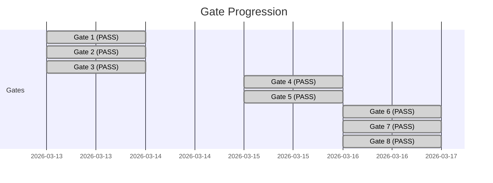
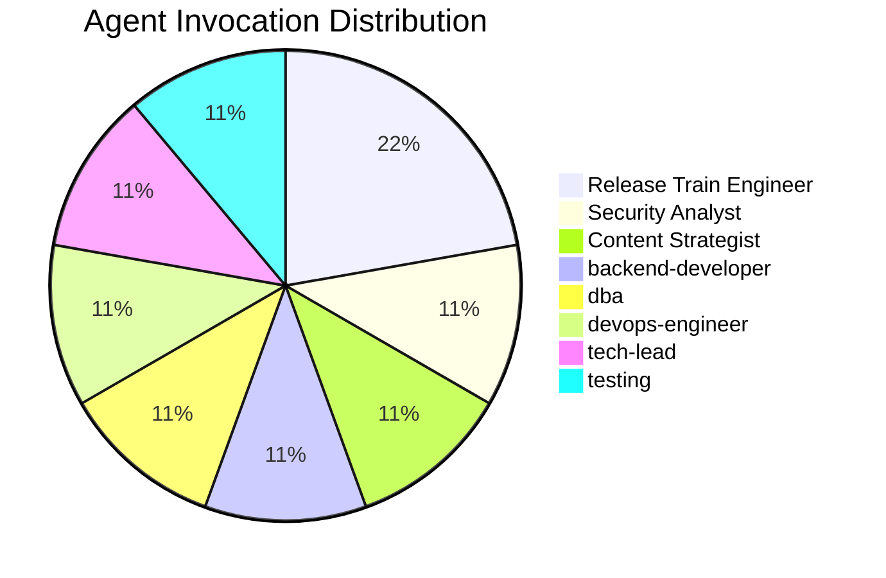
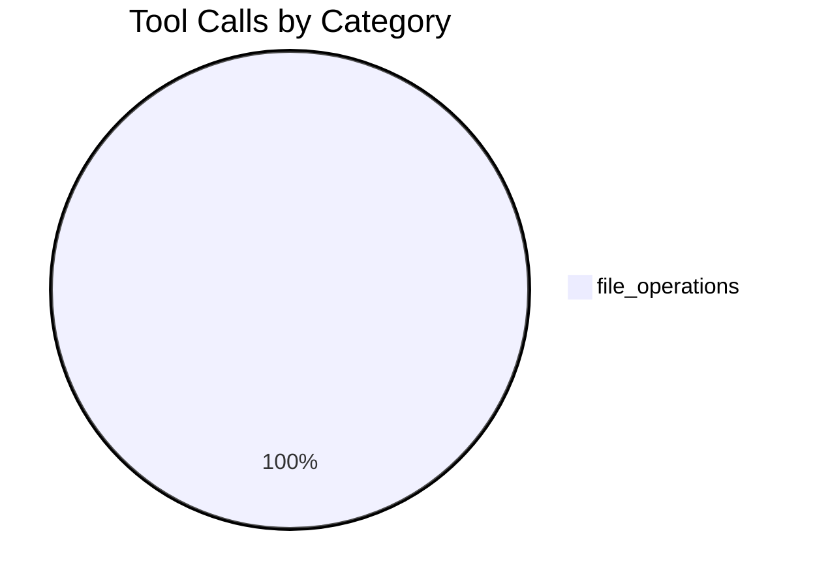
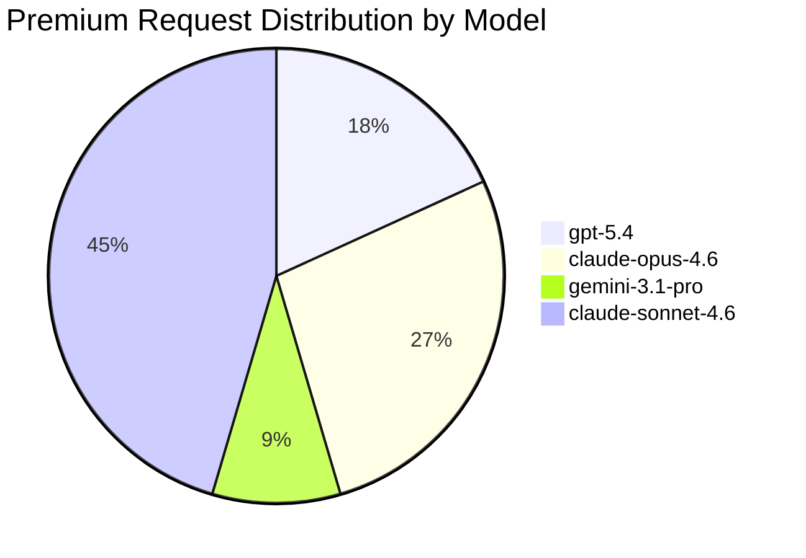
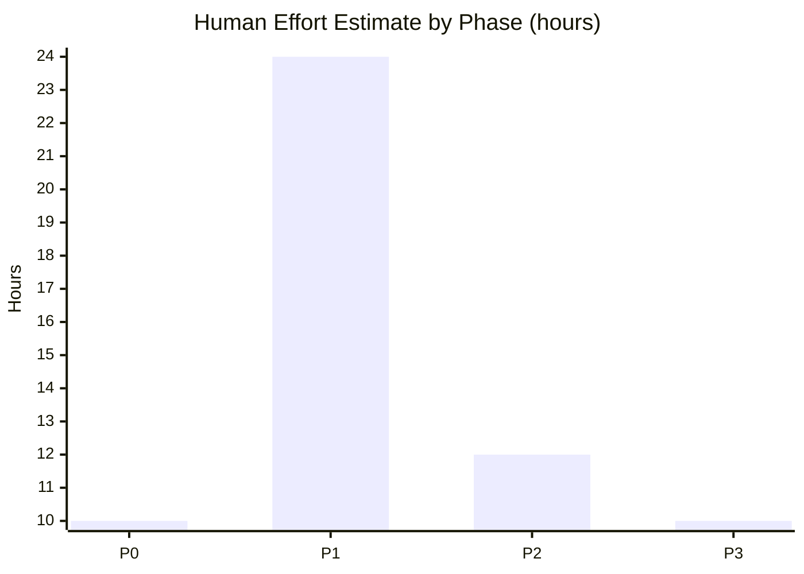
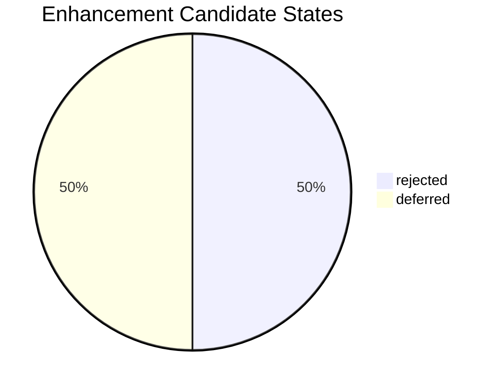

# Delivery Summary — unplughq

Generated: 2026-03-16

## Work Item Summary

| Type | Count |
|---|---|
| Epics | 0 |
| Features | 1 |
| Stories | 1 |
| Tasks | 0 |
| Bugs | 0 |
| **Total** | **2** |

## Gate Results

| Gate | Result | Date |
|---|---|---|
| Gate 1 | ✔ PASS | 2026-03-13 |
| Gate 2 | ✔ PASS | 2026-03-13 |
| Gate 3 | ✔ PASS | 2026-03-13 |
| Gate 4 | ✔ PASS | 2026-03-15 |
| Gate 5 | ✔ PASS | 2026-03-15 |
| Gate 6 | ✔ PASS | 2026-03-16 |
| Gate 7 | ✔ PASS | 2026-03-16 |
| Gate 8 | ✔ PASS | 2026-03-16 |

## Agent Utilization

| Agent | Invocations |
|---|---|
| Release Train Engineer | 2 ██ |
| Security Analyst | 1 █ |
| Content Strategist | 1 █ |
| backend-developer | 1 █ |
| dba | 1 █ |
| devops-engineer | 1 █ |
| tech-lead | 1 █ |
| testing | 1 █ |
| **Total** | **9** |

## Tool Usage

**Total Tool Calls:** 3

### Tool Calls by Category

| Category | Calls | % |
|---|---|---|
| file_operations | 3 | 100.0% |

### Top Tools

| Tool | Calls |
|---|---|
| read_file | 1 |
| create_file | 1 |
| multi_replace_string_in_file | 1 |

## Cost Analysis

| Metric | Value |
|---|---|
| Total Invocations | 9 |
| Total Premium Requests | 11 |
| Estimated Cost (overage rate) | $0.44 |
| Session Duration | 234685s |

### Cost by Model

| Model | Invocations | Multiplier | Premium Requests | Est. Cost |
|---|---|---|---|---|
| gpt-5.4 | 2 | 1× | 2 | $0.08 |
| claude-opus-4.6 | 1 | 3× | 3 | $0.12 |
| gemini-3.1-pro | 1 | 1× | 1 | $0.04 |
| claude-sonnet-4.6 | 5 | 1× | 5 | $0.20 |
| **Total** | **9** | | **11** | **$0.44** |

## Session Timeline

- **Started:** 2026-03-13T15:34:21.507Z
- **Ended:** 2026-03-16T08:45:46.813Z
- **Duration:** 234685s

## End-of-Session Validation

**Overall:** FAIL

| Check | Status | Issues |
|---|---|---|
| Checklist Validation | ✔ PASS | 0 |
| Frontmatter Validation | ✔ PASS | 0 |
| State Machine Validation | ✔ PASS | 0 |
| Cross-Reference Validation | ✘ FAIL | 61 |
| Agent Structure Validation | ✔ PASS | 0 |
| Gate Automation Paths | ✔ PASS | 0 |
| Self-Approval Detection | ✔ PASS | 0 |
| Deferred Items Tracking | ✔ PASS | 0 |
| Gate Evidence Verification | ✘ SKIP | 0 |
| Skill Structure Validation | ✘ FAIL | 62 |
| Work Item Content | ✔ PASS | 0 |
| Code Anti-Patterns | ✘ SKIP | 0 |
| Security Headers | ✘ SKIP | 0 |
| Design Token Compliance | ✘ SKIP | 0 |
| Consumed-By Validation | ✘ SKIP | 0 |
| Enhancement Candidates | ✔ PASS | 0 |
| Framework Observations | ✔ PASS | 0 |
| Emoji Detection | ✔ PASS | 0 |
| Acceptance Evidence | ✔ PASS | 0 |
| Test Contract Completeness | ✔ PASS | 0 |
| Artifact Links | ✔ PASS | 0 |
| Telemetry Markers | ✘ FAIL | 50 |
| Installed Skills | ✘ FAIL | 34 |
| Architecture Conformance | ✘ SKIP | 0 |
| Build Verification | ✘ SKIP | 0 |
| Azure Boards Sync | ✔ PASS | 0 |
| Work Item Prerequisite | ✔ PASS | 0 |
| Artifact Hierarchy Links | ✔ PASS | 0 |
| Artifact Lifecycle | ✔ PASS | 0 |
| Project Containment | ✔ PASS | 1 |

## Human Effort Comparison

Agent-reported estimates of equivalent mid-senior human effort (see [Estimation Heuristics](../docs/management-reporting.md#10-human-effort-estimation-heuristics)).

| Metric | Value |
|---|---|
| Total Human Effort Estimate | 56h |
| Agentic Session Time | 65.2h |
| Efficiency Ratio | 0.9× |

### Effort by Phase

| Phase | Human Estimate (hours) |
|---|---|
| P0 | 10 |
| P1 | 24 |
| P2 | 12 |
| P3 | 10 |
| **Total** | **56** |

### Effort by Agent

| Agent | Human Estimate (hours) | Invocations |
|---|---|---|
| Security Analyst | 24 | 1 |
| Release Train Engineer | 20 | 2 |
| Content Strategist | 12 | 1 |
| **Total** | **56** | **9** |

## Framework Improvement

### Enhancement Candidates

**Total:** 4

| State | Count |
|---|---|
| rejected | 2 |
| deferred | 2 |

| Severity | Count |
|---|---|
| high | 1 |
| medium | 3 |

---

*Generated by `.github/skills/delivery-reporting/scripts/generate-report.mjs`. Data sourced from `reports/session-telemetry.json`, `gate-evaluations.md`, and `docs/`.*
